

<h1 class="chapter" id="chap01" data-chap-title="一　初めてのヨーロッパの旅">
  一
  初めてのヨーロッパの旅 
  平成10（1998）年10月28日〜11月22日
</h1>

## はじめに {.chap-foreword data-sect-title="はじめに"}

私どもは、5年前に初めて2人でヨーロッパヘ行きました。その時の紀行文を{纏|まと}めてみようと思います。そんな記録を作るのは、恥ずかしくも過ぎ去った自分に再会するようなものですが、忘却のままにしておくのも、もったいない気もします。

平成8年に、夫は東北大学を停年退職し、翌年から、聖和短大に勤めていましたが、平成10年にスイスのローザンヌ大学の小学会で発表を依頼されて、行くことになりました。そこで、私（妻）も同伴者として一緒に行きました。ロシア西端の古都サンクト・ペテルブルグに寄ってから、ヨーロッパ各地をまわって美術館を中心に見てまいりました。

平成15（2003）年12月18日　71歳の初冬　村上 真完・ヤエ

## もくじ {.chap-toc}

<nav>

- [**はじめに**](#はじめに)
- [Ⅰ　**フィンランド**／ヘルシンキ（10月28日〜29日）](#sect01)
    - [①ヘルシンキのホテルの前](#subsect01)
    - [②ヘルシンキの宿の窓際で](#subsect02)
- [Ⅱ　**ロシア**／サンクト・ペテルブルグ（10月29日〜11月2日）](#sect02)
    - [③サンクト・ペテルブルグの街](#subsect03)
    - [④イサアク聖堂](#subsect04)
    - [⑤エルミタージュ博物館](#subsect05)
    - [⑥同博物館の玄関横の広間](#subsect06)
    - [⑦ギリシャ彫刻の展示室](#subsect07)
    - [⑧トロヤの遺品](#subsect08)
    - [⑨美しい貴婦人像など](#subsect09)
    - [⑩カザン大聖堂](#subsect10)
    - [⑪ロシア美術館のプーシキン像](#subsect11)
    - [⑫アストリヤ・ホテル](#subsect12)
- [Ⅲ　**イギリス**／ロンドン（11月2日〜11月5日）](#sect03)
    - [⑬大英博物館](#subsect13)
    - [⑭パルミラの遺品など](#subsect14)
    - [⑮ガンダーラの遺品](#subsect15)
    - [⑯ギリシャの壷](#subsect16)
    - [⑰ギリシャの神殿](#subsect17)
    - [⑱ローザンヌの夕暮れ](#subsect18)
- [Ⅳ　**スイス**／ローザンヌ、チューリヒ、ベルン（11月5日〜11月9日）](#sect04)
    - [⑲学会のレセプション](#subsect19)
    - [⑳ローザンヌの街](#subsect20)
    - [㉑旧ローザンヌ大学の前](#subsect21)
    - [㉒シヨン城](#subsect22)
    - [㉓チューリヒのスイス国立博物館](#subsect23)
- [Ⅴ　**フランス**／パリ（11月9日〜11月12日）](#sect05)
    - [㉔ベルンの連邦議事堂](#subsect24)
    - [㉕パリのノートルダム寺院](#subsect25)
    - [㉖セーヌ川の光景](#subsect26)
    - [㉗エッフェル塔](#subsect27)
    - [㉘凱旋門](#subsect28)
    - [㉙シャンゼリゼ](#subsect29)
    - [㉚ルーヴル博物館](#subsect30)
    - [㉛ヨーロッパの絵画](#subsect31)
    - [㉜ヴィーナスの彫刻](#subsect32)
    - [㉝ナポレオン3世の間](#subsect33)
- [Ⅵ　**ドイツ**／ベルリン、ハンブルグ（11月13日〜11月16日）](#sect06)
    - [㉞ベルリンのツオー駅前](#subsect34)
    - [㉟ダーレム博物館](#subsect35)
    - [㊱ベルリン国立博物館の聖母子像](#subsect36)
    - [㊲ハンブルク中央駅前](#subsect37)
    - [㊳ハンブルク大学](#subsect38)
- [Ⅶ　**デンマーク**／コペンハーゲン、ヘルシンゲル（11月16日〜11月18日）](#sect07)
    - [㊴コペンハーゲンの街](#subsect39)
    - [㊵ヘルシンゲル港](#subsect40)
    - [㊶ニー・カールスベア彫刻館のニンフ像](#subsect41)
    - [㊷デンマークの風景画家ケーブケの絵](#subsect42)
- [Ⅷ　**スウェーデン**／ストックホルム、ウプサラ（11月18日〜11月20日）](#sect08)
    - [㊸ウプサラの駅前](#subsect43)
    - [㊹ストックホルムの島](#subsect44)
    - [㊺水の都：王宮と国会議事堂](#subsect45)
- [Ⅸ　**フィンランド**／ヘルシンキ（11月20日〜11月21日）](#sect09)
    - [㊻ヘルシンキの港の朝](#subsect46)
    - [㊼ウスペンスキ聖堂](#subsect47)
    - [㊽国立博物館と国会議事堂](#subsect48)
- [**おわりに**](#おわりに)

</nav>

{width=95%}

## **Ⅰ　フィンランド**／ヘルシンキ（10月28日〜29日）{#sect01 .break-verso data-sect-title="Ⅰ　フィンランド／ヘルシンキ"}

### ①ヘルシンキ（Helsinki）のホテルの前{#subsect01}

平成10（1998）年10月28日の朝、成田ひがし屋ホテルの車で成田空港に行きます。やっと昼近くになって、フィンランド航空機AY074便に乗りました。日本列島を北上し海を越えシベリアからロシアの北の方を飛行します。白い雪原や山々、凍った川や湖、そしてバレンツ海を眺めてから、雲の中に入ると、フィンランドのヘルシンキ空港に着きました。飛行時間は9時間半、時差は7時間、到着は14時半でした。空港からリムジンバスでヘルシンキ中央駅前に行きます。外は雨です。

駅で翌朝の特急列車の切符を買ってから、予約していた宿はどこかと通行人に尋ねると、駅の正面を出てすぐ右の大きなデパートもある建物がソコス・ホテル・ヴァークナ（Sokos Hotel Vaakuna）でした。1階の受付けで記帳して675号室に落ちつくと夕暮れです。窓から駅の時計台が見えます。その針は17時過ぎを指していました。

### ②ヘルシンキの宿の窓際で{#subsect02}

このホテルは安全で快適、部屋も広く窓からの夜景もよい。テレビもあって英語の放送も聞けます。

翌29日は早く起きて、5時に10階の食堂で朝食をとります。ところが、夫が成田で買ったおにぎりを食べると梅干の種をかじって、前歯の挿し歯がとれてしまいました。学会を控えて英語もうまく話せないし、困ったなあ、と言いながら、急いで6時半のサンクト・ペテルブルグ行きの列車シベリウス号に乗り込みました。

間もなく、車内で青年達と英語や日本語で会話が始まります。アメリカ青年は茨城県の高校の教師をしているといいます。オーストラリア青年はエンジニアで姉は京都で日本語を学んだそうです。夫は英語の練習とばかり一生懸命話します。

## **Ⅱ　ロシア**／サンクト・ペテルブルグ（10月29日〜11月2日）{#sect02 data-sect-title="Ⅱ　ロシア／サンクト・ペテルブルグ"}

### ③サンクト・ペテルブルグ（Saint-Petersburg）の街{#subsect03}

列車は白樺や針葉樹の林を抜けて東へ向かいます。車内で入国審査を受け両替もします。13時半に、ロシアの古都サンクト・ペテルブルグに着きました。ここの大学に留学しているというアメリカ青年の弟が、駅に迎えに来ていました。彼らは歯科医を探してくれるといいます。

2人と一緒に、タクシーでホテル・アストリア（Hotel Astoria）に行って、荷物をおろし部屋を確保してから、青年達が電話で探してくれた歯科（American Medical Centre）にタクシーで行きました。青年達には僅かの礼金を渡して帰ってもらい、治療が終わるのを待ちます。夫の歯は見事にくっつきました。医師から証明書をもらい、ホテルに帰って受付嬢にも書類を書いてもらいます（この治療費は、日本に帰ってから、これらの書類を出して保険会社に請求すると戻ってきました）。

それから散歩に出ます。ホテルとイサアク聖堂との間を通って前方の塔に向かいました。そこは旧海軍省です。この黄色い建物の前面には彫刻が施され、その前には神話にもとづく神（アトラス）像が立ち、他にも銅像がありました。この正面から延びる道路を歩いて行く前方で爆発音がして、その前に行くとガラスの破片だらけです。危険を感じましたので、右折して帰りました。この写真は、この時の光景で、夕陽を浴びて金色に照り映える古い石造の街並みに夕闇が迫っています。

### ④イサアク聖堂（Saint Isaac's Cathedral）{#subsect04}

私たちの部屋は広く豪華で快適です。次の30日の朝、1階の食堂でパン、ミルク、サーモン、果物等を頂きました。今日から毎日洋食です。この写真はロシア正教会のイサアク聖堂です。19世紀半ばに完成したというこのドームのある聖堂は、屋上にも人物の彫像があり重厚です。

### ⑤エルミタージュ博物館（Hermitage Museum）{#subsect05}

ホテルの脇の通りを東に歩いて行くと、道は北に曲がって、旧参謀本部の大きなアーチをくぐります。すると、この写真のように、広場の向こうに淡いブルーの壁と白の円柱の3階建てのエルミタージュ博物館が見えてきます。前の広場の真ん中には、高く（48メートルという）天使像を頂いた円柱が立っています。その台座の四面には甲冑を着けた人物や女神の像が彫られています。写真を撮っていると、みすぼらしい物乞いの女が寄ってきたのに、当惑してしまいました。広場から北に廻ってネヴァ川に面している正面入口から入ります。

### ⑥同博物館の玄関横の広間{#subsect06}

ここが冬の宮殿です。1754年に始まったという大規模で、豪壮な大宮殿です。その東側には小、旧、新の3つのエルミタージュ（隠れ家）と呼ばれる殿堂が連なり、その東には劇場が続きます。ピョートル大帝に始まる歴代の皇帝は国策として、美術収集品を増やし、宮殿の改装や増築をおこなって来たのだそうです。大帝の後エリザベータ女帝、2世エカテリーナ女帝なども美術品の収集につとめて、やがて1852年には、宮廷博物館も出来たといいます。1917年のロシア革命の舞台となったところですが、今は革命記念室は見られません。

玄関を入った広間には多くの観客が列をなして、入場券を買いパンフレットを求めています。小中学生も先生に引率されて、何組も来ているのですからこの国の文化水準が判るような気がします。それにしてもなんとこの宮殿の広間の豪華なこと、大理石と金箔の装飾で美しく輝いていました。床は寄木のモザイクです。シャンデリアもあちこちに見られます。この上の階段はもっと素晴らしく、2階には豪華絢爛な部屋が沢山続いています。

### ⑦ギリシャ彫刻の展示室{#subsect07}

エルミタージュ博物館には、先史時代から20世紀までの世界中の文化遺産と芸術品が展示されています。1階東側は古代の美術が中心で、入り口から左の方はエジプト、右の方は西アジア、奥に行くとギリシャ、ローマの美術室です。そこにはご覧のように、沢山の彫刻が並んでいます。古代ギリシャ・ローマの文明は、西欧諸国の文化の源泉の一つです。ギリシャ人やローマ人たちは、自然現象の中に神を見出し、擬人化して描き、また彫刻しました。ホメロスの叙事詩に登場する神々や、戦争物語は皿や壷に描かれます。

ゼウス、ヴィーナスなどの神像もあります。人間の姿が表現され、肉体の美と調和が求められました。金や象牙の小像も、大きな大理石や青銅の像も多いのです。神像等は、自然の暴力とキリスト教による破壊を免れたものです。

### ⑧トロヤ（Troya）の遺品{#subsect08}

トロヤは小アジアの古代都市で、トルコの西海岸沿いのダーダネル海峡に近い丘にあります。1870年、シュリーマンがホメロスの詩にある王の城を求めて発掘を始めてから、トロヤ文明が明らかになりました。紀元前3000年頃からローマ時代にわたる住居跡から、金銀の冠、首飾り、財宝などが発見されたそうです。彼が、若い時から夢を{懐|いだ}いて、悲運と戦いながら努力して実現した物語を思います。この写真の壷類はトロヤのものと標示されています。

それから、この日は、2階の沢山ある豪華な部屋を廻ります。マラカイト（孔雀石）の間、金色の間、真紅の間の写真をとりました。しかしほとんどが失敗でした。17時半に同館を出て、ビールや食べ物を買って帰って、宿で食べます。夫は暇を見つけては、英語の原稿を朗読していました。

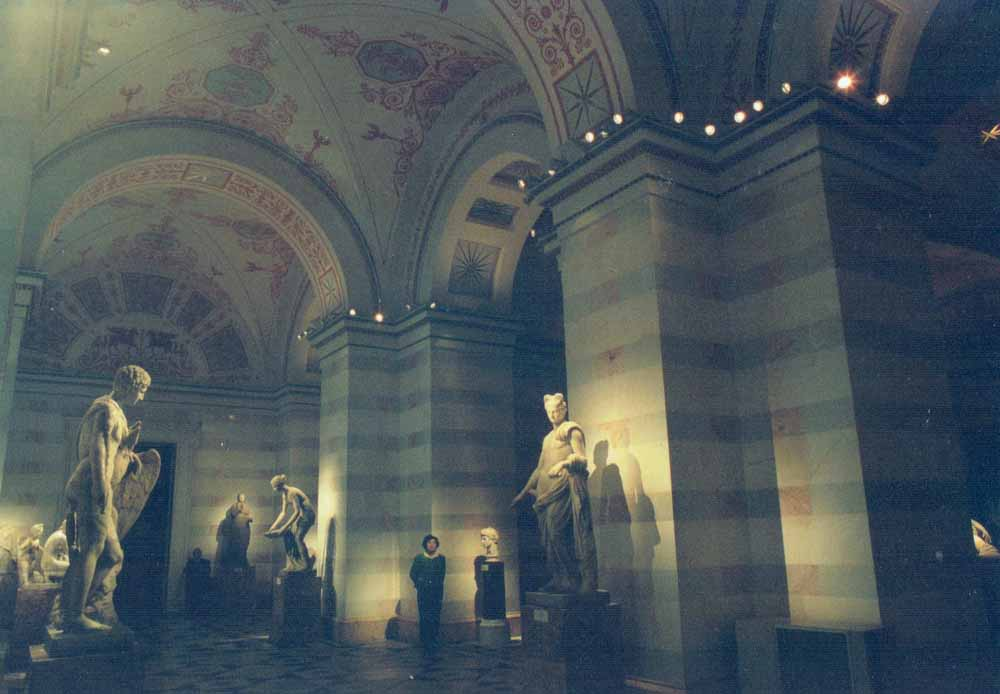

### ⑨美しい貴婦人像など{#subsect09}

10月31日も一日中、エルミタージュ博物館を廻ります。2階北側の大広間にはハッケルト（Chakkert, 1737-1807）の特別展示があり、火を噴いて燃えるトルコ船団を描いた海戦図などが印象的でした。ロシアの皇帝や軍人の肖像画を見ます。奥の方へ行くと、中世、近世の絵画、3階はフランスを主とした近・現代絵画が展示されています。ダヴィンチ、ミケランジェロ、コロー、ミレー、マネ、カンディンスキー、ピカソの絵など目が眩む思いです。

この写真はドイツの画家ヴィンテルハルター（F. X. Winterhalter, 1805-1873）の絵です。ロダンの大理石彫刻の一室もあります。1階の西側に下りると、ロシアの考古学発掘品があります。3階の西北側に上ると東洋美術の展示です。{敦煌|とんこう}やベゼクリクなどに関心があるのですが、写真撮影が禁じられています。『シルク・ロード遺跡の旅』（第三文明社、1982年）や『西域の仏教⸺ベゼクリク誓願画考』（同、1984年）を著した夫は、ロシア探検隊が持ち運んだ数十点の壁画断片などの前で感激の様子でメモをとります。16時半に同館を出て、雨の中を帰りました。

### ⑩カザン大聖堂（Kazan Cathedral）{#subsect10}

11月1日朝、ホテルを出て、エルミタージュと反対方向にネフスキイ大通りを進んで行くと、右の方に大きな円屋根が見えて、鐘の音が響き渡っています。これがカザン大聖堂でした。ローマのサンピエトロ寺院を模倣して1811年に建てられたという大聖堂です。円屋根の大殿堂を中心にして、左右に100本以上の列柱に支えられた半円形の回廊が巡らされています。頑丈な扉を押して内部に入ると、ミサが始まるところです。合唱も厳かで、聖職者たちの威儀も立派です。どの壁にも大きな絵が飾られています。列柱の左側の入り口には「宗教史博物館」という看板がありました。

### ⑪ロシア美術館（State Russian Museum）のプーシキン像{#subsect11}

さらに歩いて行くと左（北）側は商店街です。昨日博物館のガイド嬢から教えられたパッサシ百貨店も見つかりました。エンジ色の帽子と香水などを買ってもらいます。ロシアの若い女性は黒いコート、老婦人は赤いコートなどを着て、皆オシャレです。北側の小路を進むと銅像が見えます。プーシキン像でした。その後がロシア美術館とプーシキン博物館です。1898年に建てられたというこの美術館には、19世紀から20世紀前半の絵画と彫刻、中世ロシアのイコン（聖画像）などが展示されています。北国ロシアの風光と人情を描いた暗い力強い画面に圧倒される思いです。暗い森林の巨木を描いた作品や歴史的群像や宗教的な故事を描いた巨大な画面にも驚きました。

そこを出てから運河沿いに歩いて、ねぎ坊主の尖塔がいくつも{聳|そび}えるスパヤ・ナ・クラヴィー聖堂に行きました。催し物の高価な入場券を売っていましたが、ルーヴル貨がありません。夫は近くの屋代店からマトリュウシカ人形を買って来ます。また歩いて百貨店を覗いたりして、18時半に宿に帰りました。疲れました。

### ⑫アストリヤ・ホテル（Hotel Astoria）{#subsect12}

この夕べは、このホテルの最後の晩です。毎夜楽器の生演奏が聞こえます。このように素敵な部屋で、白いガウンを着て、夫はご機嫌です。朝食は、レストランのヴァイキング方式で頂くのですが、夕食は、外で買った炒めご飯、果物、野菜などを持ちこんで、持参の味噌、醤油、梅干、干物などで、頂戴しました。缶詰や煮物を買っても、臭くて嫌なので、いつも、ゆで卵が主なおかずです。翌朝は早くヘルシンキに発つので、おにぎりを作ります。受付に朝食分を頼んだら、なんとパンや、チーズ、ハム、果物、飲み物など沢山入った大きなビニール袋が2つも来ました。ロシア人は大食なのですね。

## **Ⅲ　イギリス**／ロンドン（11月2日〜11月5日）{#sect03 data-sect-title="Ⅲ　イギリス／ロンドン"}

### ⑬大英博物館（British Museum）{#subsect13}

11月2日は暗いうちに起きて、タクシーでフィンランド駅へと急ぎます。特急列車は7時過ぎに発車して、12時半にヘルシンキに着きました。少しばかり町を見物した後、前に泊まったホテルに、一部の荷物を預けてから、バスで飛行場へ急いで、やっとフィンランド航空AY833便に間に合い、4時間飛んでロンドンに着きました。夕方の18時半です。地下鉄に乗ってキングス・クロス駅で降りますと、外は大雨です。タクシーでライアン・ホテル（Ryan Hotel）に行きます。私たちの519号室は小さい部屋でしたが、湯沸かしのポットがあって便利です。

翌3日の朝、10時過ぎに、タクシーで大英博物館に行きます。市のほぼ中心にあるこの博物館は、ギリシャ神殿のような彫刻を施した大きな三角破風のついた玄関と、両側の回廊には円柱が連なっている大建造物です。1753年に個人のコレクションがイギリス国家に寄贈されたのが、この大英博物館の始まりだそうです。

### ⑭パルミラ（Palmyra）の遺品など{#subsect14}

この博物館には、古代オリエントやギリシャ・ローマなどの展示室があります。その中でシリヤ砂漠のオアシスのパルミラから出たという数体の墓石の彫像が、目を引きました。この写真は、亡くなった人を記念する石彫肖像の一つで、紀元2世紀末のものといいます。この地方は7世紀からイスラム教圏になっているので、このような肖像がそれ以後には造られることはありません。それ以前の多神教の世界には、人間や神々や動物の造形が追求されていたのです。亡くなった人の姿を遺して{偲|しの}んだのでしょう。古代エジプトには、ミイラと肖像画板もありましたが、同じように故人を偲ぶよすがであった筈です。それは、もうないのです。

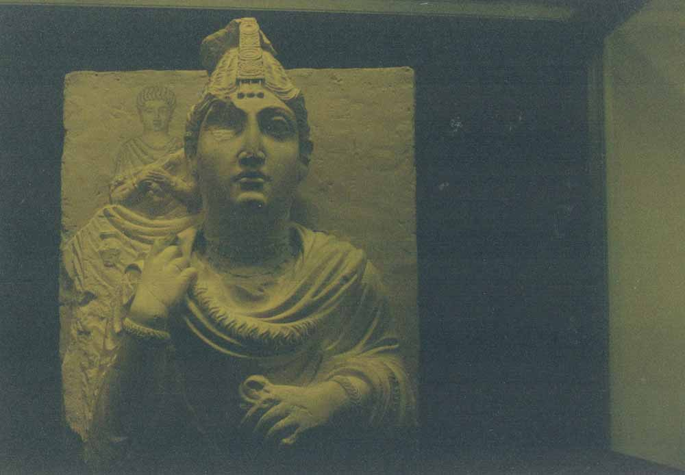

### ⑮ガンダーラ（Gandhāra）の遺品{#subsect15}

次に中国やインドの部門へ足を運びます。偶像崇拝を禁じたキリスト教やイスラム教の世界では、神の姿は描くことも彫ることもできません。仏教も初期の頃には仏様を円い法輪や菩提樹や足型で表していました。初期クシャーナ朝の紀元1世紀後半頃にインド亜大陸の北西部のガンダーラで、続いて中央部のマトゥラーで仏像が作られるようになったそうです。ガンダーラ仏は西方的な顔立ちと両肩を覆う{襞|ひだ}のある衣が特徴です。仏伝図も彫られました。

この浮彫りは2世紀〜3世紀と標示されています。菩提樹の下で、仏が2人の弟子とともに坐っており、下には説法を意味する法輪も見えます。インドのアマラーヴァティーの仏塔の石の{欄|らん}{楯|じゅん}（玉垣）が移されて、高さ4メートルほどに再構築されています。その表面に蓮華文様や仏教伝説の図などが彫刻されています。この再構築には日本の資金援助を受けたという標示があります。またここには中国の仏像もあり、シルクロードのショルチュク発掘の菩薩像頭部もありました。

### ⑯ギリシャの壷{#subsect16}

エルミタージュでも見てきたギリシャの陶器は、この博物館に沢山あります。葡萄酒や油、水等をいれる壷や飾りにもなる皿には様々な模様があります。この壷の絵は黒地に赤い模様ですが、紀元前6世紀以降のもので、それより古いのは赤地に黒、さらに古いのは幾何学模様だったそうです。

このガラスケースには小さい大理石の人物像なども見えます。この後にも、ギリシャの陶器や石彫がヨーロッパの博物館に余りに沢山あるのを見て、ギリシャ本土にはなくなったのかと思いました。しかし私たちがこの翌年に、ギリシャを訪れてみると、壷や皿などは沢山ありました。

### ⑰ギリシャの神殿{#subsect17}

アテネのアクロポリスの丘にあるパルテノン神殿は紀元前5世紀に築かれましたが、1687年の戦争の時、火薬の爆発で破壊された後、19世紀の初めに、大理石の彫刻等の多くが、イギリスの駐トルコ大使エルギン（T. Elgin）卿によって運び出されて、{終|つい}にここに収蔵されたそうです。破損した神殿の三角破風の群像彫刻が原形のように陳列されています。豊かな肉体とそれを包む薄衣の{襞|ひだ}が良く表されているのが特徴です。戦争場面もあります。

その隣室にあるのが右の小神殿です。古代リキヤ（Lykia，トルコ南西部海岸地方）の「ネレイデス記念物」（The Nereid Monument）と説明票がついていました。ネレイデスはギリシャ神話では女神です。

### ⑱ローザンヌ（Lausanne）の夕暮れ{#subsect18}

11月5日朝、ホテルを出てタクシーで、ヒースロー空港に行き、8時10分発のスイス航空SR839便に乗ってジュネーブ空港に1時間半で着きました。それから列車に乗ってローザンヌに着いたのは50分後でお昼です。

ローザンヌで世話になったホテル・アルファは駅から数分坂道を上った所で、その380号室に落ち着きます。南寄りの快適な部屋でレマン湖（Lac Léman）も見えました。夫は喜んで英文原稿に手入れを始めます。いっぽう私はロンドンのホテルに靴を忘れて来たことに気が付いて、まず靴屋を探しに出かけました。運良く店は坂道を下った所にすぐ見つかり、ちょうど良い中ヒールの靴がありました。それを履いて、18時半に夫と共に1階のレセプション会場に出かけます。

この写真は、出かける前に、ホテルの窓から写した夕景色です。ローザンヌは坂の街です。中央の黒い屋根はローザンヌ中央駅、その向こうに光るのがレマン湖です。

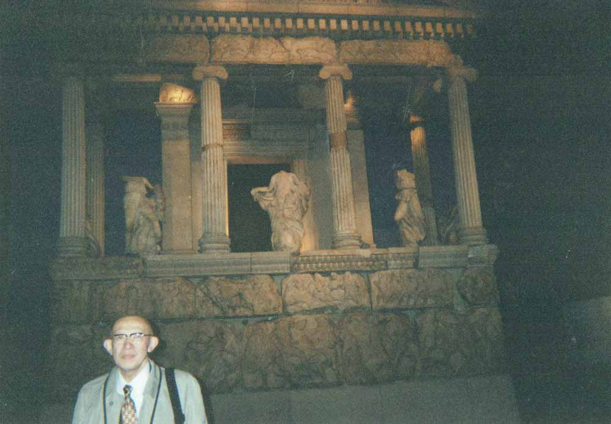

## **Ⅳ　スイス**／ローザンヌ、チューリヒ、ベルン（11月5日〜11月9日）{#sect04 data-sect-title="Ⅳ　スイス／ローザンヌ、チューリヒ、ベルン"}

### ⑲学会（Workshop on Sāṃkhya）のレセプション{#subsect19}

受付では、夫が挨拶していると、日本女性が私に声をかけてきます。会長から私を案内するように言われていました、と。京大の大学院生でローザンヌ大学に留学中の佐藤直実さんです。私はとても嬉しくなりました。会長はブロンコルスト（J. Bronkhorst）教授で、ご夫妻で歓迎してくれました。この写真の中央と、お隣りが教授ご夫妻で、その後ろが同大学のティレマン（T. J. F. Tillemans）教授、その右が信州大の茂木教授と私たちです。夫は服部京大名誉教授の推薦もあって出席したのです。夫の旅費は、会から頂戴したし、懇親会ではご馳走になるし、有難いと思いました。

### ⑳ローザンヌの街{#subsect20}

翌6日は学会の初日で夫は、他の学者たちと一緒に電車を乗り継いで大学にでかけます。私は列車でジュネーブへ行きました。鉄道のフリー切符（ユーレイルパス）を買っていましたので、列車の乗り降りが楽でしたが、博物館行きのバスに乗っても切符の買い方がわかりません。お金を出して聞くと、黒人女性がにこにこして買ってくれました。隣りの紳士が、「私も同じ方向に行きます」と、途中まで案内してくれました。ここはフランス語圏なのですが、英語でもだいたい通じます。

歴史美術博物館にはエジプト、ギリシャ等の美術、15世紀からのスイスの画家たちの作品が沢山ありました。また、時計博物館やサンピエトロ寺院等を見物してから、ローザンヌ駅に戻って、地下鉄で南1キロメートルのウッシーに下り、湖岸に出てみました。レマン湖が目の前に広がって、船やボートが往来していました。なにしろ東西100キロメートルもある三日月型の湖です。右頁の写真は次の日に、直実さんの案内で市内を見物した時の街の様子です。

### ㉑旧ローザンヌ大学の前{#subsect21}

7日朝、直実さんは約束の時間にホテルに訪ねてくれました。一緒に坂道を上って行くと、前の写真のような狭い路地に花や果物等を売っている店が続きます。大通りに出ると間もなく大きな建物が見えてきます。それが旧ローザンヌ大学で、その前の広場はマーケットになっていて、日用雑貨、食料なんでも売っています。

直実さんはこの2階は博物館になっていますと、私を案内してくれます。そこには鳥や動物、植物の標本などがずらりと並んでいました。広場を通って次はこの街のシンボルであるカテドラル（大聖堂、Cathédral）に連れて行ってくれます。それは12世紀〜13世紀に建立されたというゴシック建築で、窓のステンドグラスの絵の美しいこと。脇に小さい美術館がありました。夫は自分の発表が予定通りに済んだと安堵の様子です。

### ㉒シヨン城（Château de Chillon）{#subsect22}

直実さんとレストランで食事をしてから、私はレマン湖の名所シヨン城に行くことにしました。ウッシーの湖岸から40キロメートルも離れた湖の東端にあり、バスに乗ってモントルー（Montreux）で降り、歩いていくとレマン湖に出ます。しばらく遊歩道を歩くと湖に突き出た岩場の上に建てられたこの城が見えます。遠くから見ると、水面に浮かんでいるようです。

もともと9世紀にアルプスを越えて来る東方商人たちに通行税などをかける関所だったのですが、13世紀に現在の形になったそうです。バイロンの詩「シヨンの囚人」で有名な宗教改革者が幽閉された牢獄跡も見られます。湖畔の城跡などを巡る観光には遊覧船が利用されているようです。実際、その翌年にもこの町で学会があり、私たちはその観光ツアーに参加し、湖を廻ったのでした。

### ㉓チューリヒ（Zürich）のスイス国立博物館{#subsect23}

8日の朝、スイス最大の都市チューリヒ（Zürich）に行こうと、私は8時の列車に乗り込みました。2時間かかって着きましたが、ここはドイツ語圏なので、老婦人に英語で道を尋ねても判りません。若い人に教えられて、国立博物館に着きました。スイス人の遺品などが先史時代から近代まで時代に沿って展示されています。キリストの説話物語、ステンドグラス、教会音楽、ビデオ等が見られます。

駅近くの大きい市場（Heute Großer Markt）に行くと食料品、衣料品、装飾品なんでもあって、人々で賑わっています。ローザンヌに戻ったのは午後17時半、ホテルに着いて、ホッとしました。

20時半からウッシーの湖岸にあるレストラン (Restaurant de la Navigation）で学会最後の晩餐会があるので、夫と共に電車に乗って出かけます。レマン湖の夜景も素敵です。皆さんと歓談したり、ご馳走をいただいたりして、お別れしました。「来年も会いましょう」と。翌年も別の学会があり、また来ることになります。

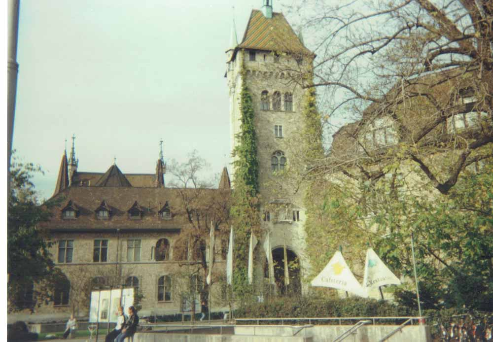{height=260}

## **Ⅴ　フランス**／パリ（11月9日〜11月12日）{#sect05 .break-before data-sect-title="Ⅴ　フランス／パリ"}

### ㉔ベルン（Bern）の連邦議事堂{#subsect24}

9日からは、また夫と2人旅です。7時25分発の列車に乗り1時間でベルンに着きました。この写真の連邦議事堂はベルンが首都になった1848年に建てられたそうです。この街はお役人町で政府関係の仕事をしている人が多いそうです。スイスはどこへ行っても街も家並みもきれいで、花が至る所に飾られています。

昼前にローザンヌに戻り、12時46分発の長距離特急列車（TGV）に乗ってフランスのパリ・リヨン駅に着いたのは16時35分でした。宿のフランツール・パリ・リヨン（Frantour Paris Lyon）は駅の隣りで、321号室に落ち着きました。日本人の観光客も大勢いました。

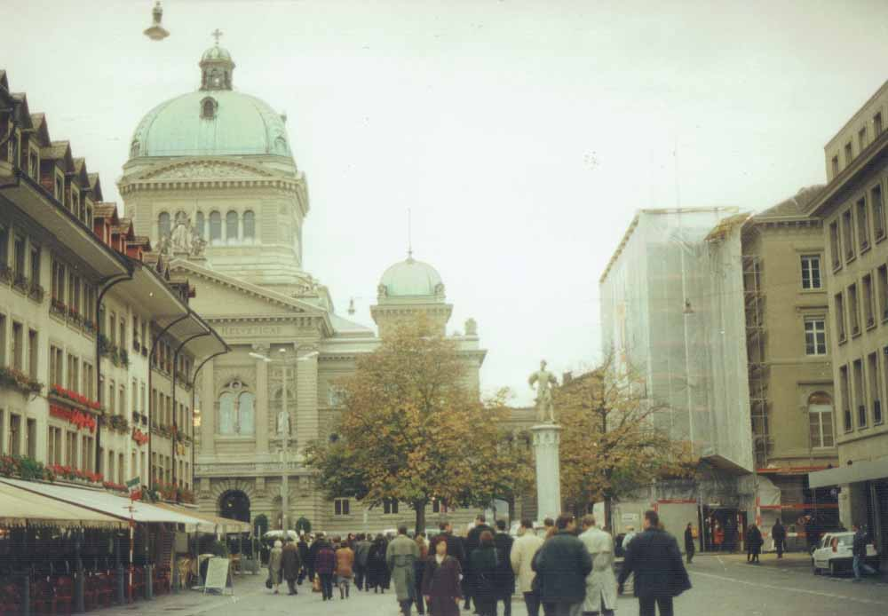{height=260}

### ㉕パリのノートルダム寺院 {.break-before #subsect25}

夕方17時すぎに、駅前のレストランに入ったのですが、ご飯があるのに、注文の仕方が下手でパンを食べることになります。フランス語はよく判らない。それからバスチーユの辺りまで散歩してから、19時ごろに帰ってきて休みました。

10日は朝早く出かけて地下鉄に乗ってサン・ミッシェル駅で降ります。そして歩いてソルボンヌ大学の前を通り、フランスの英雄たちが眠るパンテオンに来ましたが、入り口にあった残酷な絵などを見ただけで、引き返してノートルダム寺院（Cathédrale Notre-Dame）に行きました。この大聖堂はセーヌ川の中のシテ島（Îlle de la Cité）に1163年に着工されて、200年もかけて完成したという壮麗な建物です。正面左の小さい入り口から高さ69メートルという塔への階段を上って、屋上テラスに出て、そこからさらに暗い狭い螺旋階段を上って行くと、真下のセーヌ川を始めとしてパリの街が一望できました。

### ㉖セーヌ川（Seine）の光景{#subsect26}

このセーヌ川に沿って街が発達し、特に大きな船が浮かんでいる様なシテ島はパリの発祥地で、歴史を物語ると言われます。この島にかかる橋のうち、西端のポン・ヌフは最古のものだそうです。石造りでアーチ型の橋もあります。広々とした川には大小様々な船が往来しています。

また塔から下りて、地下鉄に乗ってエッフェル塔へ向かいました。塔の近くの歩道では、焼き栗が売られていましたので、早速買います。美味しい栗を食べながら、塔に上るエレベータに乗る行列に並んで、とうとう最上階に上がります。そこの広い展望台からは360度の眺望を楽しみます。

この写真は塔の近くの橋から撮りました。

### ㉗エッフェル塔（Tour Eiffel）{#subsect27}

パリのシンボルであるこの塔はセーヌ川の西南岸にあります。1889年のパリ万国博覧会のために建てられというこの塔は320メートルの高さがあるそうです。1階は地上57メートルの展望台で、塔の歴史が映像で紹介されています。270メートルの3階の最上階まで、エレベータを乗り継いで上って行きました。この塔から降りて、橋の方に歩いて行ってから、振り返ってみると、この塔には写真のように電光板が光っており、「2000年まであと417日」と読めました。この橋を渡った対岸にも公園が広がっています。

それから歩いてギメ博物館（Musée Guimet）に向かいます。そこは東洋美術の宝庫として有名で、シルクロードの遺品も多いというので、それを見るために来たのです。いざ行ってみると、修復整備中のために当分休館中でありました。

### ㉘凱旋門（Arc de Triomphe）{#subsect28}

また歩いて北の凱旋門の方に向かいます。この凱旋門は1806年にナポレオン1世（1769-1821）がフランス軍の凱旋のために建造を命じましたが、30年かかって彼の死後に完成したそうです。彼はロシア遠征に失敗してから失脚し、終に南大西洋の孤島セントへレナに幽閉されて死んで、後にその遺骸がこの門を通ったとか。高さ約50メートルもある門の上まで行くエレベータは故障中で、階段を上るのはつらいので諦めます。門の壁面には浮き彫りが飾られ銘文も刻まれています。

休戦記念日のこの日には、三色旗が立ち並び、ちょうど軍人達の儀式の最中でした。凱旋門からは、12本の道路が放射状に延びています。この近くから地下鉄に乗って、6時ごろにリヨン駅に着いてから、ご飯、玉子、蟹、キュウリ、ジャガイモなどを買って帰り、夕食にしました。

{height=305}

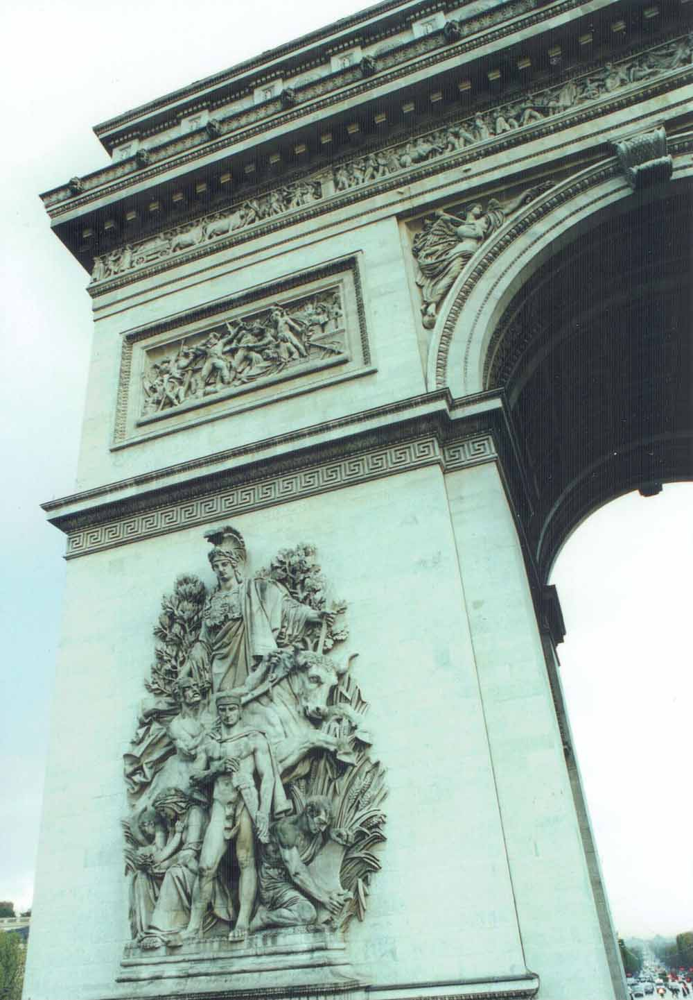{height=305}

### ㉙シャンゼリゼ（Avenue des Champs Elysées）{#subsect29}

11日朝早く、地下鉄でシャンゼリゼ駅まで行きます。凱旋門からルーヴル博物館の方へ真っ直ぐに延びている道路がシャンゼリゼ大通りで、道幅は100メートル近く、中間分離帯もないのです。両側には凱旋門から続く高い並木が{聳|そび}えて黄ばみかけています。凱旋門の近くは大商店街ですが、この辺からルーヴル宮までは左右とも公園風です。

この写真の右側は、1900年のパリ万博を記念して造られたというグラン・パレ（Grand Palais）で、今は美術館です。左側のプチ・パレ（Petit Palais）は写っていませんが、遥か前方はアンヴァリット（廃兵院）でナポレオンが眠る金色ドームです。この対岸にあるというエリゼ宮には行きません。歩いていると、修学旅行だと言う浜松の高校生たちに出会いました。進んでいくとコンコルド広場で、石の尖塔オベリスクが立っています。広い公園を進んでいくとルーヴル宮の構内です。

### ㉚ルーヴル博物館（Musée du Louvre）{#subsect30}

そこに入ると、前方にナポレオンが建造させたというカルーゼル凱旋門（Arc de triomphe du Carrousel）が建っています。その高さは15メートルと小さいながら、すべて彫刻で飾られ、上には騎馬群像が立っています。さらに進むと大きなガラスのピラミッドがあり、そこが博物館の入り口でした。そこから下りて行くと、案内所や売店などがあり、各展示場に行けます。この下には中世の城の遺構もあります。

この博物館（美術館）は、もと王宮であって、革命のさなかの1793年に開館されたそうです。近年その200年記念事業で新装改築され、ピラミッドも造られたそうです。古代から19世紀までの、王家のコレクションやナポレオンの勝利品に加え、一般からの寄贈品等も多いそうです。この写真は宮殿の北西端です。

### ㉛ヨーロッパの絵画{#subsect31}

ルーヴル博物館はコの字型の3階の大建造物で、地下にも彫刻などが沢山あります。絵画は2階と3階に多いようです。絵画で人気のあるのはダ・ヴィンチ（1452-1519）の「モナ・リザ」で、日本人も写真を撮っています。しかし割に小さい絵で、ガラスに隔てられているので、良く見えません。

ラファエロ（1488-1520）、ルーベンス（1577-1640）やベラスケス（1599-1660）の絵もあります。最も多いのはフランス絵画で、コロー（1796-1875）やヴィジェ・ルブラン（1755-1842）も印象的です。

上の写真はグルーズ（1725-1805）の「牛乳売りの女」で馬に跨っているあどけない顔が魅力的です。夫は学生時代に東京でこの絵を見たそうな。ダビッド（1748-1825）が描いたナポレオンの大画面やドラクロア（1798-1863）の「民衆を導く女神」など革命に因む作品も多いのです。どこでもナポレオンが若いのは驚きです。

{height=280}

### ㉜ヴィーナス（Venus de Arle）の彫刻{#subsect32}

古代のギリシャ・ローマの彫刻も数多く、圧倒されます。なかでも有名な「ミロのヴィーナス」（紀元前100年頃）の廻りには、溜め息まじりに見ほれる人々がいっぱいです。愛の女神ヴィーナス像はこれに限りません。

上右の写真は「アルルのヴィーナス」（紀元前360年ごろ）と標示されている大理石像です。顔は前者に似ていますが、{襞|ひだ}のある薄い衣をはおっていて、豊満さの表現は控え目です。夕方に館を出ますと雨でしたが、地下鉄で帰ります。

翌12日も朝8時半にここに来ましたが、開館前でした。入り口の通路から地下のフランス彫刻室をガラス越しに見た後に、入館します。この彫刻室ではコアズヴォ（A. Coysevox, 1640-1720）のニンフ（仙女）像などに心を引かれました。

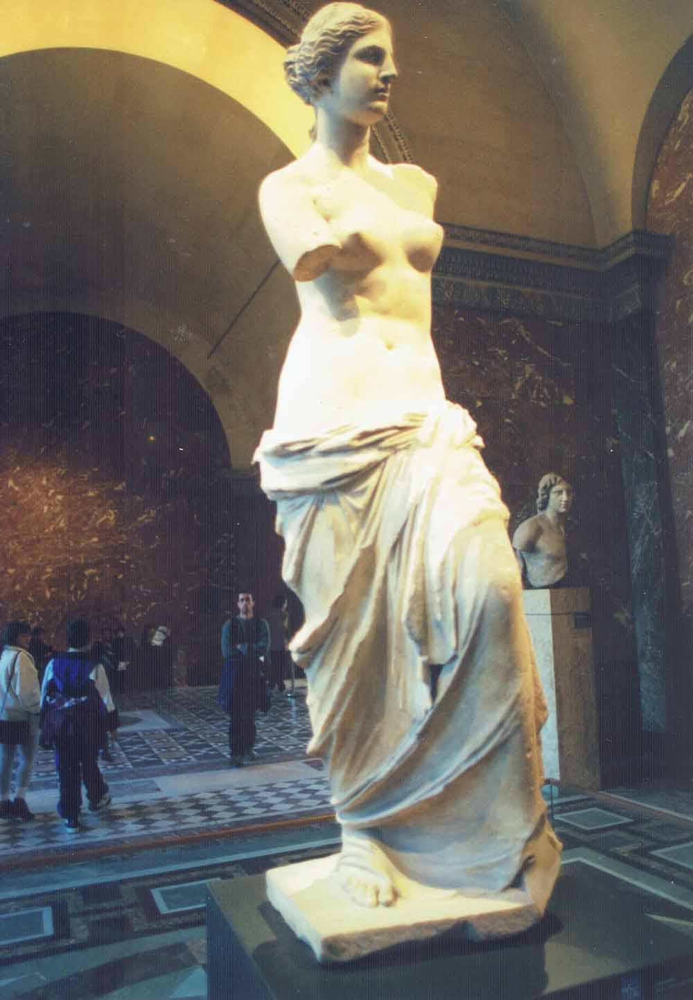{height=280}

{height=280}

### ㉝ナポレオン3世の間{#subsect33}

ナポレオン1世は革命後の混乱を収拾して、この博物館にも多大な貢献をしたと言われますが、ここには彼の甥ナポレオン3世（1808-1870）の間があります。真紅と金色でまばゆい室内装飾や家具類があり、シャンデリアが輝いています。2人はともに動乱期に栄光を得たのですが、やがて対外戦争に敗れて追放され、悲惨な最期となりました。ただここでは2人の勇壮な姿や栄華を見ることが出来るのです。

16時過ぎまでこの館を廻って最下の城砦遺跡も見てから、ここを出ます。そして地下鉄で凱旋門まで行き、商店街を覗いてから帰ってきて、宿の近くの小さい中華料理店で夕食です。安価でおいしいここのご馳走は有難いのです。食後ホテルに預けていた荷物を受け取って、リヨン駅から地下鉄で北駅に行きました。

## **Ⅵ　ドイツ**／ベルリン、ハンブルグ（11月13日〜11月16日）{#sect06 data-sect-title="Ⅵ　ドイツ／ベルリン、ハンブルグ"}

### ㉞ベルリン（Berlin）のツオー駅前{#subsect34}

パリ北駅を20時半発の列車は30分遅れて出発して、ベルリンへ向かいます。寝台車の下段に夫が、上段に私が休みます。夜半に私がトイレに行きますと、列車が急に止まりました。また寝ようとした時に、車掌が2人やって来て、尋問します。「非常弁を押したのか」と。私が上から下りる時に手探りで掴まったものが、緊急停車の弁で列車が止まったのでした。震えている私に代わって、夫は英語とドイツ語で、「妻は知らなかったのだ。罪はない」などと言い張っています。罰金を取られそうになったのですが、相手はやがてブツブツ言って帰って行きました。

13日朝、起きてみると、列車の外は真っ白な霜です。霧の中を太陽が昇ります。9時過ぎにツオー（Zoo）駅に着きました。写真中央はカイザー・ウィルヘルム記念教会です。

### ㉟ダーレム博物館（Museen Dahlem）{#subsect35}

ツォー（動物園）駅はベルリンの西南にありますが、動物園が近くにあるそうで、緑の多い町です。駅を出て、ホテル・アム・ツォー（Hotel Am Zoo）を探して人に尋ねると、すぐ近くでした。そこに行くと510号室に案内されます。明るく広い良い部屋です。そこに荷物をおいて出かけます。

宿の受付で教えられた通りに、地下鉄に乗ってダーレム駅で降り、ダーレム博物館に行きます。インド・東洋部門は閉鎖中でした。古代アメリカやアフリカの民族学資料を見て廻ります。写真は中米の飾り物やお面です。館内で食事も出来ました。後で近くの他の博物館や店などを見てから、ホテルに帰り、また外出して近くのマーケットでご飯とおかずなどを求めて、ホテルに帰って頂きました。

### ㊱ベルリン国立博物館の聖母子像{#subsect36}

14日朝8時、ホテルの食堂で朝食です。さんまの寿司、キュウリのピクルスなど、ご馳走が沢山あります。食後にバスに乗って、ポツダーマまで行き、新国立絵画館に入ります。ガラス張りの建物ですが、あまり展示品がなくて、「ゴーギャン特別展」だけが目玉でした。

次にベルリン国立博物館に行きます。この施設は非常に広く、多くの部門がありますが、未整備のところもあったようです。絵画部門を見ますと、戦災のせいか大画面がないのです。写真のラファエロ（1484-1520）の優しい美しいマリアの聖母子像が印象的でした。十字架上で、血を流しているイエスや争いごとの絵を見るのは辛いのですが、聖母や天使たちを見るとホッとします。夕方ここを出て、工事中の区域を歩いて駅を探し、やっと列車に乗って2つ目の駅で下りると、別の駅です。一少年に案内されて、別の列車で帰りました。

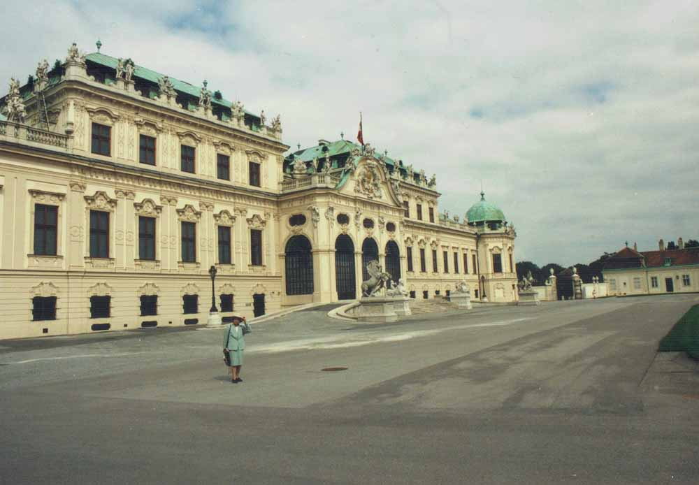

### ㊲ハンブルク（Hamburg）中央駅前{#subsect37}

15日の朝、㉞でふれたカイザー・ウィルヘム記念教会に行って見ます。第2次世界大戦で破壊されたままの姿の塔には、日曜日の今日は入れません。手前のステンドグラスのある八角形の礼拝堂を覗いて見ました。近くの博物館では日本の浮世絵（春画）などを見てから、ツオー駅12時半発の特急列車に乗ります。

15時近く、ハンブルグ中央駅に着きました。宿のマリティム・ホテル・ライヒスホーフはすぐ近くです。小さい623号室に入りました。荷物を置いてから出かけます。街の様子を少し見て、駅の売店から食料を買ってきて、夕食にしました。このドイツ第2の都市は国際的な商業都市で、近くには美術館、博物館、劇場などもあるようですが、私たちは見て廻る余裕がありません。

### ㊳ハンブルク大学（Universität Hamburg）{#subsect38}

16日朝は小雪でした。中央駅から、鉄道でダムテルに行き、ハンブルグ大学を探します。図書館で尋ねて、漸くインド・チベット文化歴史講座の建物を探し当てます。9時半にそこに着くと、シュミットハウゼン教授の部屋に通されました。そこでウェッツラ教授に再会し歓談します。フェリックス・エルプ博士に図書館に案内してもらいます。そこにはインド学関係の蔵書が多く、日本人の研究書もあり、印度学宗教学会『論集』もありました。

スリランカから留学のメッテヤ博士が、お茶を出してくれます。シュミットハウゼン教授がエリフランコ夫人プライゼンダンツ博士を連れてきました。昼食を勧められましたが、断って昼過ぎまで談話を楽しみます。学界の裏話や研究上の困難点等が話題です。帰りに教授は中央駅まで送ってくれました。宿で荷物を受け取って、同駅13時37分発の特急列車に乗りました。

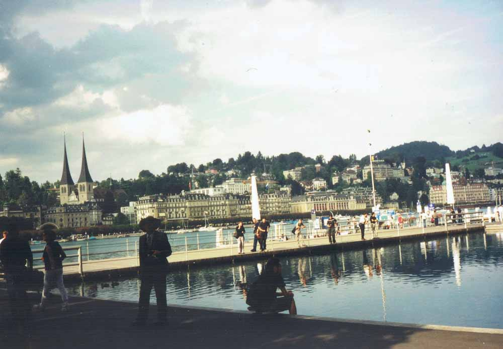

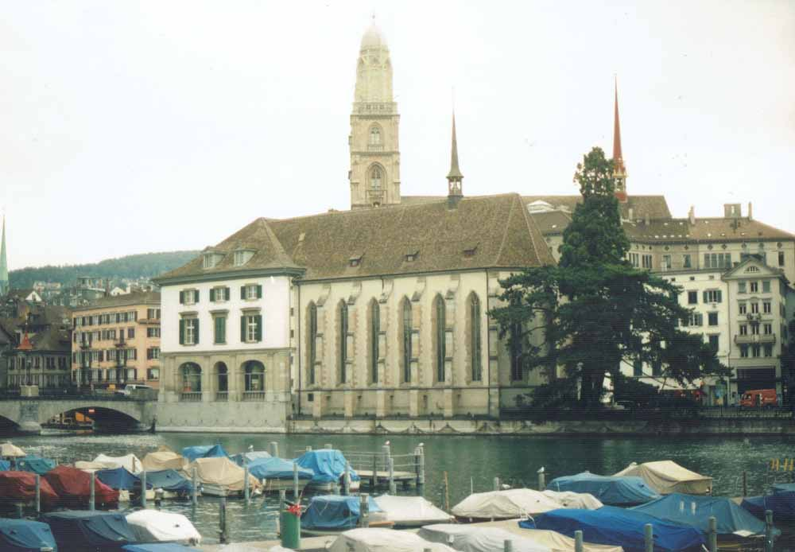

## **Ⅶ　デンマーク**／コペンハーゲン、ヘルシンゲル（11月16日〜11月18日）{#sect07 data-sect-title="Ⅶ　デンマーク／コペンハーゲン、ヘルシンゲル" .h-compress}

### ㊴コペンハーゲン（København）の街{#subsect39}

列車はデンマークの首都コペンハーゲンに向かいます。1時間たつと海が見え斜陽が美しく映えています。15時ごろプットガルデンで列車が止まりました。

列車はフェリーの船倉に入って国境の海峡を渡ります。デンマークは大小500ほどの島がある小王国で海峡が多いのです。16時頃パスポートの検査がありました。日が暮れかけています。発電用の風車が沢山見えます。

夕方の18時にコペンハーゲン中央駅に着きました。すぐ近くのラディソンSASロイヤルホテルに行きます。私たちの912号室からは、ティヴォリ公園の樹木や建物の豆電球のイルミネーションが見えます。朝になっても黄金細工のように輝いています。この写真は、翌日の朝早く、この室から東方を望んだ所です。

### ㊵ヘルシンゲル（Helsingør）港{#subsect40}

17日朝、食堂で豊かな朝食をとったあと、ホテルを出、8時50分発の北行きの列車に乗りますと、1時間ほどでヘルシンゲル港に着きました。列車から下りて見ると、写真のように大きな船に列車が入るところです。しばらく海岸を歩いていくと、尖塔や望楼が立つ城砦がある小島が見えました。それはクロンボルグ城といい、シェクスピアのハムレットの舞台だったそうですが、今は海洋博物館です。

また引き返して別の路線の列車に乗ってヘレレドへ向かいます。山も谷もない、ところどころに残雪がある、起伏の少ない農村の畑の中を走り続けます。ここの列車には犬も乗れる専用車もあって、犬づれのご婦人たちが談笑しています。途中で一等車に乗り換えて、お昼頃にコペンハーゲンに戻りました。東海岸にはアンデルセンの童話「人魚姫」にちなむ人魚の像があるそうですが行けせんでした。

### ㊶ニー・カールスベア彫刻館のニンフ像{#subsect41}

コペンハーゲン駅を東に出て歩いて行くと、左はティヴォリ公園です。少し行くと右の方にドームのある煉瓦造りの重厚な大建造物があります。これが「ニー・カールスベア彫刻館」（Ny Carlsberg Glyptotek）という博物館です。中に入ると中央の円屋根の下は椰子が茂る地中海性植物の庭です。その右の方の展示場には美しい大理石像が並んでいます。そこにこのニンフ（仙女）像もありました。デンマークのビッセン（H. W. Bissen）の1842年の作とあります。ミロのヴィーナスを美しく完成したような感じです。

奥の方にはギリシャ、ローマの大理石像が沢山あって、その夥しい数には驚きましたが、どれも破損していて完全な原形が見られないのが残念です。エジプト、中近東、エトルリヤ、イタリアなどの遺品もあります。またデンマークとフランスの近・現代の彫刻と絵画も精選されている特色ある博物館です。ビール業者カールスベアの創業者一家が収集した彫刻等と彫刻館が国に寄贈されて、19世紀末に開館されたそうです。

### ㊷デンマークの風景画家ケーブケの絵{#subsect42}

この写真はデンマークの画家ケーブケ（C. Købke, 1810-1848）の描いた、樹木のある晩秋の風景です。16時頃ここを出て近くの国立博物館（Nationalmuseet）に行きます。赤褐色のレンガ造りの塀に囲まれた5階建ての建物です。そこにはデンマーク先史から近・現代までの歴史と王家の生活・行事を示す展示品その他、人類学的・民俗学的展示品もあります。絵画は国立美術館にあるそうですが、行けません。ここは17時に閉館です。日が暮れかける中、駅周辺を歩いて帰る途中、きれいな装飾細工の店で買い物をします。この国はパーリ語研究の伝統を育て、また哲学者キェルケゴールを出した地です。

## **Ⅷ　スウェーデン**／ストックホルム、ウプサラ（11月18日〜11月20日）
{#sect08 data-sect-title="Ⅷ　スウェーデン／ストックホルム、ウプサラ"}

### ㊸ウプサラ（Uppsala）の駅前{#subsect43}

18日の朝5時に起きて支度です。今日は曇っていますが、やがて赤い朝日が昇ってきます。9時半発ヘッセルホルム行きの列車に乗りました。列車はヘルシンゲルからフェリーに入り海峡を越えてスウェーデンに渡り、昼頃ヘッセルホルムでストックホルム行きの列車に乗り換えます。15時を過ぎると日は暮れかかり、雪が降ってきます。大小の湖沼の岸辺は凍っています。ストックホルムに着いたのは16時近く、駅内で両替して翌日の船の個室を予約してから、宿のスカンヂック・ホテル・コンチネンタルに着きました。

19日朝、9時10分発北行きの列車に乗りますと40分でウプサラに到着します。この写真はその駅前の彫刻です。この古都は学問の中心地で、18世紀にはここの大学に植物学者リンネ（Carl von Linné）がおり、彼の弟子ツンベルク（C. P. Thunberg）は1775年に来日し1年余滞在して、日本を世界に紹介しました。インド学の研究者達もいます。

### ㊹ストックホルム（Stockholm）の島{#subsect44}

「北欧のヴェニス」と呼ばれるこの都は、入りくんだ湖と多くの島が橋でつながっています。11時にウプサラから帰って駅からタクシーで近代博物館に行きます。沢山の抽象画や裸踊りの映像などにはあまり興味がもてません。

東洋博物館へ行きますと、中国の絵画や陶磁器があり、日本の仏像、浮世絵、朝鮮の陶器もあります。次に橋を渡って国立博物館に行きました。この重厚な建物の1階には銅版画、2階には陶器や金銀細工、3階には19世紀までの絵画があります。主に王家の収集品というだけあって、見ごたえのある大画面の絵画が多いのです。写真はここに来る仮設橋です。向こうの左のドームの建物は、近代博物館のわきの教会です。

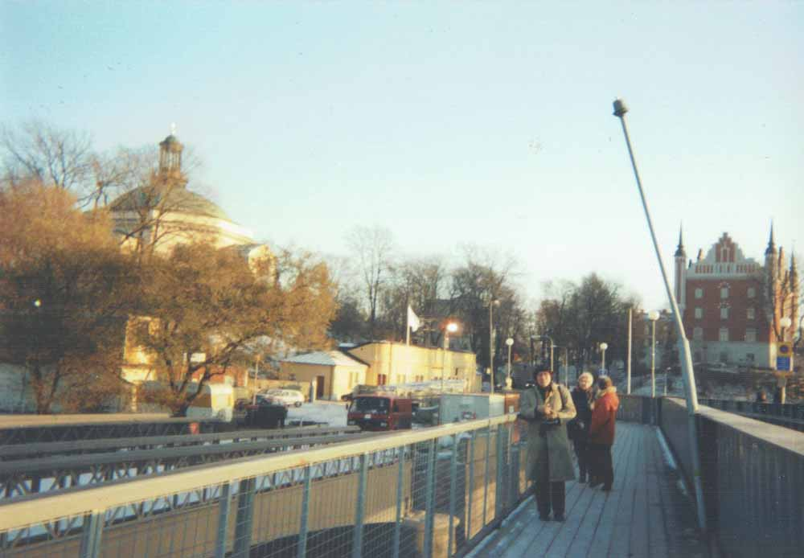

### ㊺水の都：王宮と国会議事堂{#subsect45}

この写真は東洋博物館から写した水の都の中心部です。左手は王宮（Stockholms Slott）で、その右手奥は国会議事堂、その右に遠くのクララ教会の尖塔、その手前がオペラ座のようです。国王臨席のノーベル賞の授賞式が行われる市庁舎はこの向こうにある筈です。100年間も莫大な賞金を贈呈してきたこの国の安定した政治・経済と文化の水準には敬服します。ここから歩いて帰る途中でモンゴル料理店に入って、美味しい中華料理を頂きました。

また歩き廻ってから宿に寄り荷物をもって、バスでフィンランド行きの客船の乗り場へ行きます。すぐ乗船して船底に近い2060号室に入りました。20時20分、ヴァイキング・ライン（Viking Line）のアモレラ（Amorella）号は出帆しました。10階のデッキに出て過ぎ去っていく光り輝く街の夜景を楽しんで、その下の免税店で買い物をしてから、降りて来てベッドで休みます。

## **Ⅸ　フィンランド**／ヘルシンキ（11月20日〜11月21日）{#sect09 data-sect-title="Ⅸ　フィンランド／ヘルシンキ"}

### ㊻ヘルシンキ（Helsinki）の港の朝{#subsect46}

翌20日5時、バルト海を渡って船はトルク港に着きます。港からトルクの駅への列車があるというのに、1時間の時差があるのを忘れて列車を逃がしたので、バスを乗り継いでトルク駅へ行きました。景色が見たいと、列車に乗って、霧氷に覆われた木々の散在する雪原を見ながら150キロメートル北のタンペレに着きます。すぐ乗り換えてヘルシンキに着くと14時です。前に泊まったホテルに戻りました。

21日の朝早く、歩いてマーケット広場へ向かいます。寒いです。真っ黒な雲を真っ赤に染めて朝日が昇るところで、光が射したかと思うと、また黒雲に覆われます。目の前の港に昨日乗ったような客船（シリヤ・ラインの船）が入ってきました。この写真はその光景です。

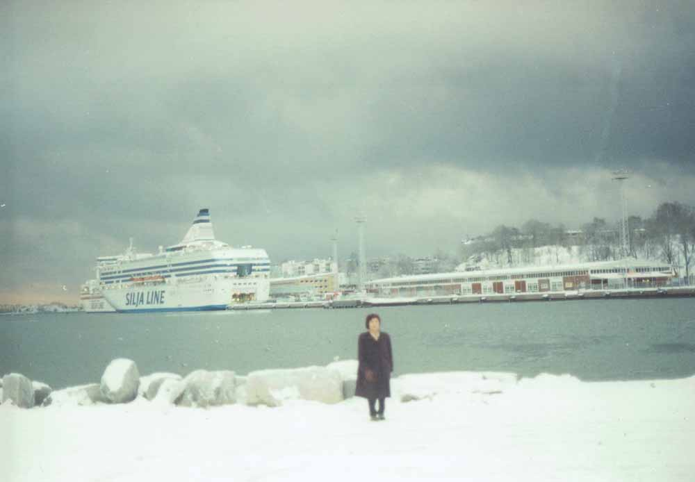

### ㊼ウスペンスキ聖堂（Uspenskin katedraali）{#subsect47}

マーケット広場では、毛皮や木製品や食べ物などを売っています。木のしゃもじと{箆|へら}を買いました。その先の岬の丘には赤レンガ造りの教会があって、青い屋根に金色の尖塔が見えます。これがロシア正教会のウスペンスキ聖堂で1868年に完成したそうです。

その前を左折して行くとまた海です。海岸は凍っています。左の方に西に進んで行きますと、右の高台に白亜の外壁と青いドームが見えます。それはルーテル派の総本山ヘルシンキ大聖堂（Helsingin Tuomiokirkko）です。さらに行くと駅前に出ます。左方に私どものホテルがありました。そのうち雪も融けてきます。

### ㊽国立博物館と国会議事堂（Eduskuntatalo）{#subsect48}

ホテルを引きあげて荷物だけ預けてから、今度は北の方に向かいます。この写真の手前左が国会議事堂で、右側の奥に国立博物館が見えます。1902年に建てられたという重厚な建物の展望塔が{聳|そび}えています。博物館は、残念ながら改修工事中で休館でした。駅に近い現代美術館に行きますと、まことに奇妙な展示と映像に出会います。

13時半頃に帰ってきて、ホテルの建物のデパート部（1〜5階）を覗いてみます。もうクリスマスの商品がいっぱいです。ホテルで荷物を受け取って、その向かいからリムジンバスで空港に向かいます。

成田行きのフィンランド航空AY073便は16時5分に離陸しました。あっという間に暗くなります。機内では、日本から団体旅行でオーロラを見に行ったのに見えなかった、という添乗員と客達が、北の空を覗いています。私達も夜空を見つめましたが、分りません。少しは眠ったかと思うと、間もなく翌朝の暁光がさしてきます。成田空港に着いたのは10時すぎでした。

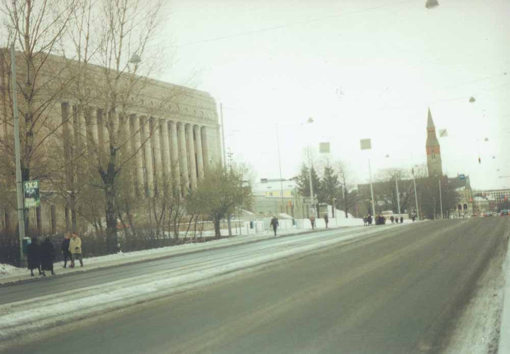

## おわりに {.chap-afterword}

この旅行の時は、もうヨーロッパに行くこともないかも知れない、と思って廻った26日間でした。ところがその翌年にも、スイスの学会に出て、ギリシャ、イタリア、ハンガリー、オーストリアにも旅することになったのです。

ヨーロッパを旅して思うことは、先ず建物の規模の大きいことと、古い建造物も多く、改築を繰り返しながらも立派に保存されていることです。特に、どこでも博物館や美術館のスケールが大きいことには感嘆します。

それから、キリスト教中心の美術は、マリア像を除けば、十字架上の処刑をはじめ、怒りと争いの場面が、強烈に訴えてきます。また中世に多く作られた聖職者の肖像画は、おしなべて同じ硬い表情をしています。私たちは、柔和で尊厳のある仏（如来）像や優しい観音像には、むしろ親しみと安らぎを覚えます。仏教の高僧や信者の肖像の多くも穏やかな表情です。{尤|もっと}も地獄絵は恐ろしいですが、だからひとは仏道に向かい、仁王様のように力強く努力して最後に如来様のように柔和になるのだそうです。

一昨年のアメリカでの同時多発テロ、アフガニスタン戦争、そしてイラク戦争と、世界は緊張状態になり、旅行も安心ではありません。諸大国が人類を全滅させるのに十分な核兵器を所持している現代は、その危機の直前にあるのか、と空恐ろしくなります。その危機を遠ざけるにも、せめて殺さない・怒らない・憎まない心を養いたいものです。

旅行の記憶やメモも確かではなく、写真もわるいし、資料類も不足です。思い違いや見落としもあるかも知れません。私がパソコンで作った文章は、夫が補正し加除してから、ふたりで調整しました。

平成16（2004）年1月20日

