

<h1 class="chapter" id="chap04" data-chap-title="四　タイ、ミャンマー、インドの旅">
  四
タイ、ミャンマー、インドの旅
  平成14（2002）年12月6日〜12月31日
</h1>

## はじめに {.chap-foreword data-sect-title="はじめに"}

平成14年7月に夫が学会に出席するため一緒に韓国（ソウル）に行き、8月から9月にかけては旅行社のシルクロード・ツアーの一行に参加しました。そして12月にタイのバンコクで国際仏教学会（IABS）があるので、かねての念願であった仏跡をたずねてタイとミャンマー（ビルマ）を巡り、更にインドまで行きました。その時の記憶を辿ってみます。パソコン入力は主に私（妻）がしました。

平成15（2003）年2月20日　70歳の春　村上真完・ヤエ

## もくじ {.chap-toc}

<nav>

- [**はじめに**](#はじめに)
- [**Ⅰ　タイ（シャム）（12月6日〜16日、30日）**](#sect01)
    - [①寺院ワット・プラケオ](#subsect01)
    - [②ワット・プラケオの諸塔](#subsect02)
    - [③ワット・ポーの巨大な涅槃仏](#subsect03)
    - [④ワット・アルンの仏塔](#subsect04)
    - [⑤アユタヤーの仏](#subsect05)
    - [⑥アユタヤーの仏塔](#subsect06)
    - [⑦タイ族最初の国スコータイのワット・マハート](#subsect07)
    - [⑧スコータイの仏様](#subsect08)
    - [⑨ナコーン・パトム（Nakhon Pathom）の大塔](#subsect09)
    - [⑩ナコーン・パトムの古い仏様](#subsect10)
- [**Ⅱ　ミャンマー（ビルマ）（12月16日〜22日）**](#sect02)
    - [⑪ヤンゴン（ラングーン）の寝ている仏様](#subsect11)
    - [⑫シュエダゴン・パゴダ （Shwe Dagon Pagoda）](#subsect12)
    - [⑬シュエダゴン・パゴダの仏様](#subsect13)
    - [⑭マンダレーのお寺](#subsect14)
    - [⑮マハー・ムニ・パゴダ（Maha Muni Pagoda）](#subsect15)
    - [⑯マンダレー丘上の大パゴダ](#subsect16)
    - [⑰アマラプラの仏様](#subsect17)
    - [⑱ウー・ベイン橋 ](#subsect18)
    - [⑲インワの遺跡の仏様](#subsect19)
    - [⑳サガイの大パゴダ（塔）](#subsect20)
    - [㉑サガイン丘のウーミントンゼー・パゴダ](#subsect21)
    - [㉒サン・ウーポンニャーシン・パゴダ](#subsect22)
    - [㉓パガンの大寺院](#subsect23)
    - [㉔ナツラアウン寺](#subsect24)
    - [㉕ジャポン寺の本尊様](#subsect25)
    - [㉖パガンの夕暮れ](#subsect26)
    - [㉗ポッパ（Popa）山のタウン・カラッ](#subsect27)
    - [㉘岩山の頂上の小仏塔](#subsect28)
- [**Ⅲ　インド（12月22日〜29日）**](#sect03)
    - [㉙ベナレスの沐浴河岸](#subsect29)
    - [㉚初転法輪の地サールナート](#subsect30)
    - [㉛釈迦入滅の地クシナガラ](#subsect31)
    - [㉜クシナガラの涅槃堂](#subsect32)
    - [㉝商都ヴァイシャーリーの跡](#subsect33)
    - [㉞ナーランダーの遺跡](#subsect34)
    - [㉟霊鷲山（グリドラクータ）](#subsect35)
    - [㊱霊鷲山の頂上の下の岩窟](#subsect36)
    - [㊲仏成道の地ブッダ・ガヤー](#subsect37)
    - [㊳ブッダ・ガヤー大塔の仏様](#subsect38)
    - [㊴ブッダ・ガヤーの仏龕のついた小仏塔](#subsect39)
    - [㊵カルカッタ（コルカタ）の店主サンカルサ氏](#subsect40)
- [**おわりに**](#おわりに)

</nav>

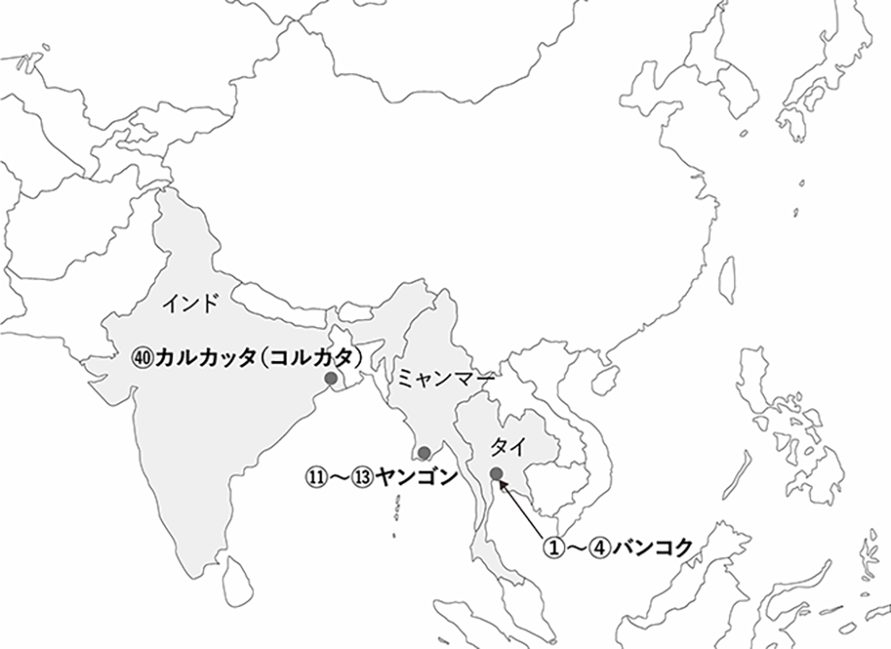{width=100%}

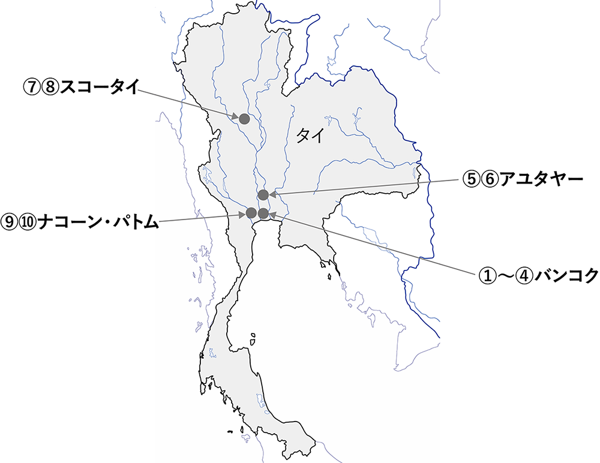{width=86%}

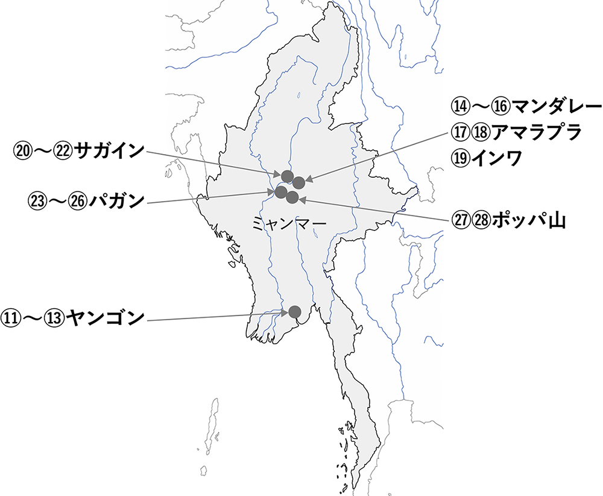{width=80%}

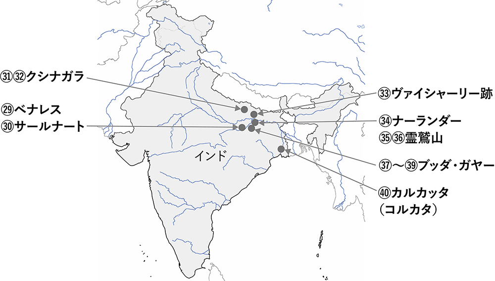{width=100%}

## **Ⅰ　タイ（シャム）**（12月6日〜16日、30日） {#sect01 .break-verso data-sect-title="Ⅰ　タイ（シャム）"}

### ①寺院ワット・プラケオ{#subsect01}

平成14（2002）年12月6日、成田からタイ航空（TG641便）で6時間飛行してタイのドンムアン空港に着きました。ここからタクシーで首都バンコクに向かいます。市内は大変な渋滞で、やっとチュラロンコン大学構内のササ・インタナショナル・ハウスに着きました。大変暑い。でもここの宿の部屋は冷房も効くし、照明も十分で、仙台の自宅よりも快適です。

翌7日朝、タクシーで先ず行った所が、王宮とともにある寺院ワット・プラケオです。18世紀末（1782年）、現王朝を創めたチャオプラヤー・チャクリ王（ラーマ1世）が都をバンコクに定めたときに建立し、代々保護してきたお寺で、この黄金の仏塔は、遠くからもよく見えます。塔の後に見えるのが本堂で、グリーンのエメラルド仏（高さ66センチ）が高い基壇に安置されています。この本尊様は季節ごとに衣が替えられ、12月には、金の衣を着ています。

### ②ワット・プラケオの諸塔{#subsect02}

仏教国タイには、実に多くのワット（寺院）があり、塔の形も、色々です。ここでも様々な種類の仏塔が見られます。先が細く尖っているものが多いのですが、ごつごつしたトウモロコシ状の塔もあります。また敷地内にアンコール・ワットの模型まであります。廻廊にはラーマーヤナを描いた壁画が続いています。タイの人々は、よくお寺参りをして、お供え物やお賽銭をあげ、熱心に仏様を拝んでいます。もちろん外国人の観光客も多く、食堂やおみやげ屋もあります。博物館では王宮寺院の歴史を偲びました。

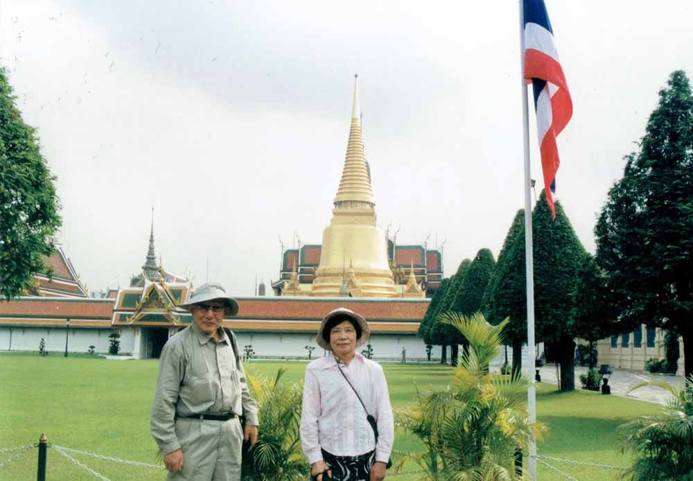

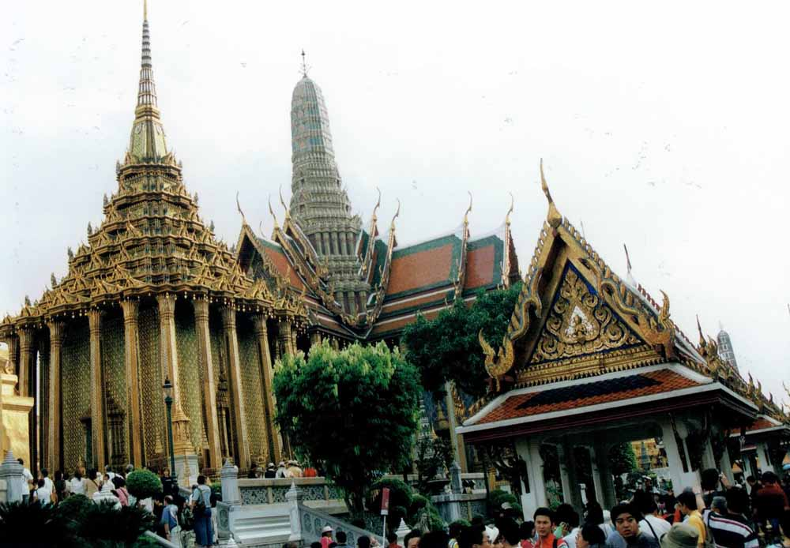

### ③ワット・ポーの巨大な涅槃仏{#subsect03}

バンコクで、最も古く、大きいワット・ポーは、{涅|ね}{槃|はん}{仏|ぶつ}（釈尊入滅の姿を現した仏像）で有名です。ワット・プラケオの隣りにあります。涅槃仏は建物いっぱいに納まっていますが、長さ46メートル、高さ15メートルの仏像は金色に輝いています。足の裏にも、細い線で{須|す}{彌|み}{山|せん}世界や法輪、インドの神々などがビッシリ描かれています。

日本では涅槃仏は横たわって目を閉じていますが、タイやミャンマーの涅槃仏は目をパッチリと開いていて魅力的です。これは入滅して（死んで）しまった仏の姿ではないようです。右の写真は2日後の9日夜、船に乗って国際仏教学会（IABS）の皆さんと一緒に再訪した時のものです。若い2人の修行僧が仏前で、美声でヴェッサンタラ{本|ほん}{生|じょう}{話|わ}（釈尊の前世の善行を集めた説話集）の朗詠をするのに聴き入りました。

### ④ワット・アルンの仏塔{#subsect04}

ワット・ポーを出てマーケットを通りチャオプラヤ河岸にでると、川向こうに見えるのが、この塔です。2バーツ（約2.5円）を出して小船に乗ると、4、5分でお寺の前に着きます。この写真は手前の川を渡る船の上から撮りました。この79メートルの塔は高くそびえ、それをとりまく小塔が4基建っています。表面には色彩豊かな陶器の細片が埋め込まれています。塔の基部に上って{右|う}{繞|にょう}（右回りに回る礼）します。

このお寺の表に出て、幌付のオート三輪車（トゥクトゥク、リキシャ）に乗りました。大橋を渡って渋滞の市街に入ると、運転手は道がわからなくなり、仲間の車に乗り換えさせられ、あちこち廻って、やっと宿の近くのMBKという大百貨店に着きます。

この2日後の9日の夜に、船に乗って行く途中、照明を受けて金色に輝くこの塔を、また再び眺めました。

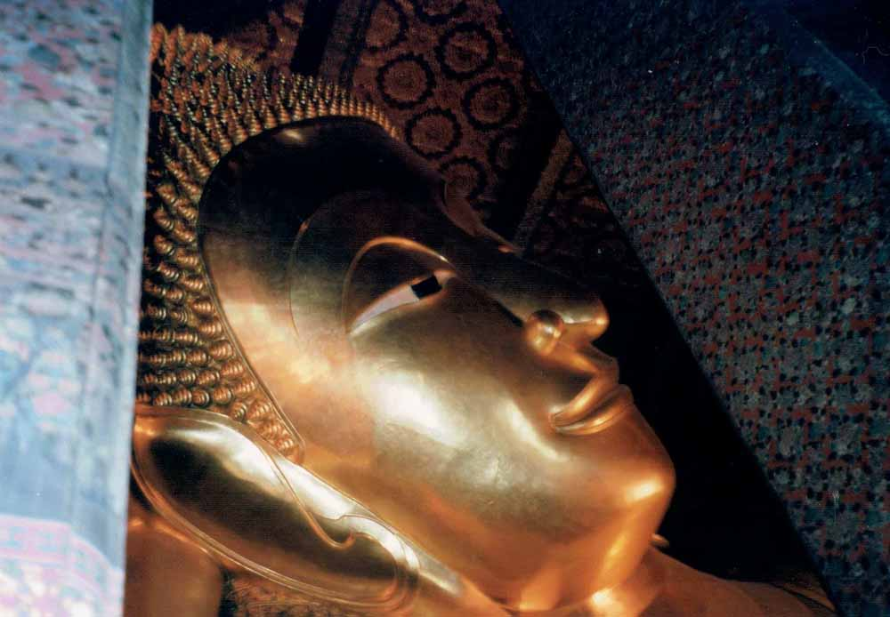

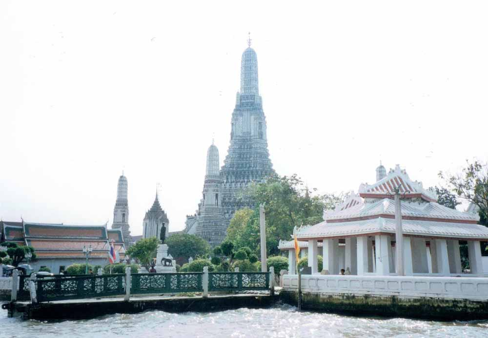

### ⑤アユタヤーの仏{#subsect05}

12月11日、学会3日目の午後は、アユタヤー遺跡めぐりのツアーです。バンコクからバスで1時間の所（80キロメートル）にあるアユタヤーは、14世紀から400年余り続いた後にビルマとの戦争で破壊された古都です。まず世界文化遺産となっている王宮跡と寺院跡をまわります。次に行ったのは王宮の旧火葬場というワット・ナー・プラメーン（Wat Na Pramaen）です。ここは戦禍を免れ後代に建て直されたといいます。大きな本堂には、金色の大仏が座っておられます。またタイの古い時代（ドゥヴァーラヴァティ、DvāAravatī）の様式の、下膨れの柔和なお顔の仏像もあります。

右の写真の石仏は本堂の前の高い基壇の小さいお堂にありました。高さ3メートル、高く黒っぽく光っています。金箔もあちこちに貼られています。つぎに訪ねたワット・パナン・チューン（Wat Phanan Choeng）には、大殿内に高さ19メートルの金色の坐仏像があります。

### ⑥アユタヤーの仏塔{#subsect06}

最後に行ったのが川の畔のワット・チャイワッタナラーム（Wat Chai watthanaram）の遺跡です。夕日をあびる古塔を背景にしてパチリ。中央がスイスのクリスティナ女史（Prof. Dr. Cristina Scherrer-Schaub）、右端がニュージーランドのハリソン氏（Prof. Dr. Paul Harrison）です。クリスティナさんとご一緒するのは3度目です。ハリソンさんには、10日後にバンコク空港でまた会うことになります。またバスで移動して川端のレストランに入り、みんなで一緒に食事をして、20時にバスに乗り22時にチュラロンコン大学前に着きました。

学会最後の13日夜は、タイ王室のプリンセス主催の晩餐会です。ご馳走も飲み物も沢山あり、民族舞踊もあって、皆との会食は楽しく、名残を惜しんで別れて帰りました。

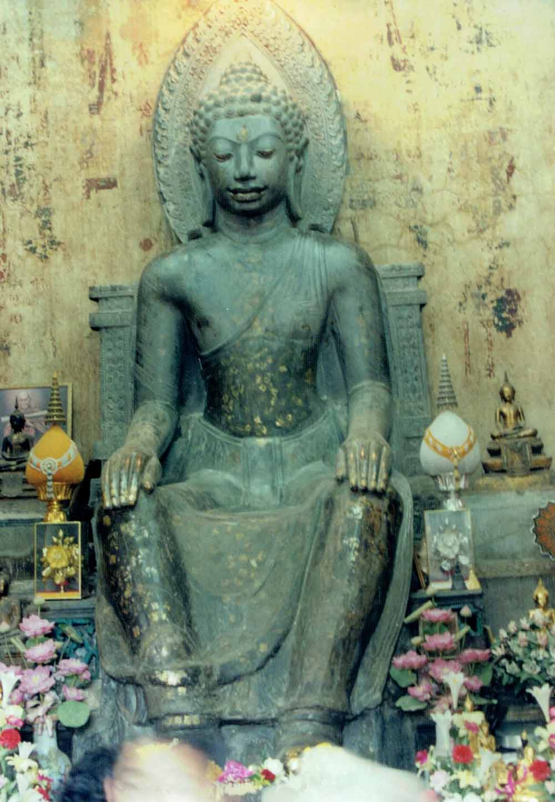{height=310}

{height=310}

### ⑦タイ族最初の国スコータイのワット・マハート{#subsect07}

14日からは自由な2人旅です。朝5時に起きて、高架電車とタクシーを乗り継いで北バス・ターミナルから、7時40分発のバスに乗ります。広大な平原を北上して14時50分にスコータイ（Sukhothai）のターミナルに着きました。そこで会った客引きのおばさんに連れられ、いったん町の宿に荷物をおいてから、炎天の中、傘をさしてバス停に向かって歩き始めました。と、リキシャの運転手が誘ってくれたので、それに乗って行きますと、30分で遺跡の仏塔が見えてきました。タイ族初のスコータイ王国は、13世紀に興り14世紀末にアユタヤーに併呑されて滅んだといいます。

先ず城壁内に向かい、高い塔や露坐の仏像や、崩壊した建造物のある一画に入ります。右の写真は王室寺院ワット・マハタートです。次に南のトウモロコシ形の3つの塔から成るワット・シー・サワイでは多くの竜や天部の彫像を仰ぎ見ます。北の池の島に塔のあるワット・サ・シーでは、軽やかに歩く姿の仏様を拝みました。

### ⑧スコータイの仏様{#subsect08}

城壁外に出て行くとワット・シー・チュム（Wat Sri Chum）の大仏像が見えます。これは両側のレンガの壁の間いっぱいに納まっており、下向きの表情が柔和で女性的です。その右奥には、崩れたお堂に威厳がある坐仏像、左奥には高い塔があります。ここの遺跡はアユタヤー遺跡より古いが保存は良いのです。仏像は雨ざらしで殆どが黒ずんでいます。最後に城壁入口前のワット・トラバン・トーンタ寺を訪ねて読経を聞き、残照をうけて帰りました。市場で果物やご飯を買って宿に着くと18時です。宿で求めたビールと玉子に、持ってきた海苔、梅干、干物、味噌、醤油などがご馳走です。翌15日はバスで7時間かけてバンコクに帰りました。

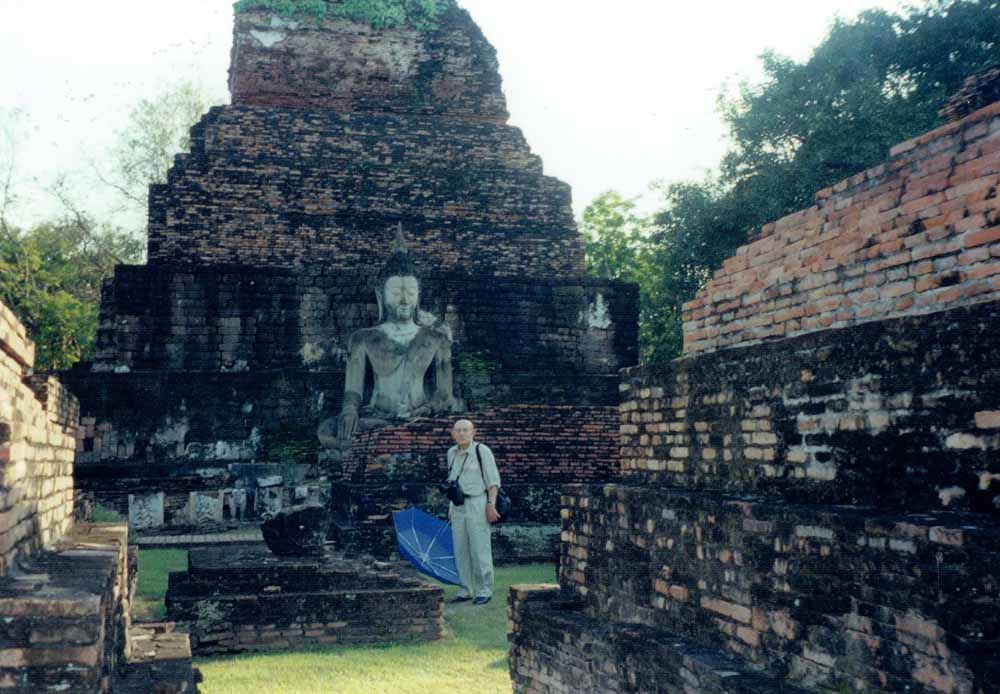

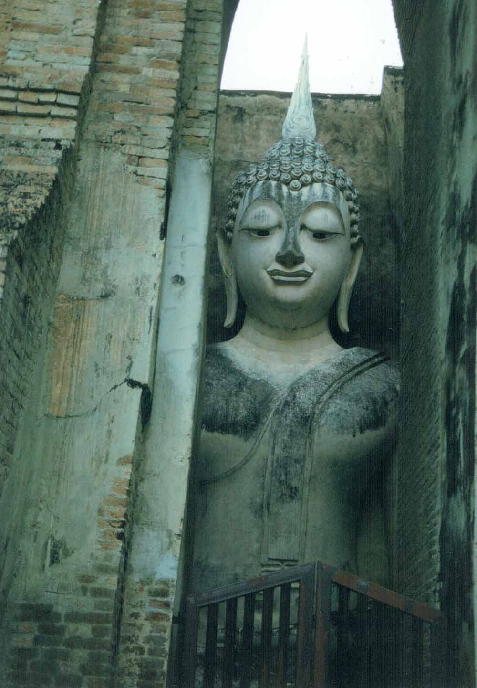{height=310}

### ⑨ナコーン・パトムの大塔{#subsect09}

バンコクの西から50余キロメートル離れたこの町は、タイで一番古い（6世紀〜7世紀頃）ドヴァーラヴァティー王国の都といいます。私達がここを訪れたのは、実はインドからタイ経由で日本に帰る30日でしたが、タイ観光の最後としてここに挿入させて頂きました。29日インドからバンコクに戻って翌30日、夕方の成田行きの飛行機を待つ間ナコーンパトムに行こうと、朝早くタクシーを呼んでもらって出かけます。1時間走ると前方に大きな塔が見えてきました。これが世界一高いという仏塔プラ・パトム・チェデイ（Pra Pathom Chedi）です。伝説では紀元前3世紀にアショーカ王の命によって建てられた塔がこの基礎にあるといいます。19世紀に現在形に増改修されたという大塔は、高さ120メートル余、レンガ色のタイルに輝く釣鐘形の基部の上に尖塔が高く聳えています。周りの回廊の外側には、百余の{仏龕|ぶつがん}（仏像を入れる厨子）にいろいろな仏像が安置されています。

参道の門に面する東西南北の四方には大きな仏堂があり、多くの人がお参りに来ます。大塔の基壇の端の方に幾つかある小石塔の下に洞窟が掘られていて、あちこちに金色の仏像が安置され、{布|ほ}{袋|てい}様もあります。坊さんが居て、私が仏様に紙幣を捧げると、頭に水を振りかけ、手首に幸福を呼ぶという赤い紐を巻いてくれました。

### ⑩ナコーン・パトムの古い仏様{#subsect10}

大塔のすぐ近くに博物館があり、そこにはこの辺りで古く栄えた王国の遺品や仏像や種々の貨幣が展示されています。右の写真は、その中の古いドヴァーラヴァティー様式の下ぶくれのお顔の仏様です。大塔をゆっくり廻っていると、夫は女の子ら（15歳とか）にとり囲まれて、タイについての感想を求められるままに、差し出された用紙に英語で書いてあげます。その後彼女たちは私達の写真も撮ってくれました。

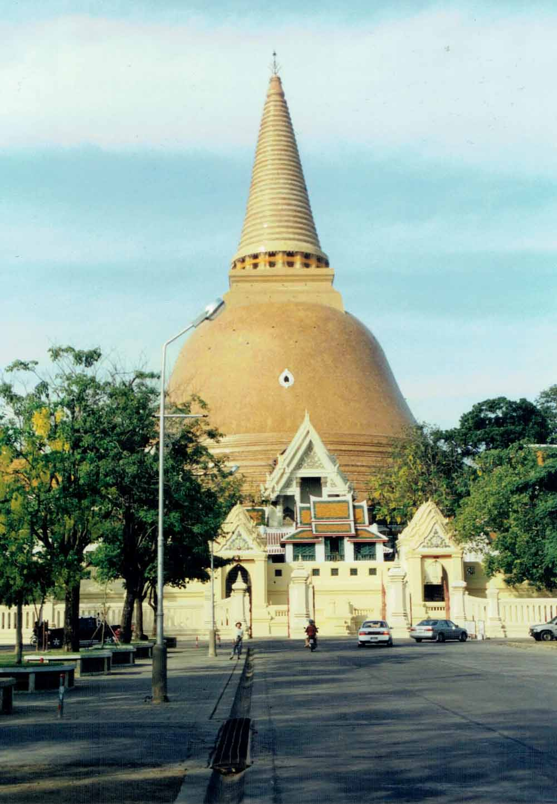

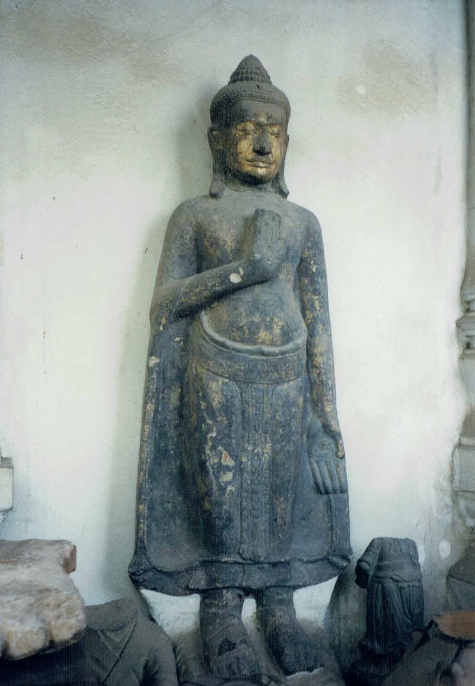{height=310}

## **Ⅱ　ミャンマー（ビルマ）**（12月16日〜22日） {#sect02 data-sect-title="Ⅱ　ミャンマー（ビルマ）"}

### ⑪ヤンゴン（ラングーン）の寝ている仏様{#subsect11}

今度はミャンマーの旅です。16日朝、バンコクからタイ航空で1時間、ミャンマーの首都ヤンゴンの空港に着きました。旅行社のマウン（Maung Hnit）さんが日本語のできる社員ハンリ（Han Li Aung）さんと運転手をつれて迎えに来ていました。13日の晩餐会で会った原田正美さんが手配してくれていたのです。早速ユザナ・ホテルに行きます。

9階の部屋に荷物を置いてから、車で出かけて、まず案内された所がこのお寺（チャウッタージ・パゴダ、Chauck Htat Gyee Pagoda）でした。ここには巨大な寝ているお釈迦様がまつられています。全長70メートル、高さ17メートルの金色の衣を着けた仏様は目を大きく開いています。足の裏には、仏教の宇宙観が示されています。この仏像は英軍によって破壊された後、近年復興されたそうです。建物は鉄骨に波トタンが載っているだけであり、床も外も同じ地面です。

### ⑫シュエダゴン・パゴダ{#subsect12}

マウンさんの食堂で昼食をとった後、ハンリさんに案内されて市内のスーリ（Sule）・パゴダなどを廻って郊外に出ますと、小高い丘にこの塔が夕日に映えて金色に輝いて見えます。この塔は高さ99.4メートル、基部の円周が433メートルとか。尖塔の上には多くの宝石がちりばめられているそうです。

4つある参道の中の南門から入りますと、階段が長く続いて、沢山のお店が並んでいます。でも私達は階段を登らずに、5ドルの入場券を買い、裸足になって右脇のエレベーターに乗って60メートルの丘の上の広いタイル張りの方形の境内に出ます。そこには大きな菩提樹や、大小60余りの堂塔があり、どこにも仏様が安置されて、人々が拝んでいます。この塔の起源は古く、原型は15世紀に完成されたそうです。

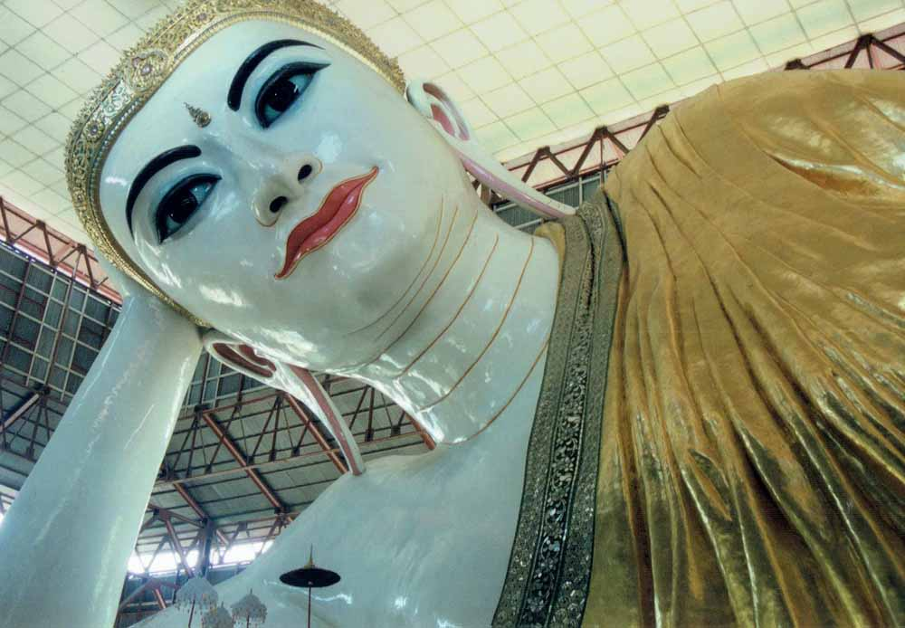

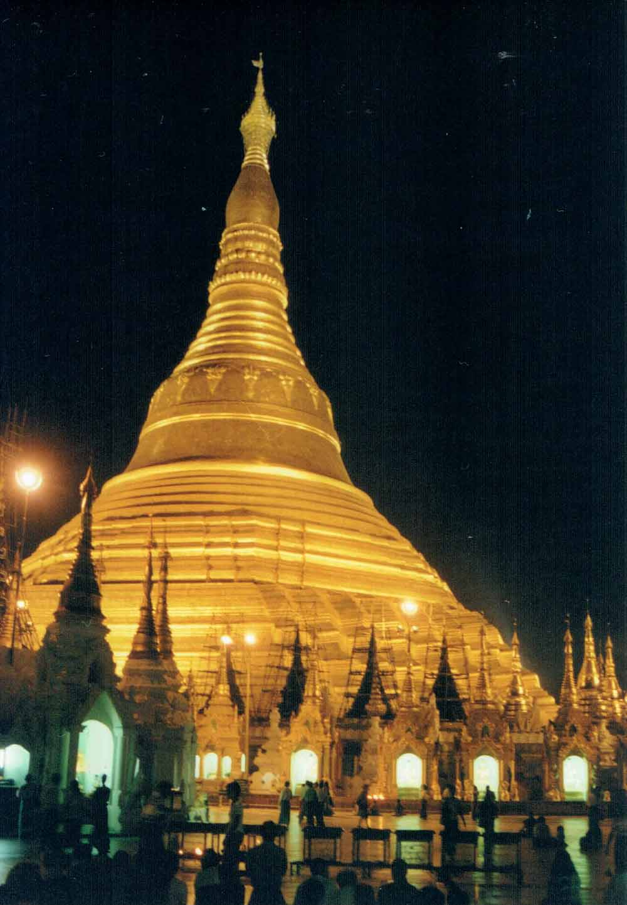{height=310}

### ⑬シュエダゴン・パゴダの仏様{#subsect13}

この塔を廻っているうち、夕日が空を染めて沈み、満月が出てくるころ、堂塔には四方から照明があてられます。どのお堂の中にも、大小さまざまな仏様が、所狭しと並んで見事です。ミャンマーの仏像は、タイの仏と違って頭が尖っていず、丸く、柔和な表情をしています。2つの大きな釣鐘があります。24トンの鐘と42トンの鐘です。前者はイギリスに運ばれる時に海に落ちたのを、後でビルマ人達が力を合わせて引揚げ、ここに据えたといいます。その時の情景を描いた絵も飾ってあります。この写真で私が胸につけている花は、この朝タイ航空から頂いたランの生花です。

マウンさんの食堂で夕食をとった後、19時半ホテルの933号室に帰りました。大きな窓からは金色のシュエダゴン・パゴダがよく見えます。その夜は仏塔に守られて休みました。

### ⑭マンダレーのお寺{#subsect14}

17日朝ヤンゴン空港からエア・マンダレー（6T403便）で、ミャンマー第2の都市マンダレーに飛びました。8時半過ぎ空港に降りると、英語で声をかけて来たカイン（Khaing）さんが、120ドルで19日朝まで観光案内しますと誘います。彼の用意した車で市内に向かい、1時間でユニバース・ホテルに着き、部屋を取ってから、市の南に向かいます。

先ず行った所が古びた黒ずくめのお寺シュエインピン・モナステリー（Sywe In-Pin Monastery）です。木彫りの装飾がきれいです。19世紀末、裕福な中国のヒスイ商人が寄進した、チーク材で造った僧院といいます。

ここには、1人の老僧がいて、パーリ語の論書 Dhatukathāとその注釈書をひろげていました。夫は興味深く見て、彼に話しかけましたが、相手は英語がわかりません。

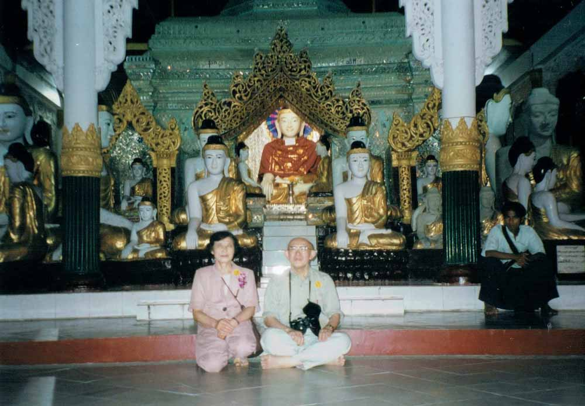

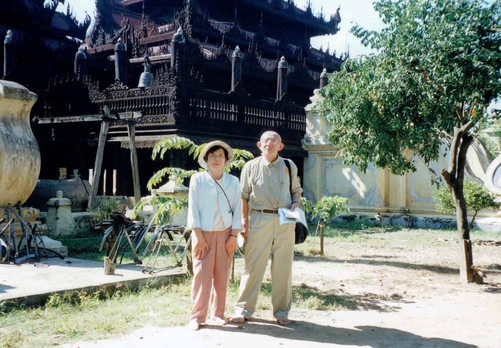

### ⑮マハー・ムニ・パゴダ{#subsect15}

更に南に進むと右写真のお寺です。床と柱等の下部は{臙|えん}{脂|じ}色ですが、その上は柱も天井も、大きい坐仏像も金色です。この本尊様には、男達が金箔を貼るために、台座に上っています。脇のお堂ではアユタヤーから捕獲したという獅子や人の青銅像を人々が撫でています。自分の患部と像の同じ部位を撫でると病気が治るというのです。次に近くの大理石工房に行き、大小の大理石像を見ましたが、小石片を求めます。鋳物工場を見てから、ホテルに帰って昼食をとりました。午後は、正方形の濠と城壁に囲まれたマンダレー城内に入り、大戦末に焼失し近年再建された宮殿や博物館を巡ります。

マンダレーは1857年からイギリスに占領されるまで、25年間の王都です。ミンドン王が仏教を大いに支持したので、塔寺が多いそうです。

高床式3層のシュエナンドー（Shwenandaw）寺や、世界一大きな本（パーリ全三蔵の石碑1,458面）のあるクドードォ（Kuthodaw Pagoda）寺を急いで見てから、北に向かいました。

### ⑯マンダレー丘上の大パゴダ{#subsect16}

旧王宮の北北東にあるこの丘は標高236メートル。南の正門から丘の上にある大きいパゴダまで、屋根つきの長い参道が続いています。しかし私達は車で途中まで行き、東からエスカレーターで上りました。そこは四角形の、タイルを敷詰めた境内で、中央の大塔を囲んで大伽藍があり、4体の金色の大仏像をはじめ沢山の仏様が安置されています。麓から4つの参道があり、参詣者が絶えません。

その日は、ちょうど踊り子たちを囲んで、ビデオ撮影が行われていました。夕日をあびるモデルたちです。眺望を楽しみながら日が没するのをずっと眺めて、17時半過ぎにエレベーターに乗って下り、それから車で山を下りて、宿に帰りました。

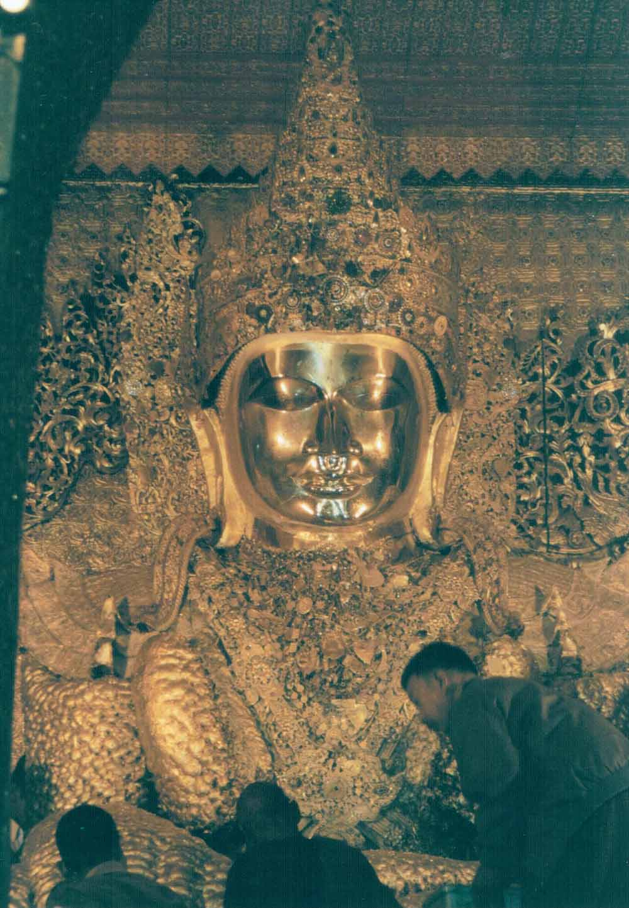{height=310}

### ⑰アマラプラの仏様{#subsect17}

18日は朝早く起きてレストランで食事を終えると、もうカインさんが迎えに来ていました。この日は一日中マンダレーの南の古都をめぐります。市内から南の郊外に出て、草深い、また木々の多い所を通っていくと、古ぼけた白い仏塔群が見えて来ます。そこがアマラプラの古都の跡です。

ここはマンダレー城の南10キロメートルほど、都がマンダレーに移る前の王都といいます。いくつかのお寺を回って見ます。タウメンジーというお寺の塔門を入り、裸足になって屋根のある参道を登っていきますと、高さ11メートルの肌色の大仏坐像が私どもを見下ろします。写真はその近くの仏様です。白いお肌に朱色の衣をまとって座っています。ここでは、お釈迦様はこの様な姿で表わされています。特徴的な右手（降魔印）の指が長く見えるのは写真のせいでしょう。

### ⑱ウー・ベイン橋{#subsect18}

150年前に都がインワからアマラプラへ移った時、ウー・ベイン市長は、さびれた旧王宮のチーク材を運んで、タウンタマン湖を渡るため1.2キロメートルの橋をかけたといいます。この橋を多くの人が渡ります。{放|ほう}{生|じょう}（功徳のために生き物を逃がしてやること）用の小鳥を売る女が寄ってきます。僧院で英語を習ったという娘から帽子を買いました（⑳）。私の首飾りは、腕輪とともに⑰のお寺で女の子から買った木の実細工です。橋の近くのマハー・ガンダーヨン（Maha Gandhayon Kyaun）僧院では、1,000人近い若い修行僧が生活し、パーリ語などを学んでいます。10歳までの子供は白い衣、11歳以上は赤褐色の衣を着ています。

10時20分、鐘の合図で、皆大きな黒い鉢を持って揃って食堂に集まり食事を始めます。白亜の清潔な学堂もありますが、近くの調理場には肉類などが散在し、臭いのです。

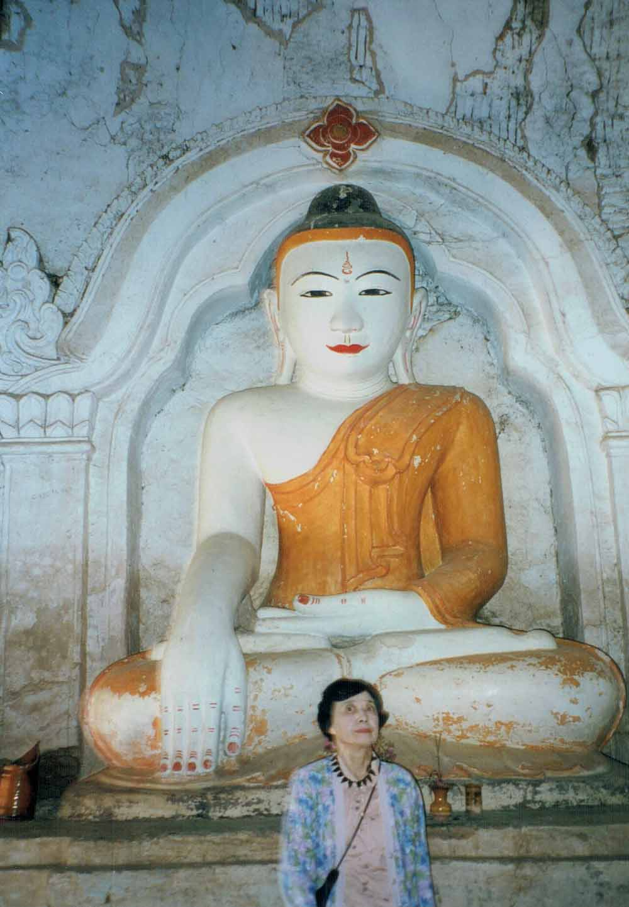{height=310}

### ⑲インワの遺跡の仏様{#subsect19}

10時45分にアマラプラを発ち南西に進むと、エーヤワディ川（Ayeyarwaddy，Irrawaddy）の支流ミンツゲー（Myitnge）川の崖にぶつかります。ここから船で対岸に渡り、船着場から馬車に乗って草木の茂るデコボコ道を行くと、インワの城壁の跡があり、あちこちに木立の間に金色のパゴダや白い塔寺などが見えました。崩れたレンガの遺跡と仏像を見ます。僅かに19世紀初めの建立というレンガ造りのマハーアウンミェ（Maha Aungmye）寺だけは立派です。

インワは14世紀中頃に都となってから、中断を交えながらも400年間の王都でしたが、19世紀初アマラプラへ都が移ってから荒廃したといいます。

右写真は風雨に晒された坐仏像で、近くにレンガの仏塔の跡もあります。この大木の下で、カインさんは茸を採りました。

### ⑳サガインの大パゴダ（塔）{#subsect20}

馬車から降りて、また船で川を渡り、もと来た道に戻ってから、大鉄橋（Ava Bridge）を渡ってサガインに入ります。古城壁を入って間もなくレストランに入り昼食です。さっきの茸が野菜炒めに入って、美味しいご馳走になりました。サガインは1364年インワに遷都される前の王都で、19世紀にも数年間王都となりますが、15世紀来の仏教の一大中心地です。多くの立派な仏塔や仏寺が処処にあります。

このカウンムード・パゴダ（Kaungmudaw Pagoda）は、高さ67メートル、直径57メートルの巨大な半球型です。最も美しい王妃のおっぱいが、このモデルとか？　写真の私の帽子は、ウー・ベイン橋で出会った英語と片言の日本語が少しできる、気立てのよい女の子から買った物です。軽くて小さく折りたたみができるので便利でした。

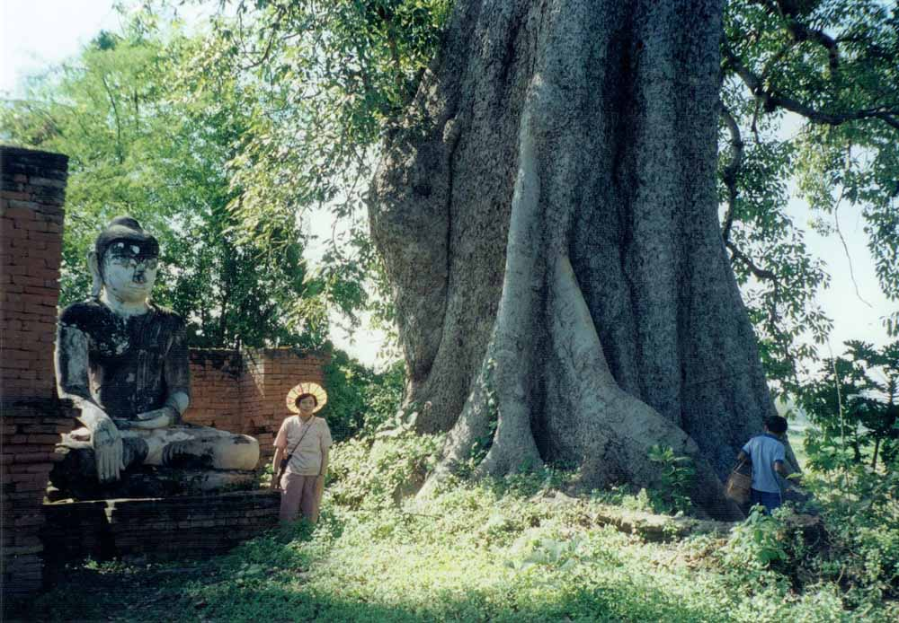

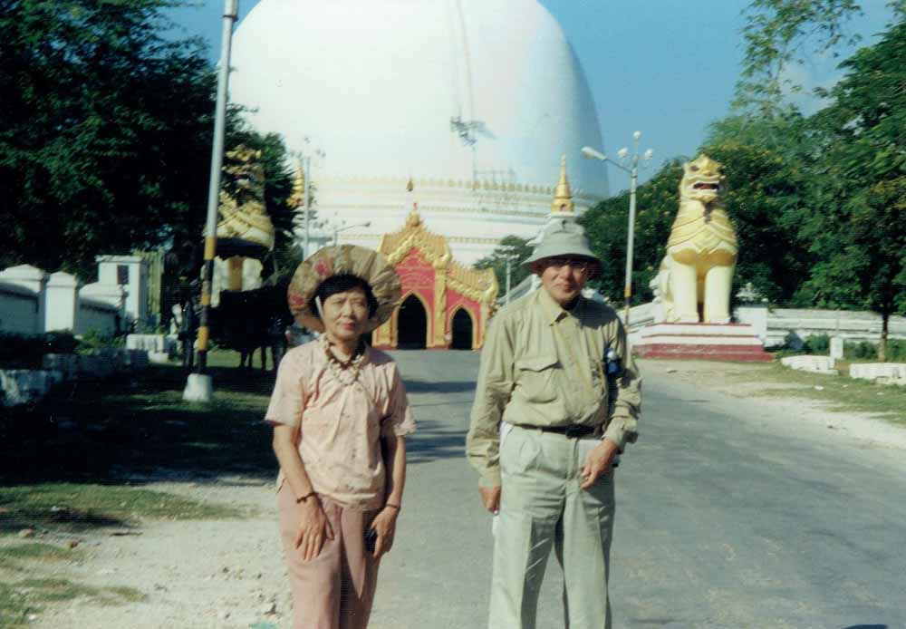

### ㉑サガイン丘のウーミントンゼー・パゴダ{#subsect21}

エーヤワディ川の鉄橋（Ava Bridge）を渡った北岸には緑の小高いサガイン丘が続いています。山全体に150以上の塔寺があるといわれています。私達は車で山路を登りました。登り詰めたところが、右写真のお寺ウーミントンゼー・パゴダ（Oo Min Thone Sai［Umin Thonze］Pagoda）です。写真は頂上の南西面にある円弧状の仏殿の内部の仏様です。45体の仏様が安置されています。どれも、大理石で、衣は金色に塗られています。

お釈迦様が成道し仏陀となった35歳から、入滅し涅槃に入られた80歳まで、45年間伝道したのを示して45体の仏となるのだそうです。見事な仏殿ですね。床もピカピカ磨かれています。私達はこの山を下りて、また金色のパゴダ（塔）を目ざして次の峰に登りました。

### ㉒サン・ウーポンニャーシン・パゴダ{#subsect22}

この丘の峰の上には、高い黄金のサン・ウー・ポン・ニャー・シン・パゴダ（Swan Oo Pon Nya Shin Pagoda）があります。14世紀の創建といいます。四方に門があり、大きな仏像が安置されています。周囲の広い方形のテラス（境内）には、白いタイルが敷き詰められていて、きれいで気持ちがいいのです。ここの眺めも素晴らしく、全山の多くのパゴダが見渡せます。

西には円いカウンムード・パゴダも小さく見えます。南にはエーヤワディ川が足下の木々や寺塔の向こうに、大きく東西に広く伸びているのが見えます。東には鉄橋の向こうにアマラプラ、そして遥かマンダレーがかすんで見えます。この地は今も仏教の修行の中心地らしく、下の寺院から読経の声がこだまして響いてきます。（翌19日の朝、下の川を船で下る時に、もう一度この丘の仏塔を望みました）。この日は夕陽を浴びながら宿に帰ります。

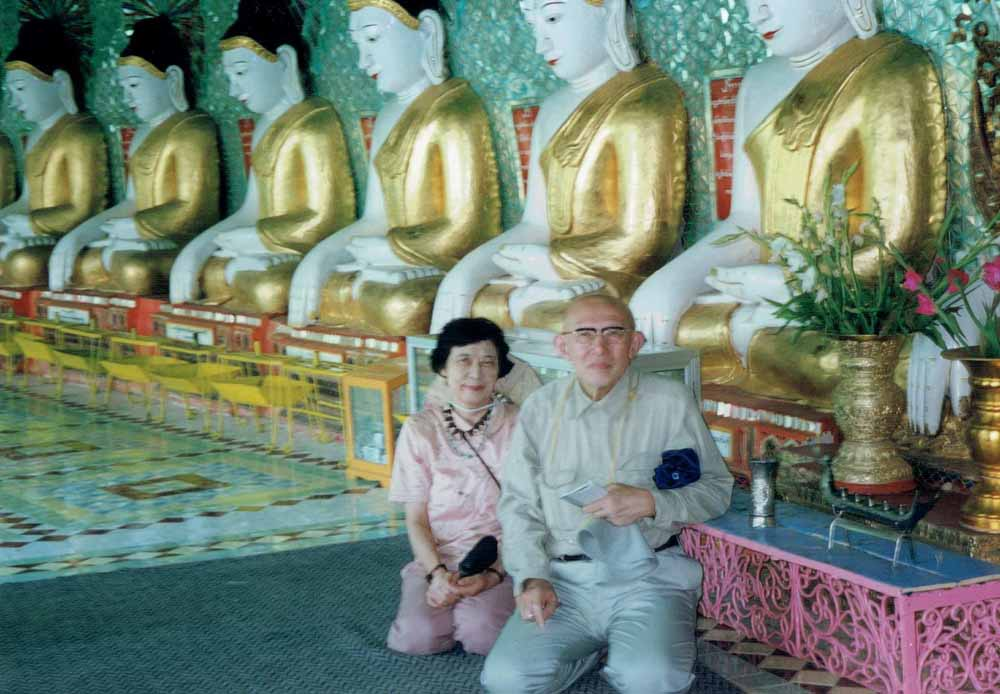

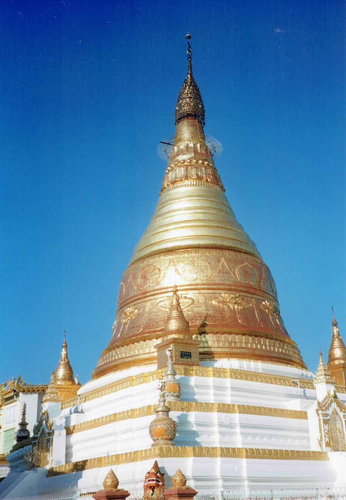{height=310}

### ㉓パガンの大寺院{#subsect23}

12月19日朝5時20分、荷物を持ってロビーに降りると、もうカインさんが昨日と同じ運転手と共に来ています。真っ暗な中を車で船着場に向かいます。彼らは荷物を持って私達を船室まで送ってから別れて行きました。

6時に船が岸を離れると、だんだん明るくなり、朝日が昇って来ます。3階の甲板に上って広々とした川を飽かず眺めました。色々な大きな船に出会います。左右に進路を取りながらも南南西に進みます。パガンに近づくと、金色の仏塔などが見えて来ます。やっと旧パガンの船着場に着いたのは16時25分。迎えの車で宿に着きました。

残照を惜しんで近くの仏塔を巡っていると、絵を売る男が寄って来ます。そのうち彼の妹と会話になり、移動には馬車がよいこと、弟のウインザー君が馬車をもって、朝から日没まで5ドルでパガンを案内すると言います。私達は彼女の申し出を受けることにしました。

翌20日朝、その馬車に乗って、ティロミンロ寺、アーナンダ寺、そしてこのタビイニュ寺（Thatbinnyu Phaya）に来ました。12世紀創建というパガン一高い伽藍です。ここの仏像は、みな金色で、眼まで金色です。写真には外にある大きな獅子像と鐘が写ってます。

### ㉔ナツラアウン寺{#subsect24}

また馬車に揺られて行ったのは、右写真の小さいお寺です。10世紀の初めに建てられた、パガンに残る唯一のヒンズー寺院です。正面の{龕|がん}には、寝ているヴィシュヌ神の臍から蓮の花が出て、その花の3つの蓮台にそれぞれ尊格の坐像が見えます。両脇と後の龕にはシヴァ神などの立像があります。ここの境内は衣料品店です。この後、私がはいているポケット付きズボンはこのお寺の前で買ったものです。

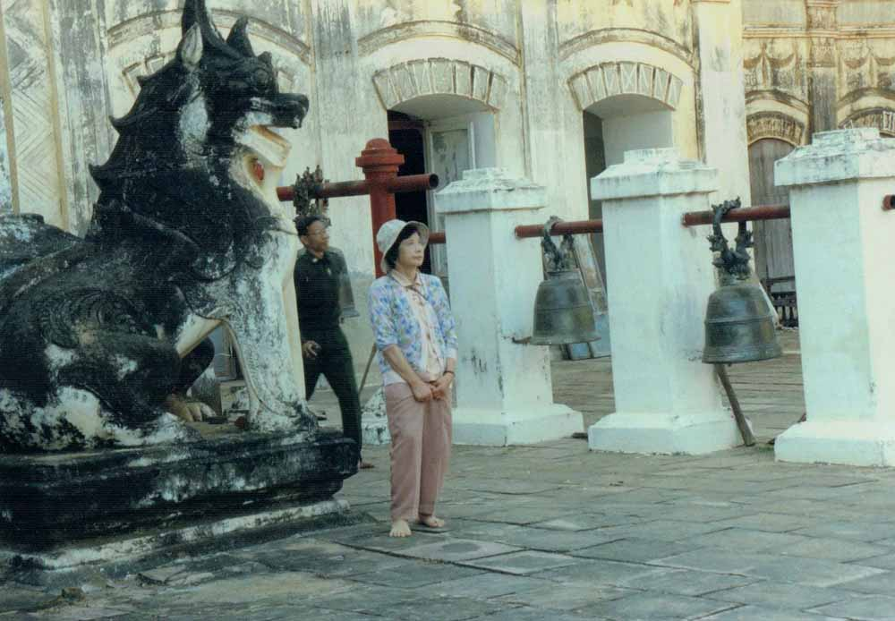

{height=310}

### ㉕ジャポン寺の本尊様{#subsect25}

その後マヌハ寺や博物館、そして細めの金色の塔のあるブーパヤー寺に寄り、城門を出て城壁に沿って小道を通り、宿のゴールデン・エクスプレスに戻りました。昼食は食堂から取り寄せて、部屋で食べました。ウインザー君も馬に乗って近くにあるという自分の家に帰ります。

15時に馬車で朝とは逆の方に向かいます。間もなくシュエズィーゴォン・パゴダ（Shwezigon Pagoda）に着きます。これは高い黄金の塔を中心に四門のある大寺院です。次に本生図が沢山あるグービヤウッジー寺（Gubyaukgyi, Wetkyi-in）を見てから、ひき返して最後に赤い煉瓦の寺に行きますと、ウインザー君のお姉さんが迎えてくれます。彼女はお兄さんが描いた絵を広げて売っていました。ここはジャポン寺といいます。この本尊の座仏像は腹に仏頭を蔵しています。お兄さんの絵も買いました。

### ㉖パガンの夕暮れ{#subsect26}

中の階段を上って、屋上に出ますと展望が開けます。私達よりも先に、もう塔に上って夕陽を望んでいる人達がいます。私達も更に高く上って、パガンの全景を心行くまで眺め続けます。{陽|ひ}は堂塔を照らし川の水面を照らして、遠くの山に沈んで行きます。私達は夕景に感激しながら馬車に乗って宿に帰りました。

パガンは、ビルマ最初の都で起源は9世紀中頃に遡り、サガインの前の都です。パガン朝は11世紀から13世紀まで栄え、元軍の侵攻を受けて属国になり滅びる（1299年）までの間に、三千余の塔寺が造られたといいます。その多くは荒廃したようですが、戦禍の跡は見られません。荒れた寺でも仏様は敬われ、土足は許されないのです。密教的な大乗仏教に代わって上座部仏教が導入されたのも同朝に始まるといいます。

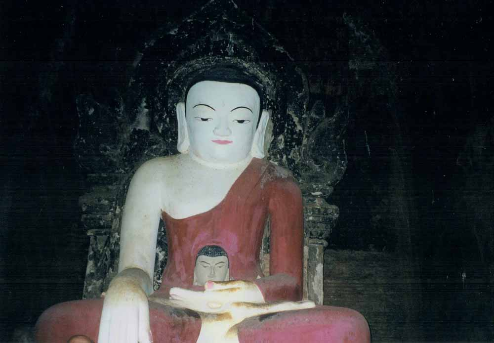

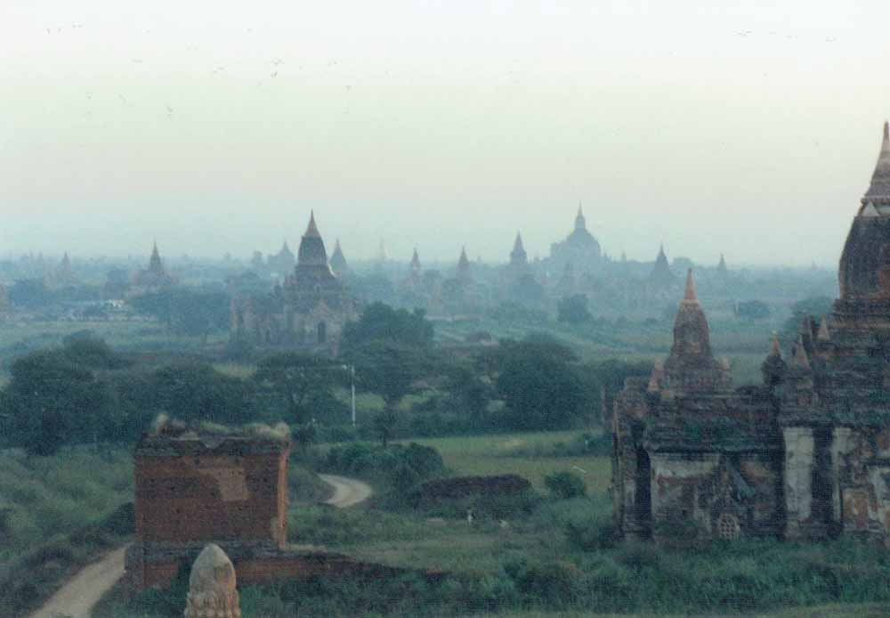

### ㉗ポッパ山のタウン・カラッ{#subsect27}

12月21日、パガンの宿を朝7時半に出て、タクシーで南東50キロメートルのポッパ山に向かいます。途中に寄った民家では、牛が臼で穀物をひいています。また椰子の樹液を集めて、鉄鍋で煮詰め、飴にして売っていました。このポッパ山は、標高1,518メートルの死火山で、緑豊かでなだらかな裾野が広がっています。その麓にある高い岩山がタウン・カラッで、その頂上に寺院の塔がそびえています。山門から上る階段には、土産物屋が連なっています。猿の餌も売っています。その上で素足になって、急階段を登って行くと、2人の女の子がついてきて、手を引いてくれます。あちこちに小さい猿達がいて、愛嬌をふりまいているので、大して疲れもせず30分で登りました。頂上は素晴らしい眺めです。

### ㉘岩山の頂上の小仏塔{#subsect28}

標高737メートルのこの岩山は、いにしえのポッパ山大噴火の際、山頂がここに落下したものといいます。{嶮|けわ}しく{攀|よ}じ登れそうもない奇岩の山です。ここはいわば神仏習合の聖地で、割に広い頂上には幾つも塔や寺社が建てられ、仏と神（nat）が祀られて、多くの人が来てお参りしています。

写真の小塔は、奥の方にあって、不安定な恰好ですが、自然石を上手に用いて金色に仕上げたものです。帰りの階段を下りる時もついてきた女の子達にチップをあげました。往復1時間半のお山参詣です。ホテルに帰ったのは12時半でした。夕方パガン空港からヤンゴン空港に戻り、出迎えの車でユザナ・ホテルに着きます。マウンさんがご馳走してくれました。その夜も金色のシュエダゴン・パゴダを眺めながら休みます。この国には美しい自然があり、優しい人達がいると感じます。明日からは、インドの旅です。

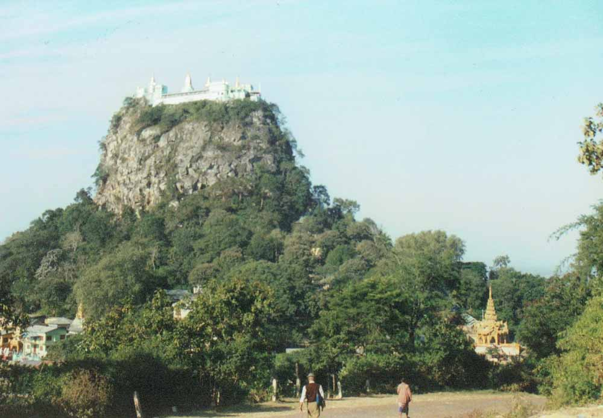

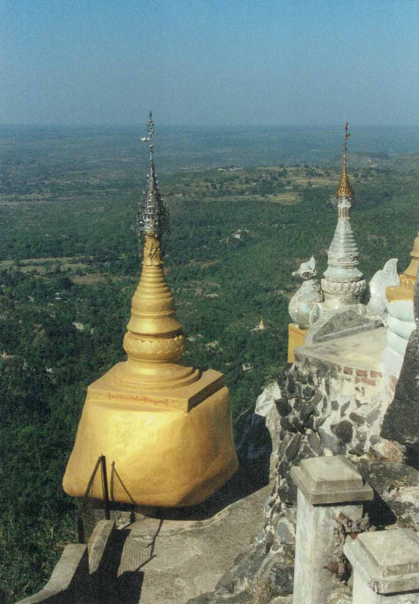{height=310}

## **Ⅲ　インド**（12月22日〜29日） {#sect03 data-sect-title="Ⅲ　インド"}

### ㉙ベナレスの沐浴河岸{#subsect29}

22日の朝、ヤンゴンからバンコクに戻り、乗り継ぎの飛行機（IC732便）を待ちます。7時間遅れて、カルカッタ（コルカタ）空港に着いたのは23時過ぎ。声をかけて来た男の車に乗りホテルに連れて行かれ、高いお代を求められます。翌23日朝、ガヤー行きの特急列車の切符を求めに旅行事務所に行きますが、やっと翌日のベナレス行き夜行列車の切符が買えました。賑やかなチョーロンギー街で、日本語で話しかけて来たのが、近くの店主サンカルサさん（㊵の写真）です。彼に助けられてホテルも換えます。車でカーリー寺や植物園などに案内されます。

24日午前中はインド博物館を巡り、夕方、彼に車で送られて行ったハゥラー駅でやっと列車に乗りこみ、翌日11時に、ベナレス駅で下りました。ここで申し出てきた若者2人に車で案内してもらいます。まずガートに向かいます。車から降りて狭い汚い小路を進むと河岸に出ます。これが聖なるガンジス河岸です。ここで沐浴すれば、天に生まれると巡礼者が絶えません。船に乗れと誘われますが、時間とお金を惜しんで、車に戻って大渋滞の道を進みました。

### ㉚{初転法輪|しょてんぽうりん}の地サールナート（{鹿|ろく}{野|や}{苑|おん}）{#subsect30}

13時半にやっとサールナートに着きました。先ず{野|の}{生|う}{司|す}{香雪|こうせつ}画伯の仏伝図があるお寺を訪ねてから、遺跡の構内に入り、大きな仏塔（Dhamekh Stūpa）やレンガの遺構群を廻り、博物館の石仏像を見ます。この写真は折れたアショーカ王（紀元前3世紀）の石柱（Asoka Pillar）です。王はインドからアフガニスタンまで石に法勅を刻ませました。ここはベナレスの北東10キロメートル、紀元前5世紀、釈尊がブッダ・ガヤーで悟りを得た後、旧友5人に初めて教えを説いた（初転法輪）地といいます。

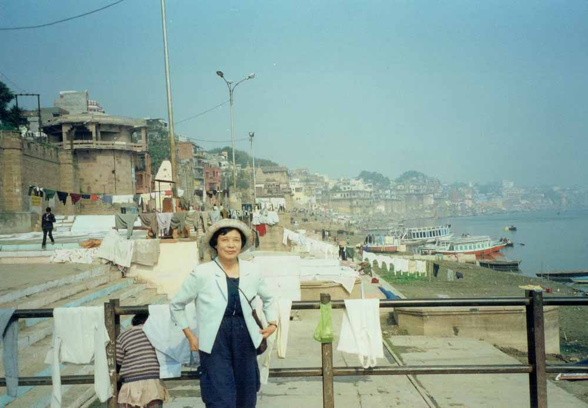

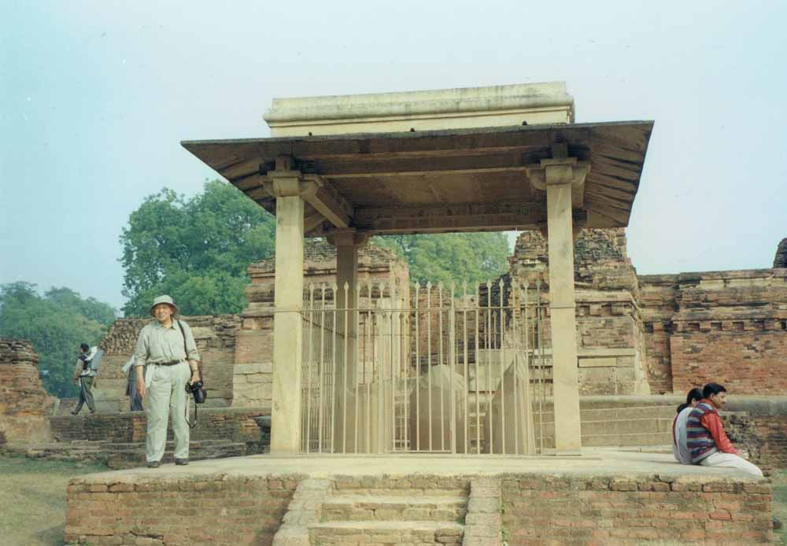

### ㉛釈迦入滅の地クシナガラ{#subsect31}

15時15分、サールナートを出発して、東北へと車を走らせ、ガジプルから北へ進み、モゥを通る頃は暗く寒くなり始めます。更にゴーラクプルから東へ闇のなかを進み、漸くクシナガラの宿に着くのは22時過ぎです。車を運転して来た2人にお金（4,500ルピー、約11,200円）を渡し、私達は部屋で暖房にあたり食事を取り寄せ食べて休みます。翌26日朝6時半、外に出てみると、大変寒く、濃霧が立ちこめて、先が見えません。子供達が現れて、私の手を引いて案内してくれます。写真は霧の中のサーラ樹です。

お釈迦様は45年間説法して80歳になったとき、弟子の阿難とともに王舎城から出て故郷の方へ向かい、ヴァイシャーリーを出てから食中毒により、この地に来て2本のサーラ樹（沙羅双樹）の間に横になられて、入滅（{般|はつ}{涅|ね}{槃|はん}）されたというのです。

### ㉜クシナガラの涅槃堂{#subsect32}

サーラ樹の後には涅槃堂があります。中には巨大な涅槃像が安置されています。夫が20年前に訪れたときは石仏のままでしたが、今は金箔が施されています。その奥の大ストゥーパ（塔）は、前には工事中であったと言います。7世紀に訪れた玄奘三蔵も涅槃像があったと記しています（大唐西域記）。このお堂に臙脂色の衣の僧たちが数十人集まってきて、{勤|ごん}{行|ぎょう}を始めるところです。尋ねてみるとチベット僧もいます。夫は一番の上座に話しかけますと、20年前に泊まったビルマ寺の住職のようです。その後、濃霧の中を子供たちに導かれて、仏最後の説法の地を訪ね、タイや日本などのお寺の前を過ぎ、それからリキシャ（人力車）で仏火葬の地（ラマーバル・ストゥーパ）まで行きます。またリキシャに乗って、宿に着いたのは20時半過ぎでした。

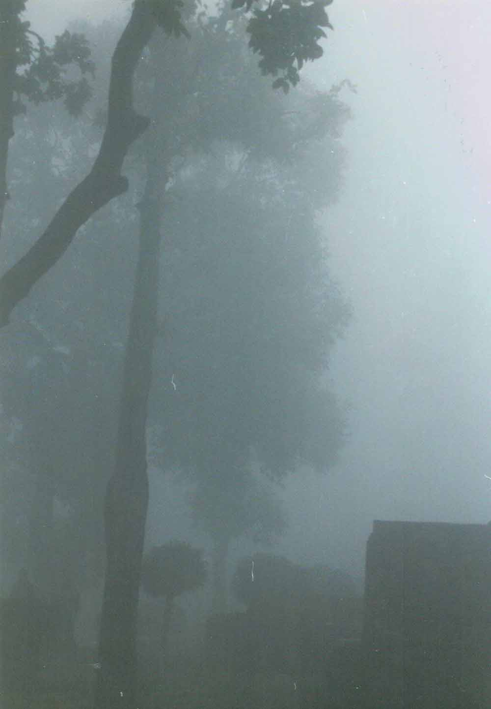{height=310}

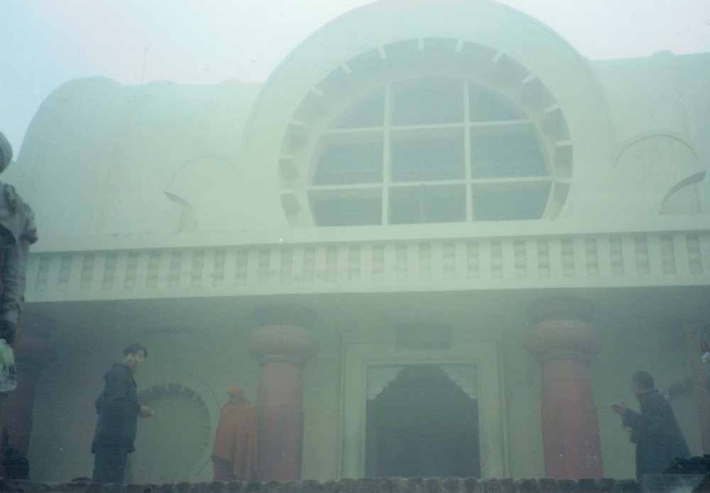

### ㉝商都ヴァイシャーリーの跡{#subsect33}

朝食の後、車を頼んでも、車は隣町から来るので中々来ません。やっと来た車には旅行業者の男も一緒に乗って、11時10分に出発です。カシアに出て東に向かって行くと、霧も晴れて日も照ります。南に向かいゴーパールガンジを過ぎ、大河を渡ってから、食堂で昼食をとり、カンティで右折して16時に鉄道の踏切を越え、細い悪路を辿って行くと日が暮れる頃に、アショーカ王の石柱が見えました。

この写真は夕暮れ時のストゥーパと石柱です。この農村一帯が仏陀時代に栄えた共和制商業都市ヴァイシャーリーの跡です。入場料（各80ルピー、約200円）を払って、この遺跡を巡ってから、また車で暗くなる道を進み、ハジプールを通りガンジス河大橋を越えてパトナに入ります。渋滞の市内を廻ってやっと見つけた宿で、業者に車代を勘定して渡し、明日の行程を約してから、部屋に落ち着くと、もう20時半です。疲れました。パトナはアショーカ王の都でした。

### ㉞ナーランダーの遺跡{#subsect34}

27日朝、霧の中を6時に出発します。朝早いのに市内は渋滞気味です。郊外に出て細い悪路を辿り、ナーランダーの学問寺の遺跡に着いたのは9時です。ここで玄奘が修学した時には、数千の学僧がいたといいます。

玄奘は629年に長安を出て、敦煌、{高|こう}{昌|しょう}、クチャ、タシケント、サマルカンド、ブハラ、バーミアン、ガンダーラを経て、インド各地を巡り、原典を携え、{葱嶺|そうれい}（パミール高原）を越えて帰国して仏典を翻訳したのです。

私も2ドル（約260円）を払って入場します。広大な敷地には、12世紀にイスラム教徒によって破壊されたというレンガ造りの僧坊や仏塔の跡が幾つもあります。9時半にここを出て、昔の王舎城ラージャグリハ（Rājagṛha）のあるラージギルに向かいます。

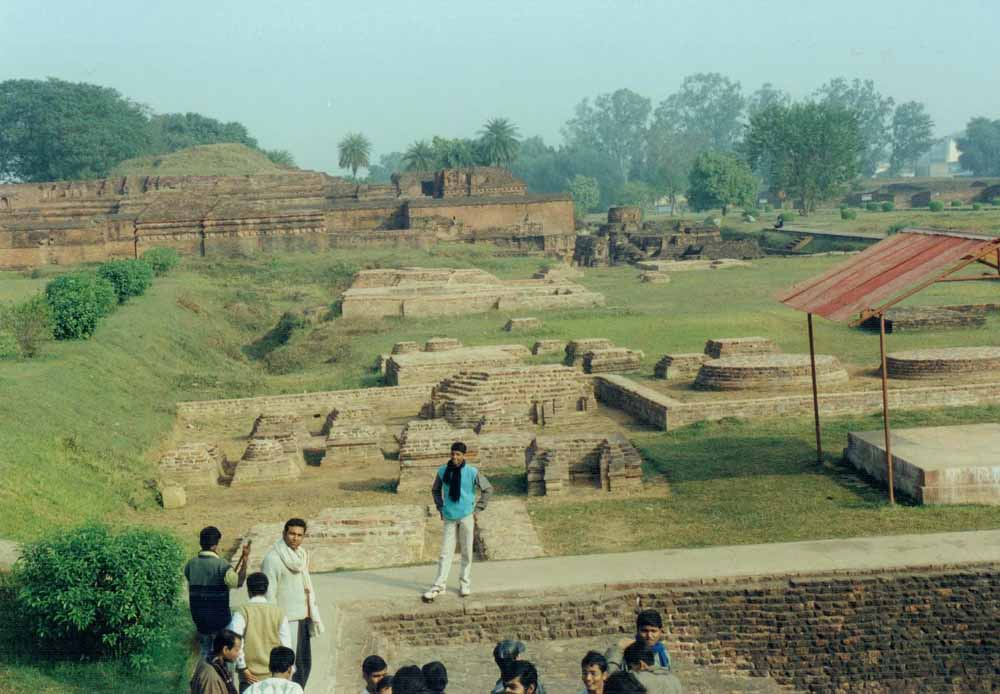

### ㉟{霊鷲山|りょうじゅせん}（グリドラクータ）{#subsect35}

ナーランダーから30分ほどでラージギルに着きます。ここは、仏陀の時代のマガダの都（王舎城）があった所といいます。ビンビサーラ王が、仏に寄進したという{竹|ちく}{林|りん}{精|しょう}{舎|じゃ}の跡や温泉の傍を過ぎて、旧都の跡という潅木の林を通って、山の下で停車してもらいます。多勢の人達が派手に飾られた幌馬車に乗ってやって来ていました。

私達はラトナギリ山のシャーンティ・ストゥーパまでのリフトに乗ろうと、皆にならって切符を買って長い行列に並びますが、待ちきれないので切符を戻し、霊鷲山を目指してビンビサーラ道路を歩いて上ります。上る人も、下る人も沢山います。50メートルほど行くごとに物乞いの女がうずくまって手をのべ声をかけて来るのですが、一々相手ができないのが、せつないです。この写真はラトナギリ山への分かれ道の辺から仏が法華経を説いたという霊鷲山を望んでいるところです。

### ㊱霊鷲山の頂上の下の岩窟{#subsect36}

赤い橋を渡って山の下を登って行くと、左は涸れた谷で、右は巨岩が重なり洞窟もあります。{阿|あ}{難|なん}窟や{舎|しゃ}{利|り}{弗|ほつ}窟です。日本人の一行も拝んで行きます。そこで、一警官が夫に日本語で声をかけて来ます。「20年前にも会いましたね」と。確かに話が合うと夫も感激の様子です。

彼に案内されて岩山を登ります。いかにも鷲の頭のような岩の脇の階段を上ったところが寺院の跡のレンガで囲まれた一画です。そこの仏壇に金色の小仏像が飾られて種々のお供物があげられ、賽銭入れの鉢には小銭や5,000ルピー札や10,000円札も見えます。私も小銭を上げ線香を貰って拝みました。ここからは上の山の日本山妙法寺の仏塔や、向こうの山々も見えます。帰りに、数珠等を売る若者がついて来ます。

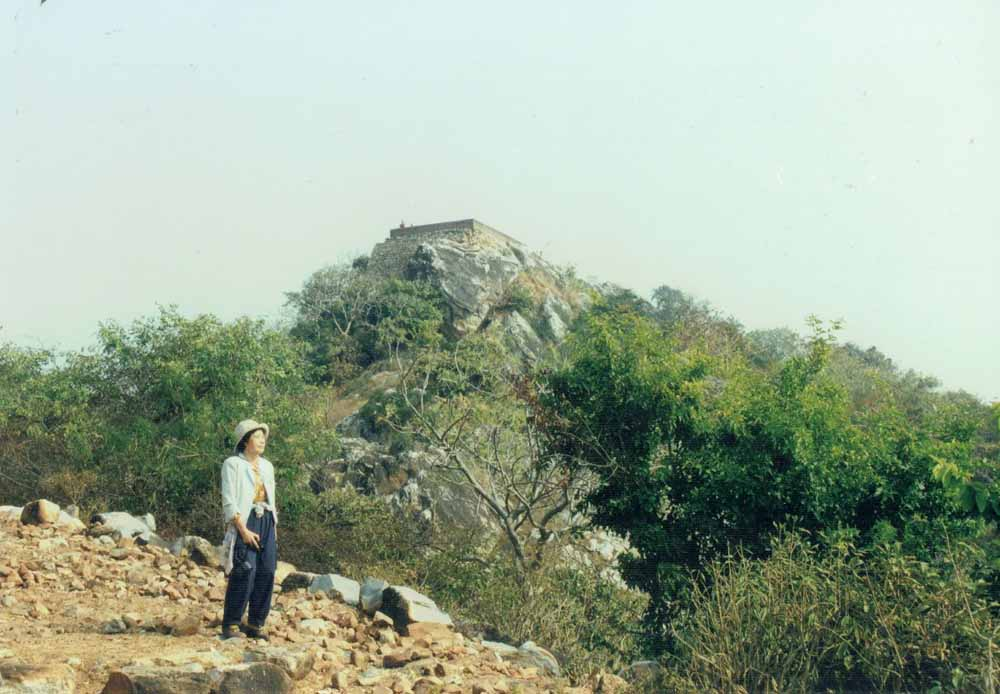

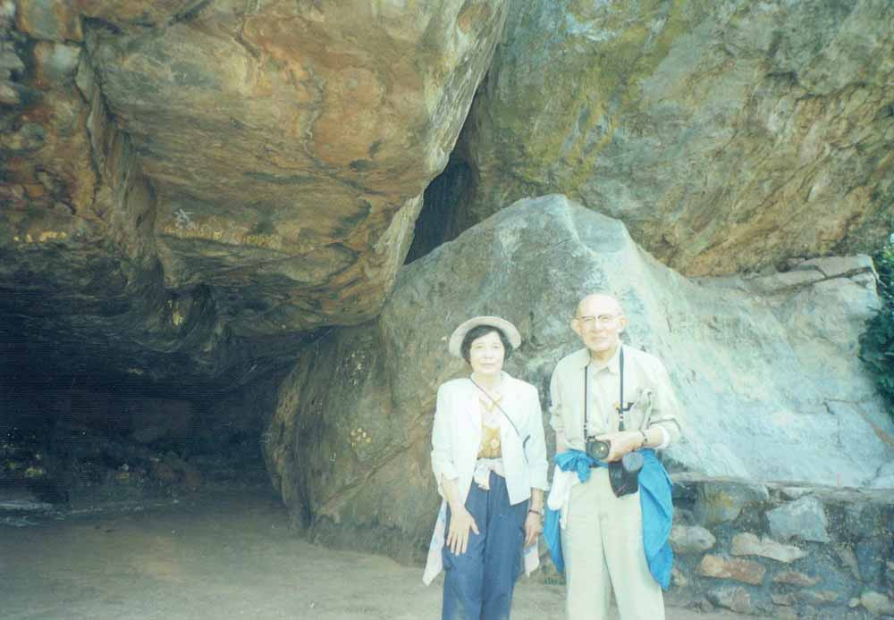

### ㊲仏{成|じょう}{道|どう}の地ブッダ・ガヤー{#subsect37}

霊鷲山の下の駐車場を12時に発って南の城門跡を出、荒地を南西に走り続けて、川を渡るとガヤーの街です。雑踏の中を縫って14時過ぎに、駅の近くの宿を予約してから、出かけます。渋滞の市内を出て、左の方に川（ネーランジャラーの下流）とその向こうに前正覚山を望みながら、ブッダ・ガヤー（ボードゥ・ガヤー、Bodh-gayā）の駐車場に着くと15時過ぎです。ここは大変な人出で、数千人、いや万人もいるのでしょうか。歩いて大塔（大菩提寺、Mahābodhi Temple）に向かい、靴を脱いで東門から境内に下りて行きます。左右に小仏塔や祠堂が続いた奥に高さ52メートルという四角錐の大塔が聳えています。その高い基壇の四隅には同形の塔が立ち、基壇の4面の外壁には2層に沢山の{仏龕|ぶつがん}が配されています。その大塔の東面入り口から入ると、奥室には金色の仏坐像が安置されていました。

### ㊳ブッダ・ガヤー大塔の仏様{#subsect38}

右の写真は前室の脇の方にある仏立像です。金箔や飾りがつけられ、光背にも小仏像が配置されています。前室の左右には階段があって階上に通じていますが、今は通れません。大塔裏の西面には、仏が坐って悟りを開かれた（{成|じょう}{道|どう}）場所を示す黒石の台座（金剛座）があり、その手前に大きな菩提樹が枝を広げています。この境内には、沢山の大小の仏塔や石の{欄|らん}{楯|じゅん}があり、彫刻が施されています。多くの仏像があります。参拝者も多く、日本人も欧米人も見えます。大勢が塔を右繞しています。臙脂色の衣のチベット僧等が板の上で五体投地の礼を繰り返しているのは、驚きです。

大塔とその境内は、19世紀末の修復と最近の整備に繋ります。アショーカ王の時代に遡る証拠があり（各地に石柱などが遺っている。㉚㉝参照）、5世紀初の法顕も7世紀の玄奘も塔の存在に触れ、その証言は{現|げ}{形|ぎょう}（神仏が形をあらわすこと）を思わせます。

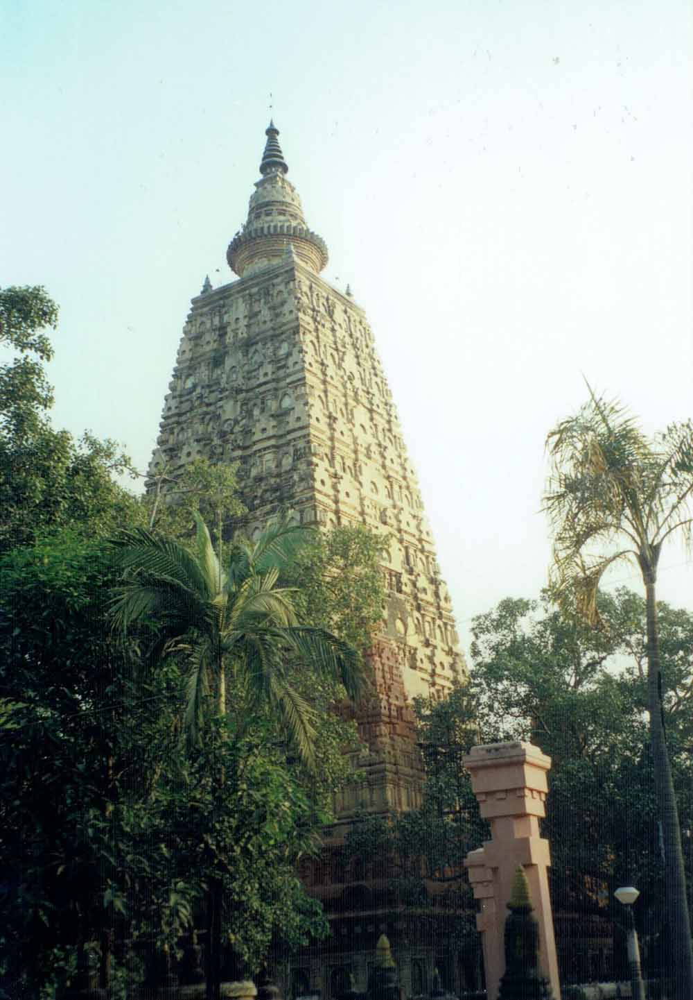{height=310}

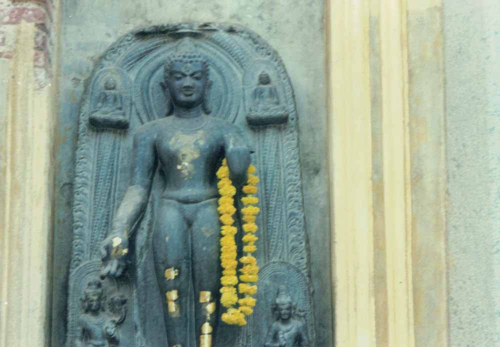

### ㊴ブッダ・ガヤーの{仏龕|ぶつがん}のついた小仏塔{#subsect39}

写真は大塔の周りにある高さ2メートル位の小仏塔です。私達に1人の男が、日本語で声をかけ、ただで説明してあげるといいます。彼は非常に故事に詳しく、成道後7日毎に仏が坐る場所を換えたといって一々案内し、最後にムチャリンダ龍王の頭で雨宿りする仏坐像がある南側の池と、2人の商人が仏に供養した跡という柱を示して、「これで終わりです」と、帽子を取って頭を下げます。彼は自分の店に5分でもよいから寄って欲しいといって車まで送ってくれました。急いでいた私達は車に乗りますが、追って来た他の人から菩提樹の葉を買います。

16時過ぎていますので、車から近くのタイ、チベット、中国、ベトナム、日本などのお寺を見、最近造られた大仏の傍まで行って、帰ります。ガヤーの宿に着いたのは17時少し前です。クシナガラから私達を乗せてくれた若者達に支払い（全部で6,000ルピー、約15,000円）を済ませ、少しのチップを上げると、喜んで別れて行きました。この格安（200ルピー、約500円）の宿では、お湯を貰って行水し、一生懸命に蚊を捕まえ、持って来た蚊取線香をつけて休みました。

### ㊵カルカッタ（コルカタ）の店主サンカルサ氏{#subsect40}

28日ガヤー駅3時59分発の特急列車に乗るために、夜半に起きて駅に急ぎます。寒いホームで待つこと4時間、夜も明けて8時になってやっと入って来た列車に、乗りました。

カルカッタ（コルカタ）のシアルダ駅に着くと13時半。24日に別れたサンカルサ氏が迎えに来ています。彼は車を探してアストリア・ホテルに連れて行き、それからニューマーケットに案内してくれます。そこで極上の紅茶をたくさん買い、また彼の店に行くと、織物類を色々見せられます。少々高い買い物もします。写真の中央が、彼のお父さんです。

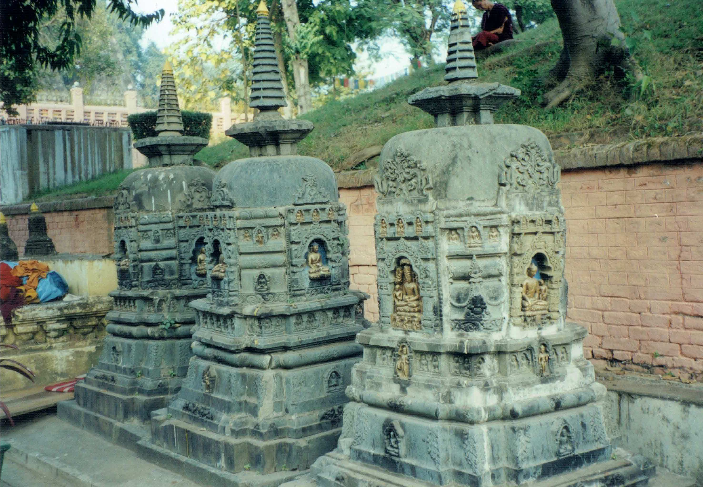

{height=310}

12月29日の朝、サンカルサ氏にカルカッタのダムダム空港まで送られ、バンコク行きのインディアン・エアラインズ、IC731便に乗るのですが、この日も荷物検査が厳しくて持ち物のポケット全部を開けて調べられ、やっと乗せてもらえます。午後にバンコクの前に泊まった宿に着いて、ほっとしました。翌30日の午前中には、タイの古都ナコン・パトムを訪ねました（⑨⑩にふれました）。その夜、12時（日本時間31日2時）、バンコク発TG642便に乗って、真っ暗な上空を日本へと飛びます。ウツラウツラしているうちに夜が明け朝食に機内食が出ました。久しぶりの日本食でしたが、そのお魚に夫はあてられます。成田には7時過ぎに着きました。さすがに日本は寒い。仙台に着いたのは14時ごろで、大晦日の街は客で賑わっていました。

## おわりに {.chap-afterword}

26日間の旅から帰り、疲れて休んでいましたが、漸く、写真の整理をはじめます。この度も様々な土地の風物や文化に接してきました。仏教の聖地を巡って、仏の時代にも思いを馳せます。仏教の遺跡にも仏寺にも詣でる人たちの多いこと、そしてその熱心な礼拝の姿には、自らを省みないわけにはいきません。そしてなにより、心に残っていることは、いろいろな人たちとの出会いの不思議さと有難さです。

この私どもの「旅のしおり」は写真入りの小文ですが、読んで推敲するうちにだんだん詳しく吟味され、旅日記のようになりました。記憶と旅のメモもそれほど確かではなく、撮って来た写真も十分ではない。現地で求めえた地図や資料など大したものでもないし、勉強不足のため思い違いもあろうかと思います。ただダイヤモンド社の『地球の歩き方』叢書には、旅行計画から、思い出の確認まで依存しがちでした。

平成15（2003）年3月20日

