

<h1 class="chapter" id="chap05" data-chap-title="五　南インドとスリランカの旅">
  五
  南インドとスリランカの旅 
  ヒンドゥー神殿とパーリ聖典の故地
  平成15（2003）年9月29日〜10月23日
</h1>

## はじめに {.chap-foreword data-sect-title="はじめに"}

7年前、平成15（2003）年に、南インドのタミルナードゥ州とスリランカを廻りました。インドへ夫は27年前に行き、4ヶ月滞在したのでしたが、私が一緒に行ったのは平成14（2002）年12月でした。その時はタイのバンコクで国際仏教学会（IABS）があったので、タイとミャンマーの仏跡を巡ってから、カルカッタ（コルカタ）に入り、主な仏跡（ベナレス、サールナート、クシナガラ、ブッダガヤー）を廻ってから、バンコクを経て年末に帰りました（第4章参照）。これから、その翌年秋の旅行を振り返るのです。

インドの面積は日本の8倍（328.8万平方キロメートル）、人口は10億以上だそうです。スリランカは北海道より少し小さい島国（6.6万平方キロメートル）で、人口は二千万ほどですが、大陸とは古くから交渉があり、係争も繰り返されてきたのです。独立（1948年）以前はインド・パキスタン・ミャンマーとともに、大英帝国の支配下にあり、また1972年まではセイロンと称していたのです。

セイロンはパーリ語のシーハラ（サンスクリット語でシンハラ。人、島の意）に由来し、ライオン（獅子、sīha）の派生語です。漢訳では{師|し}{子|し}{国|こく}（{執|しゅう}{獅|し}{子|し}{国|こく}、獅子洲、僧伽羅国）といい、またランカー（Lȧnk̄a、{楞|りょう}{伽|が}州、{楞|りょう}{伽|が}{山|せん}）とも呼ばれます。獅子国というのは、建国伝説によると、王女を母にライオンを父とする王の子、ヴィジャヤが、インドから来島したのに始まるからです。

中国の東晋代に{法顕|ほっけん}は長安から399年に出発して西域を経てインドに到り、海を渡って師子国に入り2年も滞在しました（410年〜411年）。412年に海路で帰国し、旅行記「法顕伝」（仏国記とも）を遺しています。この後（428年）に師子国王（摩訶南＝マハーナーマ）が、中国南朝の宋に使節を派遣した記録（宋書巻97、南史巻78等）もあります。その頃にパーリ仏典の註釈書が書かれたのです。この島や南インドと、中国とは海路でつながり、マレーシアやインドネシアの地を中継地として往来が続いたのです。

この島に仏教が伝えられたのは、紀元前3世紀であり、それから原始仏典、パーリ聖典を伝承してきたのです。口承で伝えられた仏の教えを、初めて文字で記録したのも、前1世紀のこの島であったと記録にあります。歴史書を作らないインドの文化とは違って、パーリ語で王統史に沿って仏教の消長を書き継ぎ、『{島|とう}{王|おう}{統|とう}{史|し}』や『{大|だい}{王|おう}{統|とう}{史|し}』を遺し、スリランカは断絶のない歴史の国です。

夫は29年前から、大学時代同窓の及川真介博士に協力しながら、パーリ聖典『スッタ・ニパータ（経集）』とその註釈書を翻訳し、研究・解説書とともに『仏のことば註』の題で5巻に纏めて共著で出版しました。また昨秋にはその索引・辞典『パーリ仏教辞典』を完成させました。その前に何とかパーリ仏典の故地を訪ねたかったのです。

同博士がスリランカに滞在したときにソーマランシ師と出会い、師とは長く親交があったので、私どもの旅も同博士を介して便宜をはかって頂きました。仏教大学を建設中の師は、日本語も達者で私らに親切に対応してくれました。それが、惜しいかな、お会いしたその翌年3月に他界されました。師を偲びつつ思い出を掘り起こし、改めてわが国の文化と宗教と{彼|か}の地のそれとを較べ、神と仏について思いをめぐらしたのです。

平成22（2010）年4月15日　77歳の春　村上 真完・ヤエ

## もくじ {.chap-toc .break-before}

<nav>

- [**はじめに**](#はじめに)
- [**Ⅰ　スリランカから南インド／タミルナードゥ州へ**](#sect01)
    - [①スリランカ：ネゴンボ海岸沿い：奥庭から見える海](#subsect01)
    - [②南インドの大都市チェンナイ（旧マドラス）：州立博物館](#subsect02)
    - [③ヒンドゥー教の諸大神殿：ヴィシュヌ派とシヴァ派の大神殿](#subsect03)
    - [④古都カーンチープラム：マンゴー一樹神殿：大塔門](#subsect04)
    - [⑤カーンチープラム：ワラダラージャ神殿：高大な塔門と広大な神殿](#subsect05)
    - [⑥マハーバリプラムの古跡：巨石神殿群、巨大な石彫、海岸神殿](#subsect06)
    - [⑦マドゥライ：華麗壮大なミーナークシ神域](#subsect07)
    - [⑧ミーナークシ神域：巨大塔門、広大な神域 （北門広場）](#subsect08)
    - [⑨ミーナークシ神域：聖樹、蓮池、大神殿、千柱堂](#subsect09)
    - [⑩ティルチラパリへ：街と岩山要塞神域をめぐって](#subsect10)
    - [⑪スリランガム：ランガナータスワーミ神域：南大塔門](#subsect11)
    - [⑫タンジャーブール（タンジョール）：大神殿の門：クンバコーナムへ](#subsect12)
    - [⑬チダムバラム：踊るシヴァ大神殿：ポンディシェリからチェンナイへ](#subsect13)
- [**Ⅱ　スリランカ一周の旅**](#sect02)
    - [⑭スリランカへ：ネゴンボの海岸](#subsect14)
    - [⑮アヌラーダプラ：イスルムニヤ寺：巨岩とその下の涅槃堂](#subsect15)
    - [⑯ミヒンタレーの丘：大塔、昇る満月と沈む夕日](#subsect16)
    - [⑰アヌラーダプラの仏跡：菩提樹、大塔、トゥーパーラーマ寺など](#subsect17){.justify-compress}
    - [⑱古跡アウカナ：日を浴びて立つ大石仏像](#subsect18)
    - [⑲古都ポロンナルワ：仏塔跡、遺跡群](#subsect19)
    - [⑳ポロンナルワ：大石仏像：立像、涅槃像、坐像、そしてシーギリヤへ](#subsect20)
    - [㉑巨岩上の古城址：シーギリヤ：岩壁の美女たち](#subsect21)
    - [㉒ダンブッラ：岩窟寺院内の諸仏像：立像、坐像、涅槃像](#subsect22)
    - [㉓スリランカの中心：ナーランダ古跡](#subsect23)
    - [㉔聖典筆写の地：アルヴィハーラ岩窟寺](#subsect24)
    - [㉕旧都キャンディ：湖畔の仏歯寺、同博物館](#subsect25)
    - [㉖キャンディー：旧王宮：国立博物館、白い大仏坐像](#subsect26)
    - [㉗キャンディー郊外：植物園](#subsect27)
    - [㉘キャンディー近郊：諸寺院を巡って](#subsect28)
    - [㉙キャンディーから南へ：山腹の茶畑、製茶工場、喫茶店と販売店](#subsect29)
    - [㉚霧がかかる高原の避暑地：ヌワラエリヤ](#subsect30)
    - [㉛バドゥッラ：壁画があるシヴァ神殿](#subsect31)
    - [㉜雨のエッラ：見上げる岩山と滝](#subsect32)
    - [㉝ブドゥルワーガラ：荒地に立つ大摩崖仏](#subsect33)
    - [㉞仏都ティッサマハーラーマ、聖地カタラガマ](#subsect34 )
    - [㉟ハンバントタから、宝石の町ラトゥナプラへ](#subsect35)
    - [㊱大都市コロンボ：郊外ケラニヤ河畔：壁画のある大寺院](#subsect36)
    - [㊲コロンボ海岸：大統領邸、高層建築：市内の公園、博物館](#subsect37)
    - [㊳ソーマランシ師の木蔭が多いお寺と建築中の仏教大学](#subsect38)
    - [㊴ネゴンボの休日：運河沿いの道、大仏、ヒンドゥー神殿、教会、モスク](#subsect39){.justify-compress}
    - [㊵郊外のアルタパーラ寺：白い仏塔、なだらかな岩山、岩窟内の涅槃仏](#subsect40)
- [**おわりに**](#おわりに)

{width=100%}

{width=100%}

## **Ⅰ　スリランカから南インド**／タミル ナードゥ州へ（9月28日〜10月8日）
{#sect01 .break-verso data-sect-title="Ⅰ　スリランカから南インド／タミル ナードゥ州へ" }

### ①スリランカ：ネゴンボ海岸沿い：奥庭から見える海{#subsect01}

平成15（2003）年9月28日（日曜日）、仙台11時24分発の「はやて」10号で東京駅まで行ってから、上野の東京国立博物館で「アレクサンドロス大王と東西文化の交流展」を見ます。この王が遠征して西北インドに着いた年（327 B.C.）が、インド史の年代の基点です。王の諸石像やそれ以降の金銀貨、碑文などを初めて見るのです。夜は「成田ひがしやホテル」に泊まりました。

翌29日（月曜日）、宿の車で成田空港第2ターミナルに着いたのは、10時過ぎ。スリランカ航空UL461便は13時40分に離陸。房総半島を横断して伊豆半島に差しかかると、右手に富士山が見えます。そのうち雲に視界を遮られますが、15時40分には沖縄を過ぎて洋上を飛んでいます。18時過ぎにヴェトナムの海岸線も見え、19時過ぎにはバンコクの北東を飛び、やがて洋上に出て、20時20分にアンダマン諸島を眼下に見ます。20時50分に日が沈み、暗くなりました。

日本時間23時5分（現地時間19時5分）に着陸した空港がマレ（Malé）で、観光立国で知られる小国モルディヴ（Maldives，人口33万人、千余の島があり面積298平方キロメートル）の島です。人家も見えず薄暗い簡素な空港施設に人影が移動しています。ここで大部分の人が降り、それから機内掃除が終わると、乗客が沢山乗り込んで来ます。

1時間後（20時22分）に離陸して1時間飛んで着いたのが、スリランカのバンダラナイケ国際空港（Bandaranaike International Airport）でした。当地の時間は22時33分です（日本時間は2時3分。時差－3時間30分）。 両替すると20,000円が約16,530ルピーで、円の2割高という感じです。

入国手続きなどに11時間ほど費やし、タクシーに乗って30分程でネゴンボ（Negombo）の宿、キャメロットビーチ・ホテル（Camelot Beach Hotel）に着きました （車代600ルピー）。ここはインド洋の波が打ち寄せる西海岸沿いで、幾つもホテルが建ち並んでいます。直ぐに部屋（1階121号室）に入り、荷物を作り直しシャワーを浴びて、大きなベッドに休みます（1時20分）。冷房がきいた部屋ですが、蚊がいます。止むなく蚊取り線香を焚きました。

### ②南インドの大都市チェンナイ（旧マドラス） ： 州立博物館{#subsect02}

9月30日（火曜日）朝、雨。5時半に、予約しておいた車で空港へ向かいます。600ルピーの車代に1,000ルピー札を渡しますと、どうしてもお釣りが貰えません。8時30分に航空機（UL121便）は離陸して1時間後にチェンナイ（Chennai、旧Madras）に着陸しました。インド時間は9時（時差－30分）です。両替すると20,000円が7,820ルピーになりました。1ルピーは2.56円相当です。タクシー（300ルピー）で行った予定の宿には部屋がなくて、別の宿プレミア・ホテル（Premier Hotel）を捜し当てて、1,000ルピーを前払いして3階の209号室に入りました。ここはインド第4の大都市で人口700万人、タミルナードゥ州の州都です。

持ち合わせの食物を食べてから、南西3キロメートル余にある州立博物館（Government Museum）にタクシー（50ルピー）で行きます。入場券（2人で500ルピー）と撮影料（200ルピー）を納めて入りました。仏像彫刻も多くあり、陳列室の階段の両脇には豪快で迫力ある護法神が立っています（写真）。アマラヴァティ―大塔から発掘された石彫浮彫「仏足を礼拝する人々」（西暦150年頃）、ガンダーラ仏、マトゥラー仏もあります。大塔の{欄楯|らんじゅん}（玉垣）の一部も復元されています。また南インド各地から集められた古い石像やブロンズ像（ジナ像やヒンドゥーの神像等）も多く、火炎輪の中で躍動的に踊るシヴァ像や乳房豊かな女神像が沢山あります。同館発行の出版物5冊（340ルピー）を買いました。どれも写真図版がよくないが、私らには新しい資料です。

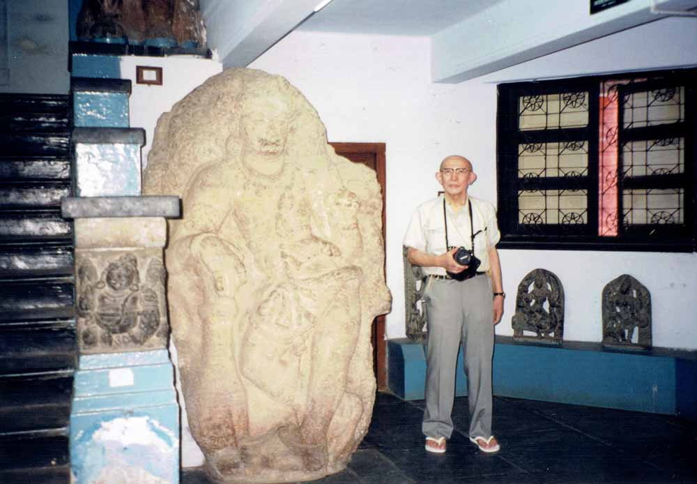

### ③ヒンドゥー教の諸大神殿：ヴィシュヌ派とシヴァ派の大神殿{#subsect03}

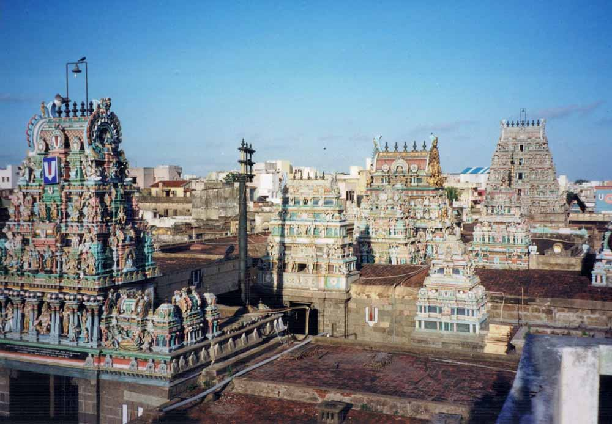

9月30日、15時半に館外に出ますと、日焼けした精悍な男が「200ルピーで市内を案内する」と言い寄ってきます。自動三輪車（リキシャ）の車夫ログ（Logu）さんです。言われるまま、まず東海岸のセント・ジョージ砦（St. George Fort）へ行きました。17世紀にイギリス人が建設したというかつての軍事基地は、今は要塞博物館で、西洋の美人画が多い美術館もあります。

それから市の南部のヴィシュヌ神を{祀|まつ}るヒンドゥー教のパールタサーラティ（Parthasarathy）神殿に行きます。入り口に{聳|そび}える高い門（塔門、ゴープラ）が建ち、見事な彫刻で埋め尽くされています。向かいの建物の屋上に案内されると、境内が見渡せます。右奥には最大の東門、手前の左端にはやや低い西門が見えます（写真）。ヴィシュヌ神の化身（権現）クリシュナを祀る神殿までは入れませんが、靴を脱いで中庭に入って見ました。次に南のカパーレーシュワラ（Kapalesvara）神殿に行きますが、修復中で、高さ40メートルもある塔門は{莚|むしろ}で覆われていました。ここはシヴァ神を祀る神殿です。インドの大半の人々はヒンドゥー教徒ですが、その神々の中で最も人気があるのがシヴァ神で、ヴィシュヌ神がそれに次ぐようです。シヴァ神のシンボル（リンガ、男根）が本尊で、その妃、子供、乗り物の牛ナンディン、その他の{眷属|けんぞく}が祀られています。ヴィシュヌ神は妃や、その化身達とともに祀られます。

インドの神々で日本に入ってきた仏教の守護神である帝釈天、吉祥天、毘沙門天などには、中々お目にかかれません。

南インドの4州はドラヴィダ（タミル）語圏ですが、サンスクリットで哲学を論ずる学問の伝統もあります。ベンガル湾沿いのこの州は、イスラーム教徒が少なく、北インドとは趣の異なる豊かな文化があリ、由緒ある大神殿や文化遺産が多いのです。

この街の夕方は交通渋滞で大変です。ログさんに2軒も土産品屋に案内されましたが、何も買わずに宿に帰ります。彼とは話も通じるので、翌日も頼むことにしました。

### ④古都カーンチープラム：マンゴー一樹神殿：大塔門{#subsect04}

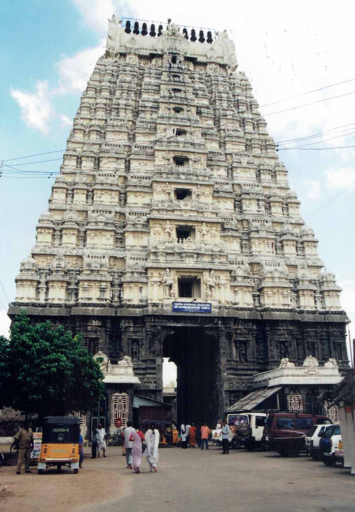

10月1日（水曜日）、朝7時半、ご飯2皿とお湯を貰って食事を済ませると、ログさんが来ています。南西 77キロメートル程のヒンドゥー教の聖地カーンチープラム（Kanchipuram）に向かいます。暗殺された前首相ラジーヴ・ガンディー（没1991年）の慰霊の列柱等や、韓国の現代自動車工場前を過ぎ、聖地の手前で彼は自分の妹の家の前で停まると、子供達とお母さんが出て来ました。トイレを借りると、コンクリート敷きの小屋に水が流れているだけで、そこで用を足すのです。子供達に小銭を上げると、喜んで手を振って見送っていました。

ここには7〜8世紀に遡る沢山の神殿があり、巡礼者も多い由です。昔、西域を大廻りしアフガニスタンからインドに入り諸地を訪ねた{玄奘|げんじょう}（旅行629年〜645年）は、ここ（{達羅毘荼|ドラヴィダ}國の大都城、{建|カーン}{志|チー}{補|プ}{羅|ラム}）まで来て、百余の{伽藍|がらん}に万余の僧徒が上座部の法を学び、神社（天祠）が八十余あり、ここが{護|ご}{法|ほう}菩薩の生地だと伝えています。

当地最大の神殿はシヴァ神を祀るマンゴー一樹神殿（Ekambaranatha Temple, Ekambareshvara Temple）で、60メートルの白い大塔門には精巧な彫刻が施されています。門の通路は天井も10メートル程も高く、壁には浅浮彫刻の{蔓草|つるくさ}模様に囲まれて女神や子供の姿も見え、観音開きで高さが10メートルもある木製の戸が開いています。入ると化粧された象が出迎えてくれます。中央の石造の大神殿は広大で数百の列柱が立ち、石柱や壁面は彫刻で飾られ、{夥|おびただ}しいリンガや神像が見えます。左（西）奥の中庭には樹齢3,500年とかいい、幹の直径が1メートル余もあるマンゴー樹が葉を茂らせています。この時は見えませんが、実をつけるそうです。これがこの神殿名の由来です。

### ⑤カーンチープラム：ワラダラージャ神殿：高大な塔門と広大な神殿{#subsect05}

10月1日昼、マンゴー一樹神殿を出て、西郊外のカィラーサナータ（Kailasanatha）神殿に行きます。7世紀に造られたドラヴィダ様式の最初の神殿といわれ、58もの小さい神殿が外壁となっています。中に7つの神殿がありシヴァ神を祀った本殿があります。その東の聖カーマークシ・アンマン神殿（Sri Kamaksh Amman Devasthanam）を通り、ずっと南東のワラダラージャ（Sri Varadaraja）神殿に行きました。ここはヴィシュヌ派の大神殿で12世紀に遡る由ですが、16世紀に建てられたという大塔門を入ると何棟もの石造の神殿があり（写真）、百柱殿の石柱に細かく施された彫刻が見事です。石造の鎖、裸体の男女像、立ち上がる馬、鉄砲を撃つ外国兵、叩くと金属音がする円柱もあります。階段脇の壁にはヴィシュヌの化身達の小さな像が並んでおり、その13番目が仏陀です。バラモン僧が一生懸命説明してくれたのですが、最後に20ルピーを渡すと、大変不満顔になりました。

14時頃、車夫のログさんが「近くには絹織物や染色の町がある」と言って或る工場に連れて行かれて、スカーフ2枚650ルピーを買うことになりました。そのうち大雨となり、道が川となって、対向車が来ると、濁水を浴びせられます。エンジンも止まって、ログさんは苦労していましたが、他の人の手を借りて漸く車が動きました。

### ⑥マハーバリプラムの古跡：巨石神殿群、巨大な石彫、海岸神殿{#subsect06}

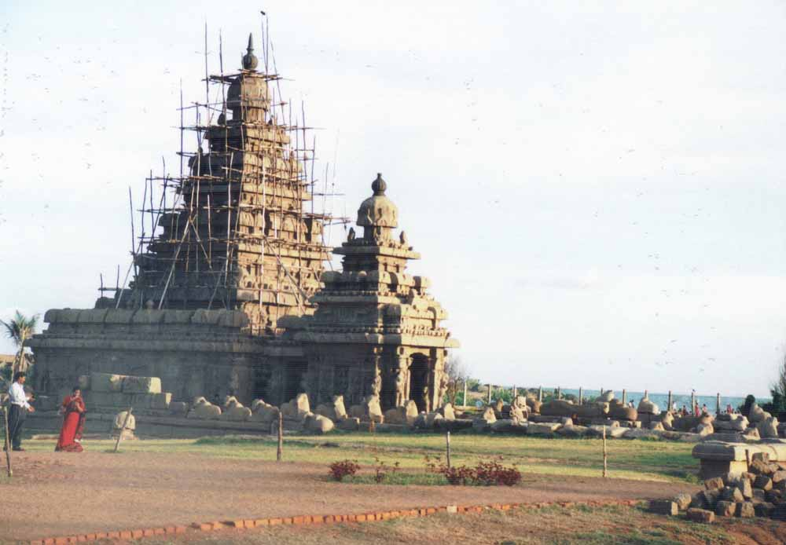

やがて雨が止んですっかり晴れ、小高い山の前の湖畔で休憩します。ここを16時に出て山を越えて、30分程でマハーバリプラム（Mahabalipuram, Mamallapuram）に着きました。チェンナイの南60キロメートルにある7世紀の古遺跡群がある町です。南郊外の砂地には5つの{山車|だし}という意味の5棟の神殿パンカ・ラタ（Panca ratha）という5棟の神殿と象や獅子等が一大岩石から彫り出されています。また道端の大石壁にある彫刻は「ガンガーの降下（Descent of Ganges）」、別名「アルジュナの苦行」といい、高さ13メートル、幅は29メートルもあるそうです。自然の石の窪みを利用して、ガンガー河が天から降下するという神話を造形化したもので、神々、人間や、飛天、象、蛇など数々の動物達が彫られていました。

東郊外の岬の砂浜には8世紀前半に建てられたという大小の四角錐型の端正な海岸神殿（Shore Temple）が並んで建っています。昔は7つの神殿があったそうです。小さい方はヴィシュヌ神を祀り、大きい方はシヴァ神のシンボル「リンガ」が祀られてあるそうです。海辺には木々が植えられていました。

ここは 7世紀ごろ東西交易の拠点として栄えた港とか。

カーンチープラム（建志城）まで来た{玄|げん}{奘|じょう}は、スリランカ（僧伽羅）に行って修学しようとしていたが、当時スリランカ王が死んで、国が乱れ飢饉に苦しむ中から避難して来たという三百余の僧達に会い、彼等の学力に失望して、西北に道をとって帰国の途に就いたそうです。玄奘はこのマハーバリプラムには来なかったようですが、建志城を南海之口と呼び、「聞くところでは東北の海畔の城（町）から三千余里（1,200キロメートル）で僧伽羅に着く」と伝えています。この海畔とはこの地に違いありません。

私等はそこから海岸沿いに北に向かい、やがて渋滞の街中を徐行して、やっと19時45分に宿に着きました。ログさんにはガソリン代10ドル、車代50ドル、食費3ドルを、求められるに任せて払います。 2日の予定が1日で済んだのです。

### ⑦マドゥライ：華麗壮大なミーナークシ神域{#subsect07}

10月2日（木曜日）、朝5時に起きて荷物を纏め、宿代を勘定して貰い、差額485ルピーを払いました。2日分が1,485ルピー（約3,800円）です。今日は450キロメートル南西のマドゥライ（Madurai）に行くのです。ログさんの車でバスターミナルに向かうと、西に8キロメートル程の所で20分で着きました。彼には値切って4ドルを払います。マドゥライへの切符代は2人で285ルピーで、10時間かかるのです（飛行機では50分とか）。6時10分にバスは出発します。市外に出て高速道路を南西へと、平原を進み、バスは処々（11時55分 Parambabur，13時55分 Tiruchirappali）に止って行くのです。

午後になると雨になりました。16時頃、マドゥライ北東郊外の終点に着きました。ここはチェンナイに次ぐこの州第二の都市で人口は約120万人あるといいます。古代ギリシア人にも知られた都です。三輪車（70ルピー）で行ったのが、鉄道駅に近い木蔭にあるホテル・タミル・ナードゥ（Hotel Tamil Nadu）です。ここに入り、前金600ルピーを払い、2階の111号室に荷物を置いてから、18時前に出て歩いて街の中心の神域に向かいます。

ミーナークシ（Meenakshi）神域は宿の北東800メートル程にあり、ドラヴィダ様式のヒンドゥー大神殿です。もともと8世紀に建立された由ですが、現在の塔門は17世紀に入って、大部分が完成したそうです。

今夜は拡声器からは音楽や祈りの声が流れ、大変な人出で熱気があります。南塔門の前で下足料2ルピーを払って靴を預け、裸足で塔門から広大な神殿に入り、押すな押すなの人込みに推されて進みます。明るい照明の下で女子大生風の女性達が並んでいます。尋ねると人々を誘導しているというのです。右の池の向こうには美しい電光が殿堂の輪郭を描いています。左の一室には宝石の飾り物や神像や神獣が明るく照らし出されています。その奥には薄暗く列柱が並ぶ広い空間が続き、処々で参拝者達が神に燈明を捧げています。そのうちに人込みに混じって門から出てしまうと、靴を預けた下足置き場がない。間違って東門から出たのです。すると或る若者が助けて南門に連れて行ってくれます。そして彼の店に連れて行かれ、織物など60ドルの買い物をするはめになります。21時半、三輪車（70ルピー）で宿に着き、シャワーを浴び、夕食（30ルピー）を自室に取り寄せて頂き、23時前に休みました。

### ⑧ミーナークシ神域：巨大塔門、広大な神域 （北門広場）{#subsect08}

10月3日（金曜日）。朝7時に食事を自室に取り寄せますと、チャパテイ、プーリ、ミルク、玉子4個で75.5ルピーでした。9時過ぎに人力車で、ミーナークシ神殿前の南西角の店の屋上に案内されて、境内を見下ろします。次に西北角の屋上にも導かれます。この神域の様相が大分判ります。この神域は東西南北の4大塔門（最高52メートル）と高い塀に囲まれ、ほぼ400メートル四方に大小の神殿、聖樹、塔、{祠堂|しどう}、彫刻柱などがあり、また内部には神々、動物の彫像など、見るものが沢山あります。どの塔も極彩色の神々の彫刻で飾られ、また金色の宝珠の形の屋根も2つ見えます。金色の宝珠形は主神像の上のようです。今朝は北の大塔門から境内に裸足で入りました。昨夜ほどの人出はなく静かです。そこは広い空間で、横には聖樹があり、奥には少し小振りの華やかな塔が建ち大神殿の広い壁がその左右に続いています。北から見てずっと奥の南門の前の西方に祀られているのがミーナークシ女神で、パールヴァーティーともいい、シヴァ神（Sundareshvara）の后です。シヴァ神は手前の神殿に祀られ、その子供がガネーシャという象頭の神様で、東門寄りの所に祀られています。シヴァの乗り物の牡牛ナンディンはその手前です。

### ⑨ミーナークシ神域：聖樹、蓮池、大神殿、千柱堂{#subsect09}

3日午前、ログさんの案内で北の塔門から境内に入ります。塔門の近くには聖樹の前で、人々が蛇神や象頭の石像の前で安産祈願などをしているところです。東に廻ると本尊がいない祠堂（舞台？）の周りにいる売り子から、綺麗な布袋8枚12ドルを買いました。その向こうに牡牛の像が坐るナンディン堂（Nandi Hall）に入ると、左が昨夜出た東門（正門）に通じ、右（西）に向かうと前方が広大なシヴァ神殿で、その左には矩形の大きな池が4辺を取り巻く石段の下にあります。昨夜見た電光の殿堂は屋根の上に設けられたネオン管細工でした。

その奥がミーナークシ神殿で、昨夜は照明輝く部屋でしたが、今日は薄暗く、異様な神像が見えます。その隣のシヴァ神の神域は、左右に龍馬が彫られた石柱が立並ぶ大空間です。壁面や天井には壁画が見えます。異教徒が入れないという神々が立つ{一画|いっかく}もあるのですが、夫が「仏教徒だ」と言うと入れました。象頭のガネーシャは人気があり多くの人が拝んでいます。大神像にはバターの球を投げつけるのです。ナンディン堂に戻ると、その北側が千柱堂（Mandapa of a thousand Pillars）で、985本の柱が立つ博物館です。入り口にいる男に入場料（2人で10ルピー）と撮影料（250ルピー）を払うと、私らの額に赤点を付けてくれました。ヒンドゥー教徒の印だそうです。石柱には神々や動物達が彫刻され天井まで緻密に彫られ、現代女性までも色彩豊かに彩られていて、圧倒されます。売店に白い粉の出る石があったので買いました。北門から出ると或る店に案内されました。屋上からもう一度神域を見下ろします。東に霞む岩山は象山という由です。ここで絹のスカーフ16ドルを買い、水を貰い手足を洗います。13時に宿に着き、ログさんに50ルピーを払いました。航空券の再確認をするのに手間取り、やっと旅行店で手配して貰うと200ルピーを請求されました。

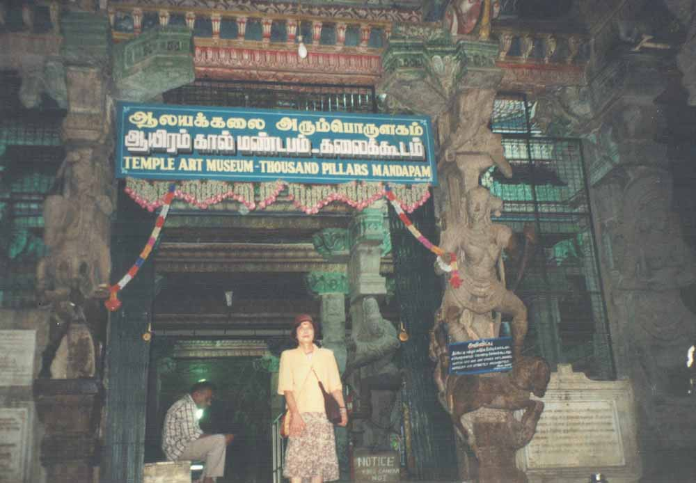

### ⑩ティルチラパリへ：街と岩山要塞神域をめぐって{#subsect10}

14時半に三輪車（60ルピー）を拾って、街中のヴァイハイ川を渡って東北のバスターミナルに向かいます。そこは新市街で官庁や大学などや、ガンディー博物館もあるとか。バスの発着場は郊外です。ここから東北方120キロメートルのティルチラパリ（Tiruchirappalli, Tiruchy）に行くのです。バス代と手数料とで110ルピーが要りました。バスは15時10分に出発して、象山の東麓を進み、処々に停車しながら18時に街の中央の終点に着きます。すぐ前に見えたミーガ・ホテル（Meega Hotel）に行きますと、ルピー勘定だというので、近くで両替して（50ドル、2,200ルピー）、550ルピーを前払いして、11階の部屋（103号室）に入りました。食堂でご飯とナン（44ルピー）を求め、隣の店からビール59ルピーを買って、自室に落ち着いて久し振りに乾杯です。

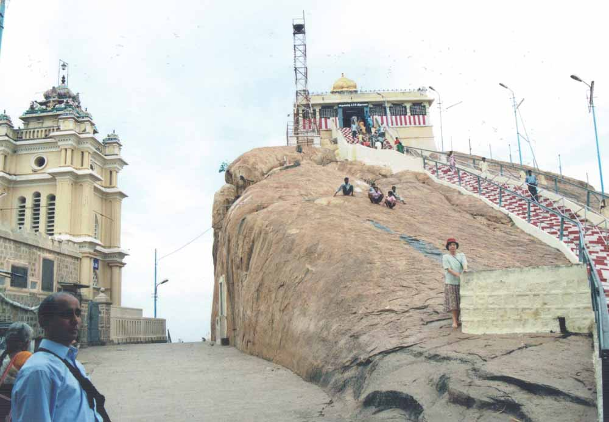

10月4日（土曜日）、朝6時45分、宿の前で三輪車を拾って出掛けます。ここは古都です。北方4キロメートル程の街全体が見渡せる岩山要塞（Rock Fort）に向かいます。そこには岩山（83メートル）があり、麓から頂上まで石段が続く岩を{刳|く}り抜いた巨大な神域で、大神殿の天井に描かれたシヴァ神は八方を{睨|にら}むのです。上の岩山に出て階段を登り頂上のガネーシャを祀ったウッチピッラヤール神殿（Uchipillayar）に着きました。ここでは眺望が大きく開け、北には街の外れに、広い砂洲の大河カーヴェリー（Kāverī）が流れ、その向うには緑の中に大塔門が聳えて見えます。この要塞は17世紀にマドゥライの王が構築したのだそうです。

山を下り、三輪車で北に廻り、カーヴェリー河を渡ると、川の中洲で諸神殿がある聖地スリランガムです。インド最大の神殿都市だとか。古典の出版地でもあります。橋を渡って東に右折すると、シヴァ神を祀る神域ジャンブケシュワラ（Jambukeshvara）に着きました。これは17世紀の建造で、5重の周壁と7つの塔門があるとか。一巡してまた次の神域を訪ねます。

### ⑪スリランガム：ランガナータスワーミ神域：南大塔門{#subsect11}

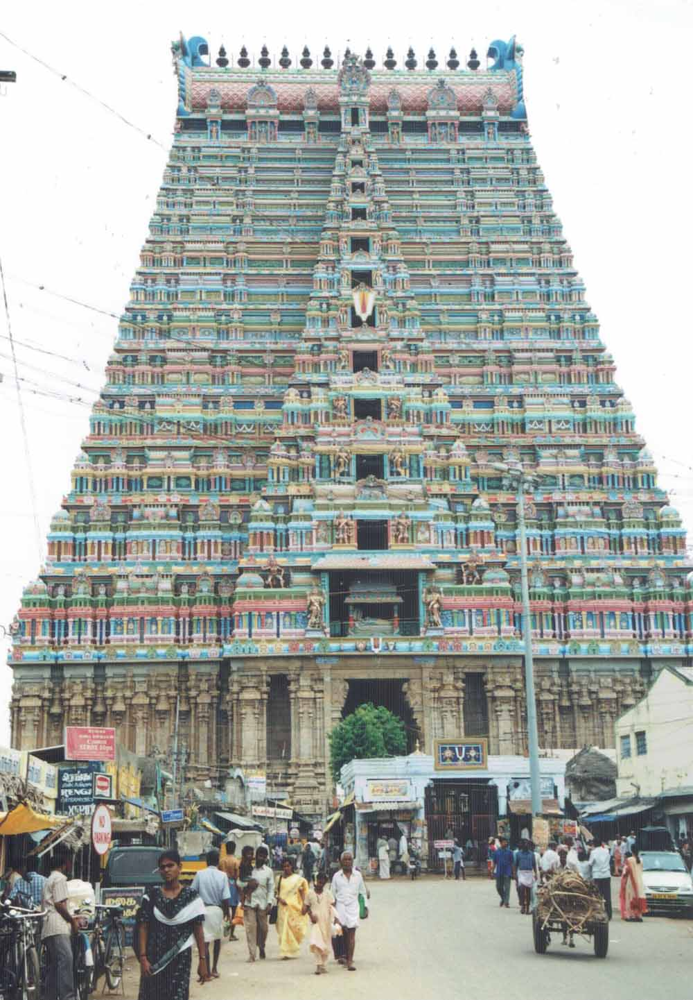{height=289}

4日、朝9時頃、西に1.5キロメートルほど行ったところにある地域最大のランガナータスワーミ（Ranganathaswami）神域に行きます。南北が長い方形の境内は、広大な7重の周壁に囲まれ、21の塔門があるそうです。このヴィシュヌ神を祀る神域の起源は10世紀を遡るようですが、今の建物の殆どは17世紀にマドゥライ王が建てたとのことです。歴代の王朝が次々と手を加えて拡張したそうです。南の外側の塔門は72メートルと最も高いのですが、未完であったのが、20年前にユネスコの援助で完成したとか。大抵の塔も頂上まで見事に色鮮やかな彫像で飾られています。南門から入って4つ目の門から内部が神域で、5つ目の門は通れましたが、次には入れて貰えません。神殿はうかがえません。東の4周目の塔門は白く清楚に高く聳えています。4周目から外は門前町で繁盛しています。

この後、引き返して、10時10分にティルチラパリの宿に帰りました。ログさんには約束通り250ルピーを渡すと、ガソリン代100ルピーも請求されました。食堂に入って遅い朝食を始めます。チャパティとプーリ（77ルピー）を買い、面倒な思いをしてお湯を貰い、味噌汁を作って啜ります。12時15分、バスで東55キロメートルのタンジャーブールへ向かいます。

### ⑫タンジャーブール（タンジョール）：大神殿の門：クンバコーナムへ{#subsect12}

13時45分タンジャーブール（Thanjavur, Tanjore）南郊外のバス駅に着きました。ここはチョーラ朝（9〜13世紀）の首都であった古都です。三輪車でシヴァ派の大神殿（Brihadishvara）に行きます。象がいるどっしりとした塔門をくぐり、次に左右に守護神が大きく彫刻されている塔門を入ると、広い神域で、正面にシヴァ神の乗り物である巨大なナンディン（聖牡牛）像がありました。これは単石から切り出され高さが4メートルもあるそうです。その後ろの正面の低い拝殿の奥に聳える四角錐の本殿は高さが63メートルもあるそうで、その頂部には宝珠様の石が置かれています。その冠石は重さ80トンもあるとか。神殿を囲む回廊には沢山のシヴァリンガが置かれています。これらは1,000年前、王朝の最盛期に建造された由です。ここの石造建築は、茶褐色で多くの彫刻が施されていますが、彩色はありません。塔門が低く本殿が高いのが特徴です。ミーナークシ神域やランガナータスワーミ神域とは反対です。

それから旧王宮に行きました。16世紀にマドゥライ王が建てたという一部が博物館ですが今日は休館です。広場の隅に神殿のような高大な四角錐の塔が見えますが、旧武器庫なのだとか。15時15分にバス駅に戻り、ログさんに200ルピーを払います。

15時20分にバスは出発して、1時間程で北東38キロメートルメートルのクンバコーナム（Kumbakonam）のバス駅に着きました。近くに飲食店や安宿Mkツーリスト・ホーム（MK Tourist Home）があります。2階の一室を確保して荷物を置き、三輪車を拾って夕暮れの街に出かけました。ここにも多くの神殿があり、門前町の集まりです。大叙事詩マハーバーラタ（Mahābhārata）の南インド版の出版地です。チャカラパーニ（Chakkarapani）神殿は小ぶりな{社|やしろ}ですが色彩が綺麗です。アーディクムベーシュワラ神殿は、遊園地もあり繁盛しています。ラーメーシュワーミ神殿はヴィシュヌを祀っています。ナーゲーシュワラ神殿も堅牢な石柱に絵が沢山飾られています。どこにも多彩な高い塔門がありました。

暗くなってしまい、神殿巡りも出来ないので、帰ります。19時15分頃、宿の前に着いて、傍の店でナン5枚25ルピー、ゆで玉子5個15ルピーを買い、苦労してお湯を貰って帰って、自室でくつろいで、食事を摂り、21時過ぎに休みました。ここは冷房も効かず暑い夜です。

## ⑬チダムバラム：踊るシヴァ大神殿：ポンディシェリからチェンナイへ{#subsect13}

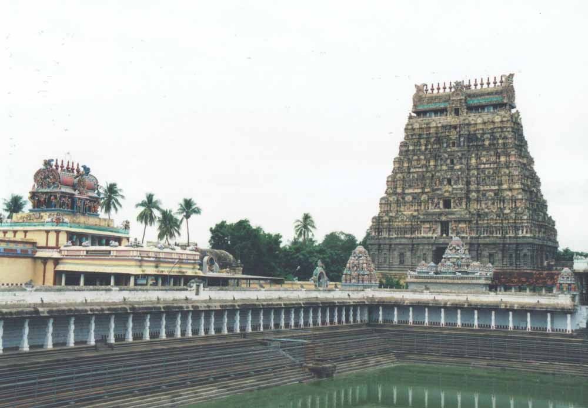

10月5日（日曜日）、朝6時に起きると、浴室の蛇口からお湯が出ますので、湯浴みします。お湯を貰って味噌汁を作り残り物を食べました。8時45分、宿を出て、すぐそばのバス駅に行き、ここから74キロメートル東北のチダムバラム（Chidambaram）へ行くバスに乗ります。切符は1人22ルピーです。すぐに出発して、途中で左に大神殿（Vaithisvara）が見える街などを通り、カーヴェリー河を越えて、目的地のバス駅に11時前に着きました。

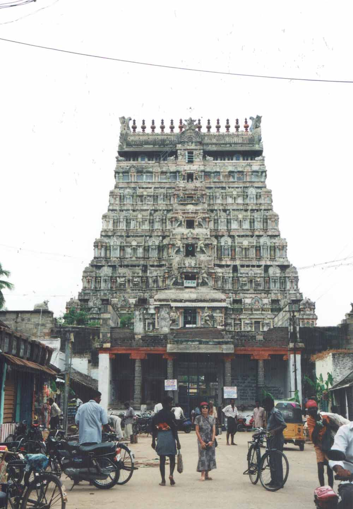{height=289}

直ぐに三輪車に乗せて貰って、ナタラージャ神殿（Naṭarāja）へ向かいます。そこはチョーラ朝の王様が10世紀に建てた神殿で、神殿を中心に町が発達した由です。その四方の塔門の建造時期は西が9世紀、南が12世紀、東が13世紀、北が16世紀で、南が最も高く49メートルあるとか。東門から入ると右（北）に広い千柱堂と大きな矩形の池（シヴァガンガー）、中央は金色の屋根を頂く神殿を囲む大伽藍の区画です。ナタラージャとは踊る王の意味で宇宙的躍動をするシヴァ神です。シヴァの息子であるガネーシャ神や ムルガン神などの御堂もあるのです。

12時半に、同じ車でバス駅に戻り、今度は76キロメートル北のポンディシェリー（Pondicherry）へ行くのですが、直通バスはなくて途中カダルール（Cuddalore）で乗り換えです。今度はバスは超満員で、私は坐れたのですが夫は立ちっぱなしです。

やっと16時前にポンディシェリーのバス駅に着いて、宿を探しますが空室がないのです。三輪車で1時間も探し廻って、7軒目で粗末な宿ティラヤム・ゲスト・ハウス（Thilayam Guest House）の3階の一室に入りました。夕方18時過ぎに繁華街に出てTシャツ20ルピーを買い、また両替すると20ドルが886.5ルピー でした。今夜はインド旅行の最後の晩餐にしようかと、車で料理店シーガルズ・レストラン（Seagull’s Restaurant）に行きました。ご飯、玉子、中華そば、ビールを注文して、2階の露台で満月に近づく月の光を浴び、ベンガル湾の波が砕けるのを感じながらゆっくり夕食を頂きます。帰りにはご飯、ナンなどもパックに詰めて貰って330ルピーを払いました。宿の近くの茶店でお湯を貰い、味噌汁と茶を作り、バナナや蜜柑を食べて休みます。ここは250年間フランスの植民地でしたが、今も学芸と教育の中心地で、研究書を出し続けているフランスインド学研究所もあるはずです。街並みは整然としていますが、処々で下水が流れて汚いところも多いのです。

10月6日（月曜日）、朝6時に起きて衛星放送でBBCを聞きます。8時55分に宿を出て、三輪車でバス駅へ行き、9時25分にチェンナイ行きのバスで出発します。料金は1人46ルピー、距離は160キロメートル余です。海岸沿いに北上してから山際を行き、空港近くを過ぎてバス駅に13時に着きました。それから三輪車で14時頃、前と同じ宿プレミア・ホテル（Primier Hotel）に着きました。15時に出掛けて郵便局でハガキを出してから、美術館へ行ったのに時間もなくて、ログさんの車に乗せられて物産店を覗いて帰ります。途中で両替しますと、2,000円が784ルピーでした。夕方、私は電話を掛けに、夫は中華料理を求めて歩きましたが、手ぶらで帰ってきました。

## **Ⅱ　スリランカ一周の旅**（10月8日〜10月23日）{#sect02 .break-recto data-sect-title="Ⅱ　スリランカ一周の旅"}

### ⑭スリランカへ：ネゴンボの海岸{#subsect14}

10月7日（火曜日）、朝はゆっくり自室で、チャパティ、プーリ、オムレツなどを取り寄せて朝食を食べてから、出掛けます。夫はよいズボンを見つけて250ルピーで買い、着替えをします。11時に宿代を清算すると、食費こみで902ルピーでした。ログさんの弟が三輪車で空港へ連れて行ってくれます。空港は南西20キロメートル程の山際にあり、45分で着きます。荷物検査ではカッターとライターが引っかかりました。14時20分に漸く休んで煎餅やチャパティを食べ、15時に搭乗の行列につきます。15時50分にコロンボ行きのUR128便は離陸して、時差+30分のスリランカ時間の17時23分に着陸しました。空港ビルに移動し、入国審査を受け、荷物を受け取って出ますと、ソーマランシ師（Ven. Udagaladeniye Somaransi）が出迎えに見えています。旅程について助言を伺い、再会を約して別れました。それから師が手配した車で前に泊まったネゴンボの宿キャメロットビーチ・ホテル（Camelot Beach Hotel）に行きます。車代は600ルピーでした。夕食は宿の食堂で、ビールも頂戴し、1,600ルピーを払います。そのうちにソーマランシ師から連絡が入り、「スリランカを廻るには貸切車を使う方がよいから、支配人に話して置こうか」と。そのようにして貰い、宿の支配人から11日間で車代26,000ルピーという予約を得ました。

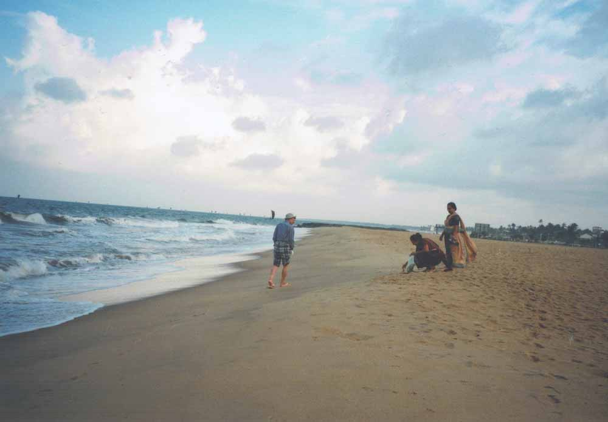

### ⑮アヌラーダプラ：イスルムニヤ寺：巨岩とその下の涅槃堂{#subsect15}

10月8日（水曜日）朝6時、ネゴンボの宿で余分の荷物を事務員に預けた後、食堂で食事をします。7時10分にロビーに出ますと、旅行業者サンタ（Santha）さんがいます。彼は私らを彼の事務所に連れて行き、宿泊費を含めた計画を勧めますが、それは断って宿料は私等がその都度払うことにします。前金6,000ルピーを求められます。それは断り切れません。旅程や料金の支払い方法など確認した契約書が交わされます。それから彼の家に寄ると、痩せ型の中年男ガムヌ（Gamunu）さんが運転手として乗りこみます。こうしてスリランカ周遊の旅が始まります。

8時20分に出発して海岸線を北上して行くと、雨も晴れてきて9時30分にチラウ（Chilaw）という賑やかな町に着きました。運転手のガムヌさんは食事のために下りていきました。私らはそこでバナナ2本25ルピーを買い、それから持って来た煎餅などを適宜に食べてお湯を飲むのです。9時47分に出発しキリヤンカリヤ（Kiriyankaliya）を過ぎると、左に海老の養殖池が続きます。入り江（lagoon）の岸の町プッタラム（Puttalam）から東に向かい、二、三の町（Karuwalagaswewa、Kala Oya）を過ぎて、緑の平原を進んで行くと、木蔭豊かな仏都アヌラーダプラ （Anuradhhapura）に入り、今日の宿ホテル・シャリーニ（Hotel Shalinī）に案内されました（12時50分）。木蔭で涼しい1階の角の部屋に入り、お湯のシャワーを浴び、キャベツの漬物をつけて休みます。

ここは2,200年以上も昔から、千年余も王都であった地で、紀元410〜411年に法顯が滞在時の様子を伝えています。しかし19世紀には仏跡は密林に埋もれてしまったとか。今は仏跡が復元されているのです。

15時過ぎに車で宿から3キロメートル西のイスルムニヤ精舎（Isurumuniya vihāra）に行きました。右には矩形の池、その左に巨石を背にお堂があり、右の大石の水際には彫刻があり、象の姿も見えます。入り口の階段の左右には護法神が立つ石像があります。入場券は1人100ルピーでした。紀元前3世紀に建てられた僧院の跡とかといわれます。洞窟状の本堂には新しく彩色された仏坐像や{涅槃像|ねはんぞう}があり、堂内の仏像は堂々としており壁画も立派です。背後の岩には白亜のすがすがしい仏塔が立ち、脇の高い岩の上では眺望が開け、ここの仏都の全景が見渡せます。背後の西には大きな池があり、遠く東の山の左肩には、白い仏塔が見えます。それがミヒンタレーの丘です。16時15分に、ここから出て、白い大仏のある僧院に立ち寄ってから、11キロメートル東のあの丘に向かいます。

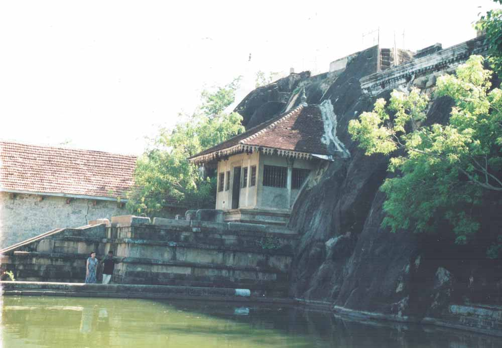

### ⑯ミヒンタレー（Mihintale）の丘：大塔、昇る満月と沈む夕日{#subsect16 .break-before}

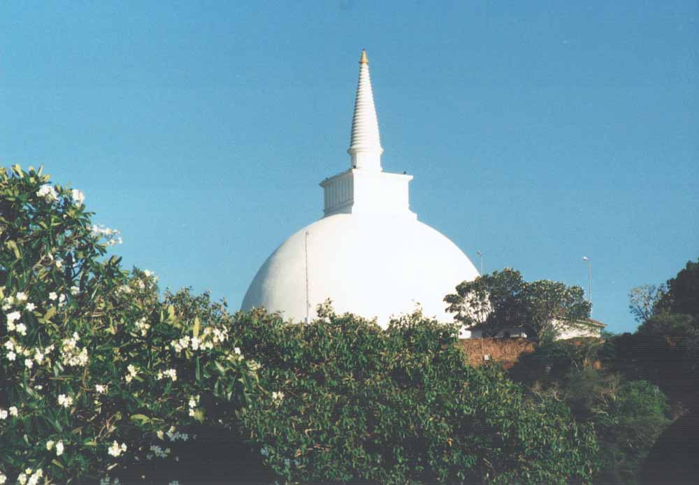

17時前に、丘の麓の駐車場に着きました。この丘が、紀元前3世紀にアショーカ王の王子マヒンダが仏教を伝えたという故地です。脇の階段を登ると高さ12メートル、周囲130メートルという崩れかけた土饅頭型の仏塔、カンタカチャイッティヤ（Kanthaka Cetiya）があります。これは1930年以降に発掘されたそうで、周囲は芝生で花咲く木々も植わっています。紀元前60年頃に建てられた当初には30メートル以上も高かったそうで、{半月磐|はんげつばん}（moon stone）や守護神石像（guard stone）、動植物や人物が彫られたが石柱も見えます。若者が来て分かりやすく説明をしています。彼に案内されて裸足になって、頂上の白い半球形のマハーサーヤ大塔（Maha Seya Dagaba）を目指して、参道の右に僧院の跡や樹間を登って行くと、岩に囲まれた貯水池がありました。その脇の岩場を登ると頂上で、視界が大きく開け、円い月がもう昇っています。後ろを振り返ると夕陽が沈むところです。直ぐ近くのお釈迦様の髪が祀られているという大塔を{右繞|うにょう}して休みました。下方東側には白い大仏と仏塔が見え、そっちが表参道です。そこを下りたいと思ったのですが、夫が「お金がかかる」と止めるのです。岩山を降りて行くと、貧相な男がいて何か言っています。「あの男が入場料1,000ルピーを求めているから払って下さい」と彼が頼みます。怪しいと思いながらも、お金を払います。また若者は600ルピーを求めるのです。後でガムヌさんにこの経緯を話すと、2人ともペテンのグルだというのです。けちな了見のせいで失敗したのです。でも願った通りに、あの丘の上で東天に満月を仰ぎ、西天に夕日が沈むのを見届けることが出来ました。

19時過ぎに宿に着き、ご飯、魚料理、玉子、ビールなどを取り寄せて夕食を頂き、蚊帳を吊って休みます。

### ⑰アヌラーダプラの仏跡：菩提樹、大塔、トゥーパーラーマ寺など{#subsect17}

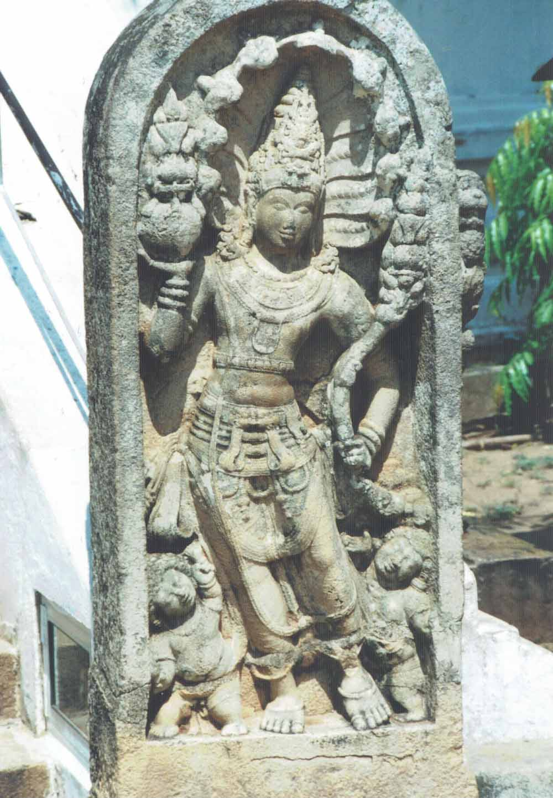

10月9日（木曜日）、朝目覚めると、蚊がいます。{蚊帳|かや}の中に蚊が2匹入っています。これは捕まえました。7時頃、パン、ゆで玉子を取り寄せ、味噌汁を作り、お茶を{淹|い}れて食事を始めます。今日はまずここの仏跡を廻るのです。8時15分に部屋を出ますと、ガイド役の若者（Anil君）が来ています。10分後に車夫のガムヌさんが来て、出掛けて西に向かいます。8時34分に切符売り場に着いて遺跡地区の周遊券2人分65ドルを買います（1人3,120ルピー）。

まず菩提樹寺（Sri. Maha Bodhi Tree）の入り口で車を降り、大樹の前に建つ仏殿に詣でます。彩色されたお釈迦さまが{結|けっ}{跏|か}{趺|ふ}{坐|ざ}し、花や供物で飾られ、周りにも仏達が安置されています。裏の菩提樹は若々しい枝葉をつけています。紀元前3世紀にアショーカ王の王女サンガミッター（Saṅghamittā）が、仏成道の地ブッダガヤの菩提樹の枝をここへ運び、時の国王が植えたと伝えられています。ここはブッダガヤと同じように参拝者が多いのです。この北のルワンウェリ・サーヤ大塔（Ruwanweli Seya Dagaba）にお参りして大塔を巡ります。高さ55メートルの純白の塔は第2次大戦中に現形に復元されたそうですが、昔はもっと高かったとか。大塔の隣にある仏堂には多くの仏立像が並んでいます。ここが上座部仏教の伝統を護り続けた大寺派の中心であったのです。

北に向かうと、沢山の石柱に囲まれた塔トゥーパーラーマ寺（Thūpārāma Dagaba）があります。ここは最古の仏塔と言われます。入り口の階段の左右には一対の守護神石像が立っています。龍神とも言われます（写真上は左側の像）。釣鐘型の白塔は1840年の再建とか。この北2キロメートル程の宮殿跡に、保存がよい半月磐があります。その外縁の炎輪は人間の欲望の世界で、内側には象、馬、獅子、牡牛、そして花や鳥などが彫られています。近くに聳えるアバヤギリ（{無畏山寺|むいさんじ}）のアバヤギリ大塔（Abhyagriri Dagaba）は、紀元前1世紀初めにタミル勢力を退けて復位した王（Vaṭṭagāmaṇī Abhaya）が建てた寺で、以来大寺派と抗争しながら12世紀まで、大乗仏教を受け容れて栄えた名刹の跡です。この草ぼうぼうの赤煉瓦の堆積は75メートルの高さがある由ですが、古くはもっと高かったとか。引き返してジェータヴァナ（Jetavana）大塔へ行きますと、3世紀に遡る赤煉瓦の土饅頭型の塔が復元工事中です。当地の仏跡については後にも触れましょう。

12時40分に宿に着き、案内の若者に500ルピーを払い、以後の案内は断ります。宿には宿泊費3,166ルピーを支払い、14時に出発して、西南に向かい、疎林の平原を進みました。

### ⑱古跡アウカナ：日を浴びて立つ大石仏像{#subsect18}

マラダンカダワラ（Maradankadawala）の分岐点を南に向かい、右折して湖畔を行くと、アウカナ（Aukana）に着きました（15時20分）。11メートル余の石仏立像は5世紀後半にダートセーナ王が建てたそうです。頭上の火炎光（siraspata，仏陀が現世にいる目印、{智慧|ちえ}の炎）は20世紀に付け替えられたそうです。右手を上げた形は、仏像の{施無畏|せむい}{印| いん}で、「安心しなさい」と、人々に{安寧|あんねい}を与えようという姿です。近くには仏塔があり菩提樹も元気に茂っています。一巡してまた発車して（15時40分）、湖畔の道を北に進み、カキラワ（Kakirawa）の辻を越え、ゲーンウォルポーラ（Ganewalpola）の三叉路で右折して山の南麓を東行してから左に山道を行くとリテイガラ（Ritigala）遺跡です（16時50分）。千年も山麓の密林に埋もれた広い遺跡で、礎石などが見えますが、蚊がいて痒く、15分程行って戻って東に向かいます（17時45分）。ハバラナ（Habarana）からは良い道ですが、疎林を通ると二度も象に出会いました。

18時8分にポロンナルワの宿ヘーマリー（Hotel Hemalee）に着いて、蒸し風呂のような部屋に入ります。廊下の卓上で、ご飯、お魚、オムレツ、即席麺、漬物などを頂きます。蚊帳を吊って22時頃休みました。

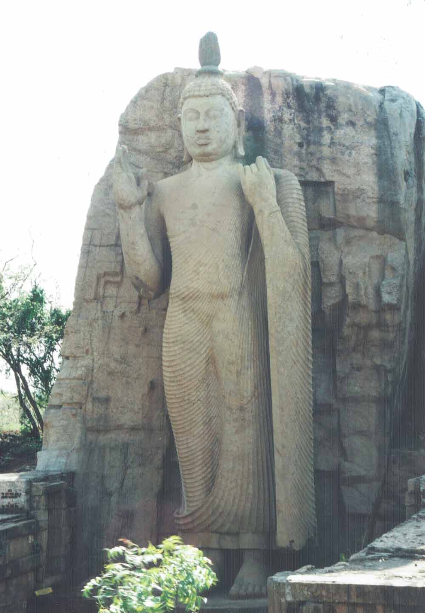{height=289}

### ⑲古都ポロンナルワ（Polonnaruwa）：仏塔跡、遺跡群{#subsect19}

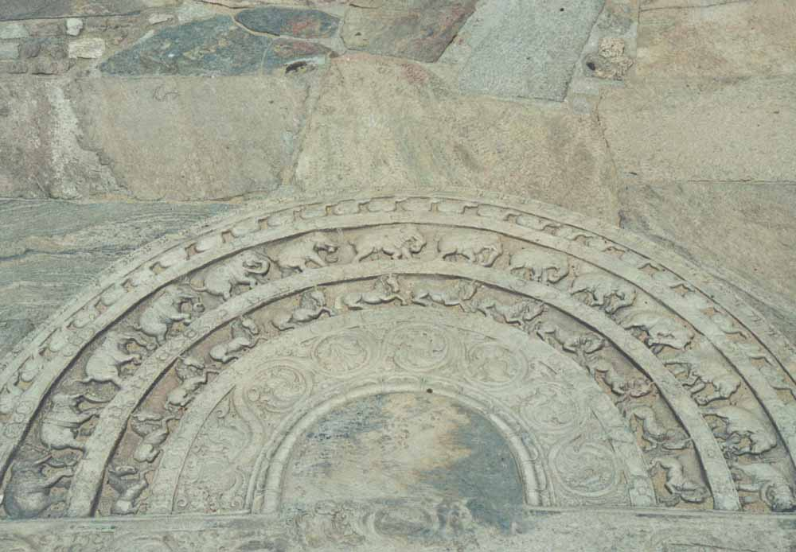

10月10日（金曜日）、8時から昨夜と同じようなものを食べます。宿の勘定は2,297ルピーでした。

8時55分に出発し東へ向かいます。途中、堀のところで人々が騒いでいるので見ると、{鰐|わに}がいます。見ていると、10ルピーを取られるのです。巨大な湖が見えてきました。この東側の地域に遺跡群があるのです。スリランカは11世紀には、南インド勢によって都アヌラーダプラが征服されて、ポロンナルワに都が移されました。ここは仏教都市として開発され、またビルマ（ミャンマー）から高僧が招かれて仏教が栄えたのです。13世紀後半には、シンハラ王朝はまた南インド勢の侵略を受けて、島の中・南部へ退き、この町は廃都となりましたが、1900年以降に遺跡の発掘で注目されるようになったそうです。

9時23分にポロンナルワ博物館に入ります。この地区の古い歴史を遺跡の写真や建造物の模型などで知ることができます。12世紀ごろの風化した仏像、ヒンドゥーの神々のブロンズ像もあります。ナタラージャ、ガネーシャなどがほぼ完全な形で残っています。裏の方に出ると、本屋があって、そこで碑銘刻文の報告書など数冊（4,392ルピー）を買いました。

10時50分に出発して、銀行で両替すると、40,000円が33,740ルピーとなります。11時17分に東方に向かい、宮殿跡に行くと12世紀の煉瓦造りの重厚な建物の壁が残っていて、宮殿内の北東にニッサンカ・マッラ王の閣議場（Council Chamber of King Nissanka Malla）があり、各大臣名が彫られた石柱も沢山残っています。獅子像のところが玉座で、首相、知事、貴族、商人たちの席もあったとのこと。宮殿の南東に沐浴場があります。また13世紀のヒンドゥー神殿跡シヴァデーワーラヤ（Siva Devalaya）がかなりよく残っています。

11時30分に遺跡群クワドラングル（Quadangle）に入ります。城壁に囲まれた四辺形の庭に11の建物があるとか。入り口を入ってすぐ左側にトゥーパーラーマと言う四角張った仏堂があり階段を登って中に入りますと古い仏像があります。その北東にある円形の大きい仏塔ワタダーゲ（Vatadage）跡の、入り口にある半月磐（ムーンストーン、写真）と守護神石像はよいものです。その向かい側はハタダーゲ（Hatadage）という{仏歯寺|ぶっしじ}跡です。門を入ると右側の壁に王を讃えるサンスクリット文字の碑文が残っていて、その廻りに踊り子たちの彫刻が見えました。

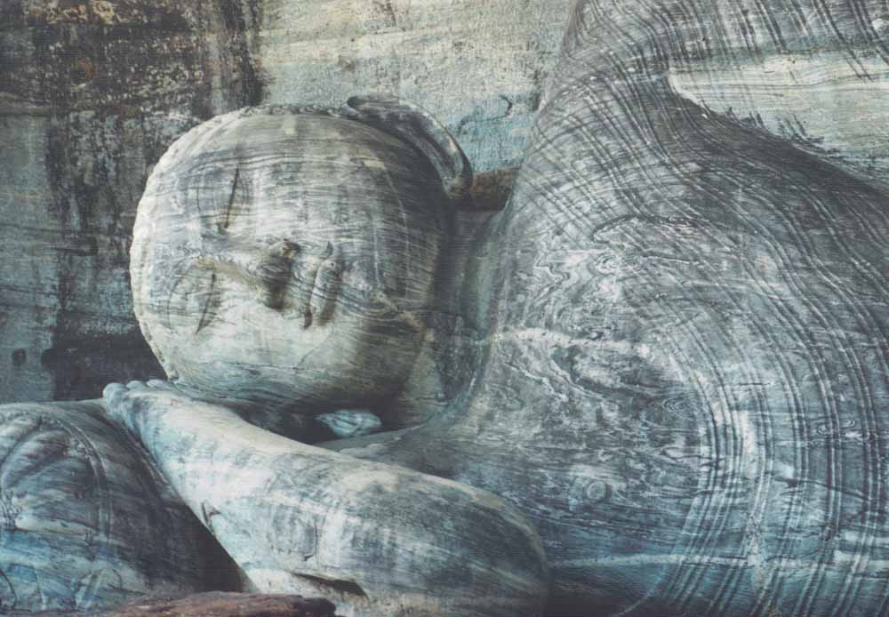

### ⑳ポロンナルワ：大石仏像：立像、涅槃像、坐像、そしてシーギリヤへ{#subsect20}

その北の端には7階建ての塔サトゥマハルプラサーダ（Satmahal prasāda）があります。それはタイ人が建てたそうです。遺跡群を出ますと、タミル人が建てたというシヴァ神殿（Siva Devalaya）やキリ精舎（Kiri Vihāra）の塔が見えます。

ずっと北へ行くとガル精舎（Gal Vihāra）の3体の大石仏像があります。左側は瞑想している4.6メートルの坐仏像、真ん中は腕を交差して考えている姿の7メートルの立像（{阿難|あなん}）、右端の14メートルの涅槃像は、ふくよかで柔和なお顔です。湖畔には最近の建立と思われる大仏が立っています。

14時20分に精舎の庭を出て25分で宿に着きました。ご飯と水を取り寄せて食べ、勘定すると154ルピーでした。16時20分に出発して東に向かいます。森林の中を進むと野生の象達に会います。17時45分に夕日を受けるシーギリヤ（Sigiriya）の岩山を写真に収めて、ダンブラの方に向かい、18時5分に木立に囲まれた宿イナマルワ・イン（Inamaluwa Inn）に入ります。ご飯とゆで玉子とビールを求め、味噌汁を作って夕食を頂きました。21時30分に休みます。

### ㉑巨岩上の古城址：シーギリヤ（Sigiriya）：岩壁の美女たち{#subsect21}

10月11日（土曜日）、7時前に起き、パンとお湯をもらって朝食。7時50分に出発すると10分余でシーギリヤの東の入り口に着きました。ここは巨岩を前方（西）に望む庭園で煉瓦造りの遺構もあります。進んで行くと右側に石窟寺院跡があり、左側は説教の岩場とか。岩石の間に隙間が連なり階段や足場となっています。ここは観光客も多く日本人も見えます。

この石段を登り始めます（8時35分）。岩山の中腹には鉄製の螺旋階段と昇降機があります。階段を登り昇降機に乗って出ると、鮮やかな色彩で描かれた女性たちの手前の桟敷です。この覆いかぶさる巨岩の窪みに、紀元5世紀ごろ豊満な美女達が描かれたのです。写真も大体は撮りましたが、風化や破損も多く、また足場も光線も悪くて、よく撮れていませんでした。また一旦下まで降りてから、長く延びる鏡壁（Mirror Wall）と岩肌の間を左に登って行くと、北側の広場に出ます。右手の巨岩に彫られたライオンの両前足の間の階段が、宮殿への登り口です。口を開けたライオンの頭もあったとか。ここからジグザグに登りきると、広い頂上です（9時35分）。幾つかの区画からなる王宮跡、貯水池などもあり、180メートル下に広がる遺跡と、遥か向こうまで緑豊かな四方が見えました。

5世紀後半にここに王宮を建てて住んだのがカッサパ王といいます。王は全島を統一したダートゥセーナ王の長男でしたが、父と不和となって父を殺害し、異母弟を怖れてこの岩上で暮らしたそうです。しかし王は18年後、弟の軍に攻められて自害し、首都はアヌラーダプラに戻ったのです。ここにある壁画はイギリスの植民地であった1875年に、イギリス人が望遠鏡で眺めて発見したとか。壁画の美女たちは500人ほどあったらしいというのですが、今残っているのは18人だけだそうです。

10時10分に降り始め、10時45分に山を降りきると、そこにはお土産店が並んでいて、売り子たちが寄ってきます。小冊子460ルピーと半月磐の{蝋纈染|ろうけつぞめ}（バティク）30ドルを買いましたが、後で確かめると安物の金魚の絵柄とすり替えられていたのです。10時50分にここを出て、11時5分に宿に着きました。すぐに昼食を注文して食事、宿代2,310ルピーを清算して、13時に出ます。それから西南へ7分ほどで、別の宿ペルウェヘラ・ビレッジ・ホテル（Pelwehera Village Hotel）に着きました。導かれた所は庭に面した小綺麗な平屋の別棟で、少し暗いが天井が高く清潔な部屋です。

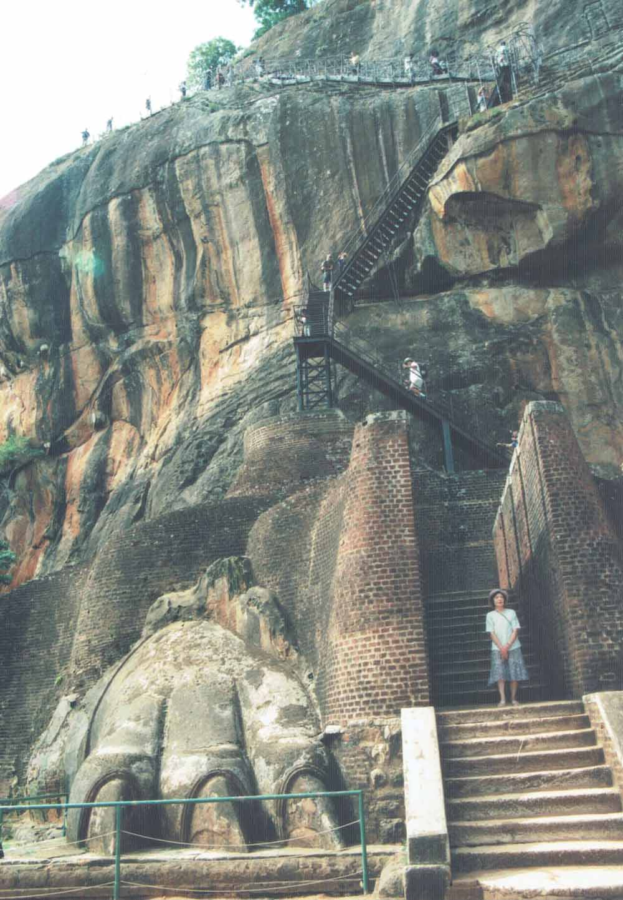{height=289}

### ㉒ダンブッラ（Dambulla）：岩窟寺院内の諸仏像：立像、坐像、涅槃像{#subsect22}

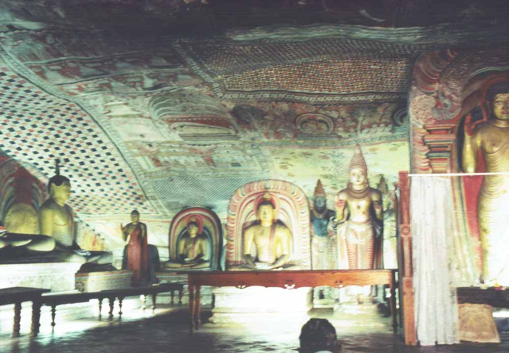

15時30分に出かけて、大仏（Golden Temple）前で降ります。新しい博物館の上に金色の大仏の頭が見えました。岩窟寺院（Cave Temple）の入場券500ルピー と博物館券100ルピーを買って入りますが、館内には見るべきものが殆どありません。16時5分に大仏の左脇から素足になって石段を登って、向こうの巨岩の下の天然の岩窟の方に昇って行きました。巨岩の左（南）下が5つの岩窟寺院になっていて、どの石窟にも極彩色の壁画が描かれ、多くの仏像が安置されています。{涅槃仏|ねはんぶつ}も壁と同じ自然石に彫られていて目を開き、全身が黄金色です。数十体もの仏像が並んでいる所もあり、ヴィシュヌ神も祀られていてヒンドゥー神域のように賑やかです。天井一面に仏陀の生涯を描いた壁画もあります。

下山して（18時15分）、野菜90ルピーを買い、宿には19時40分ごろに着きました。夕食にはご飯と玉子と海老料理とビール、お湯を取り寄せて味噌汁を作って頂きます。外は晴れて満月です。わりに暑いのです。蚊帳を吊って22時頃に休みました。

### ㉓スリランカの中心：ナーランダ（Nalanda）古跡{#subsect23}

10月12日（日曜日）。朝6時半に起きて外出して宿の周辺を散歩してみます。ここは郊外のようで近くには疎林の中を南北に走る幹線道路が伸びています。帰ってから朝食。宿代4,400ルピーを支払い、9時に出発して南へ向かいます。運転手のガムヌさんは給油所に寄ってから、またダンブッラ大仏前で停車して、骨董品店に立ち寄ります。ここで電池300ルピーを買って、9時半に出発して南に向かい、9時55分に右折すると間もなくナーランダの古跡に到着して下車しました。

ここの8世紀頃に遡るとかいう石造仏殿はこの島の中心のシンボルとして建てられたそうです。南インドの神殿建築様式とかいわれる小仏殿で、木陰に方形の石垣を廻らした基壇に建っています。仏殿の廻りの壁にはいろいろな顔が彫刻されていますが、風化しています。中には古そうな本尊の仏立像が安置されていますが、お顔の相好は風化のためか定かではありません。仏殿と並んで煉瓦の方形の基壇に低い煉瓦のストゥーパもあります。ここの近くには水量豊かなマハウェリ川（Mahaweli）があり、そのダム工事のためにこの仏殿が解体され移動させられたことがあったそうです。

10時25分に出発して20分ほど南に行ったマダワラ（Maduwala）で停車して、道を尋ねてテンプテイヤ寺（Temptiya vihāra）に行ってみました。ここは新しい石造寺院のようで、中には極彩色の仏像や壁画があります。それからガムヌさんは我々を香辛料の植物園に連れて行きます。林の中に胡椒やコーヒーの木などがありましたが、覚え切れません。

### ㉔聖典筆写の地：アルヴィハーラ（Aluvihāra）岩窟寺{#subsect24}

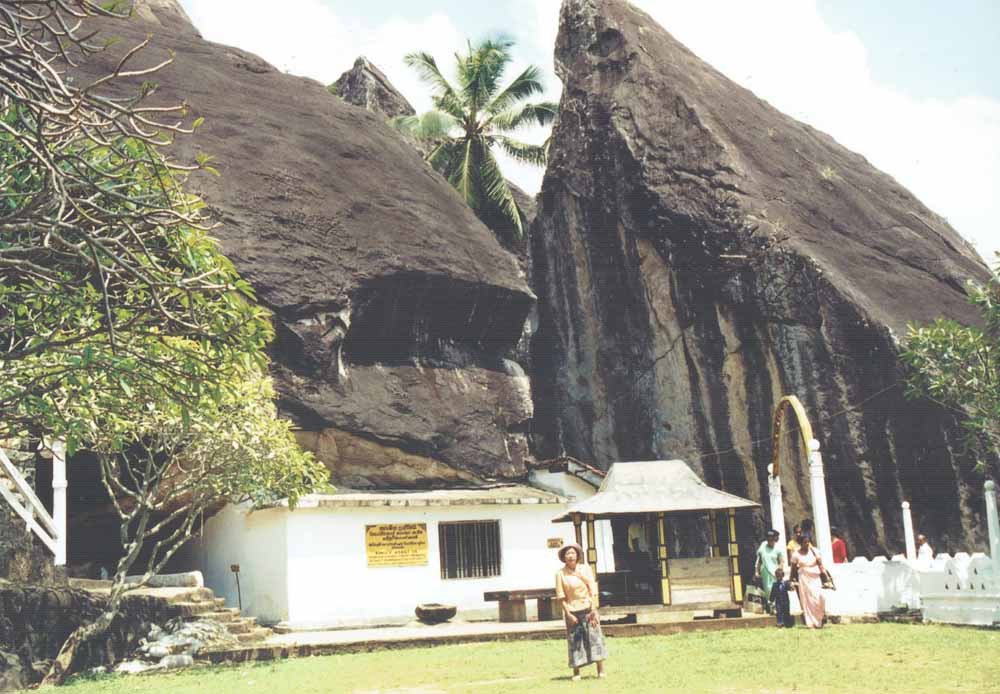

また出発して（11時32分）、13分ほど南に行くとアルヴィハーラ石窟寺院前です。ここはマータレー（Matale）の北郊外です。紀元前77年、それまで口伝で{暗|あん}{誦|しょう}されて伝えられた仏の教えが、ここで初めて文字に記されたと伝えられています。幹線道路の西側で、奥まった広い石段を登ると山間の崖の下に入り口があり、階段を上っていくと、右に立ち並ぶ巨石の石窟が仏堂です。小冊子100ルピー、下足料10ルピー、寄付金50ルピーを納めて、窟内に入ると大きな{涅|ね}{槃|はん}{仏|ぶつ}が目を見開き、そのまわりには数体の仏立像や{比丘|びく}達の立像が取り囲み、天井にまでも壁画が描かれていました。

石段の上にある図書館には、書写用の干した椰子の葉（{貝葉|ばいよう}）などが用意されており、館長さんが鉄筆で文字を書いた跡に墨を塗ってから布で拭き取ると出来上がりです。勧められるままに私も試みました。ここの脇には韓国から寄贈されたという{梵|ぼん}{鐘|しょう}が、新しい鐘楼に吊るされています。

ここから数キロメートル南に進むとマータレーの街です（12時45分）。東側（左）には南インドでも見たような小塔門のあるヒンドゥー神殿があります。境内に入って見ますと、小規模な本殿は極彩色で細やかな彫刻で飾られ倉庫には華やかな山車も見えました。

13時に出発して、少し行くと右にイスラーム教のモスクが見えます。

13時47分にキャンディの宿ブリンクボニー・イン（Blink bonnie）に着きました。ここはキャンディ湖（Kandy Lake）の南岸の傾斜地で、私らの部屋は道路沿いの最上階で見晴らしがよいのですが、食堂などは下の階です。ご飯とゆで玉子を取り寄せて食べてから、15時35分に宿を出て、西廻りで対岸に渡ると、10分で仏歯寺（Dalada Maligawa, Temple of the Tooth Relic）の前に着きました。

### ㉕旧都キャンディ（Kandy）：湖畔の仏歯寺、同博物館{#subsect25}

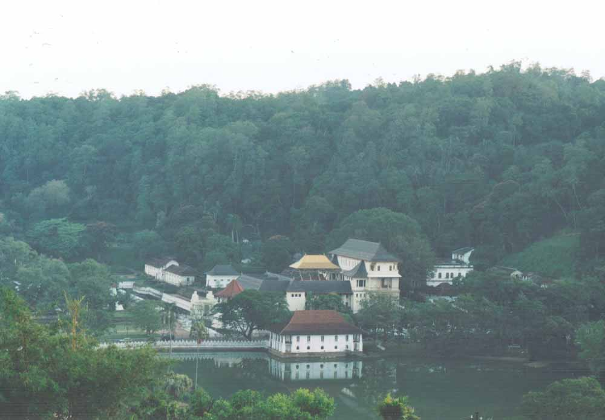

スリランカ北方において、権力争いを繰り返したシンハラ人の王権が、タミル勢力に抗し切れずに、13世紀中頃にはポロンナルワを放棄して分散し、南方の山岳地帯などに転々と本拠を移して、その最後の都が、このキャンディです。もと15世紀頃に始まるコッテ（古名：Jayavaḍḍhana，今のコロンボの東）の王系から出た王様が、ここを都にしたのだそうです。この王国は国内勢力と争うだけではなく、諸外国勢力に苦しめられ、ポルトガル、オランダ、そして英国の植民地政策に拮抗しながらも、終に1815年に大英帝国の支配に屈したのです。それでも王宮が博物館になり、豪華で宮殿のような仏歯寺も王朝の面影を伝え、山紫水明の古都です。街の中心には最後の王様が19世紀初に造った湖があって、お寺や宮殿や木々の陰を映しています。標高は500メートルほどで、緑の山々に囲まれています。

このお寺には仏歯が安置されています。インドで紀元前5世紀に仏は火葬にされたはずですが、その仏の歯が4世紀にこの島に持ち込まれたそうです。始めアヌラーダプラに祀られ、都が移る度に一緒に運ばれて、16世紀末頃にキャンデイに落ち着いたのです。キャンディ王になったヴィマラダンマスリヤ1世（在位1592年〜1604年）は、仏歯を捜し求めて、都に迎えて仏殿を建てて祀り、その4代後の王が18世紀初に新築した寺院の一部や、最後の王が建てた八角堂などが、今も残っているのだそうです。

金色の屋根の仏歯寺本堂の仏歯の間は、正面が1対の長い象牙で飾られ、上階に黄金の仏坐像や{比丘|びく}たちの立像が安置されています。本堂の後の大きい建物の上階が博物館で美しい人物画や金色の端正な仏坐像などがあります。

夕方17時過ぎに、その近くのマーケットで、梨、林檎、胡瓜、ザボンなどを買って車に乗ると、運転手のガムヌさんは何も言わずに、演芸場に連れて行くのです。2人分500ルピーを出して演芸ダンスを見ることになりました。ここのダンスは有名で、王朝時代の宮廷で踊られた舞を中心に各地の民族舞踊を組み込んだものだそうです。激しい動作の踊りと一種の曲芸があり、飛び跳ねたり、皿廻しをしたり、太鼓と笛の音に感嘆します。10分の休憩の後、炬火を使った踊りや曲芸があり、最後は火渡りの曲芸があって、18時50分に終わりました。小雨の中を宿に帰ります。19時に着いて、ご飯、ゆで玉子、ビールを買って夕食を頂き、21時過ぎに休みました。ここは高地のせいか、割りに涼しく、蚊帳を吊りましたが、蚊はいませんでした。

### ㉖キャンディー：旧王宮：国立博物館、白い大仏坐像{#subsect26}

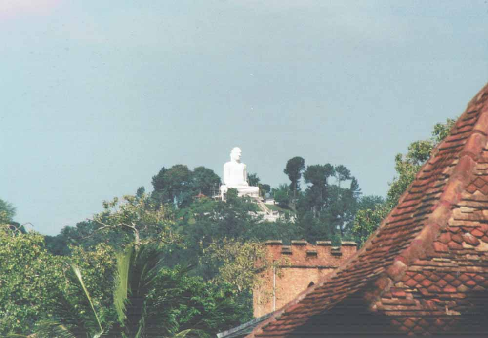

10月13日（月曜日）、7時に起きて湖や王宮などを見下ろすベランダで朝食。トースト、オムレツ、ジュース、味噌汁、サラダを頂きます。8時50分に出掛けて仏歯寺の横のキャンディー国立博物館に入りました。ここは昔の王妃の平屋の宮殿で、中庭を囲むようにして、古い仏像や石像壁画などの展示物が置かれています。古い宝物や調度品もあるのです。高等裁判所の向こうには旧王宮の平屋の遺構が考古学博物館となっていて、古い調度品などがありました。この博物館の屋根越しに白い大仏坐像（White Buddha）が見えます。北西の丘に立つ高さ13メートルの白亜の大仏は1993年に造られたとか。この大仏の後ろには幾つかの仏像や仏陀の一生を描いた浮彫などがあるそうですが、訪ねる機会はありませんでした。

### ㉗キャンディー郊外：植物園{#subsect27}

10月13日、10時40分に博物館を出て、仏歯寺の脇を歩いて駐車場に戻り、11時に出発して西南のペラデニヤ植物園（Peradeniya Botanical Garden）に行きます。入場券各300ルピー、地図20ルピーを買って広大な園に入ります。マハーヴェリ河の湾曲部の面積59ヘクタールに4千種以上の植物があるそうです。14世紀に造られた宮殿に由来し、王家の植物園から、大英帝国の経営、さらに現政権に受け継がれたのです。昔の遺構があちこちに残っているようです。正面の門を入ると、右に香辛料植物園、蘭の温室、花園などがあり、左に行くと1メートル以上も太く40メートルほども高い巨木（Australian Baobab, Upas Tree）が立ち並び、向こうの広い芝生の中央には小山のようなジャワ・ビンロー（Jawa Fig Tree, Areca catechu）がこんもり茂っています。1メートル以上も太い幹から唐傘状に分かれて茂る枝の直径は50メートルもあります。大樹といえば、この前年にカルカッタ（コルカタ）近郊の植物園で見た大榕樹（ニグローダ）を思い出します。それは主幹も見当たらず枝から垂れ下がる根が次々に幹となって森になっていたのですが、全体像が摑めませんでした。近くには研究棟があり、覗いてみると植物標本の整理中でした。どれだけの標本があるのか尋ねますと、100万点以上もある由です。

### ㉘キャンディー近郊：諸寺院を巡って{#subsect28}

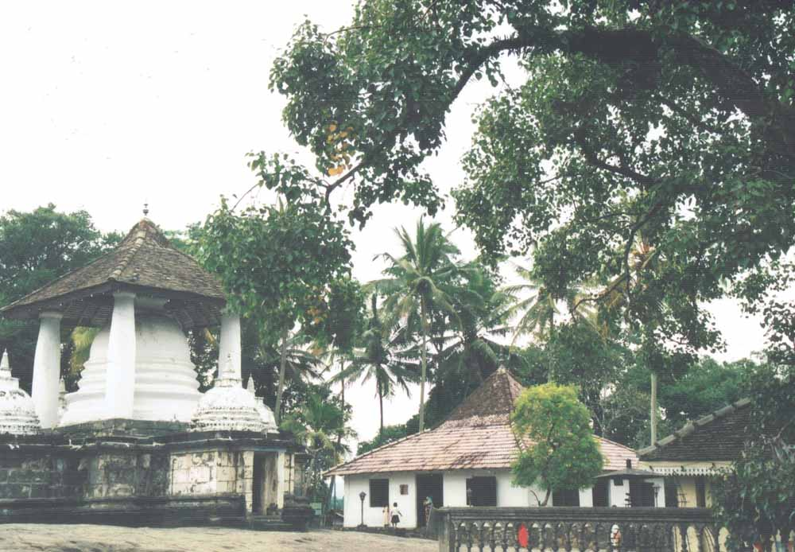

13時過ぎに植物園を出て、近くの食堂に入って、ご飯、きのこ料理、玉子焼きを取り寄せて昼食。キャンディー周辺には古寺が点在しています。14時半に出発して古寺巡りです。西南に10キロメートルほど行くと、長い階段の上にランカティラカ寺 （Lankatilake vihāra）があります。14世紀の創建というこの寺は、19世紀に洋風に再建されたそうです。本殿にはカラフルで豊満なインドの神々（Viṣṇu, bibhīṣana, Ganeśa, Skanda）が祀られています。その右に大菩提樹が茂りその前には釈迦如來坐像が祀られ、左には白亜の仏塔が立ち、小菩提樹もあります。ヒンドゥー教と仏教とが融和しているようなお寺です。拝観料は2人で200ルピー、寄付やチップを求められます。

さらに2キロメートルほど南方に行くと、大菩提樹が茂るエンベッカ寺院（Embekke Devale）がありました。ここは14世紀〜15世紀に遡るそうです。古い彫刻が施された沢山の柱の立つ拝殿の奥に小神殿があって、左右に獅子像がある入り口からは、2人の美しい女神を伴にして孔雀に乗る六面十二臂の神（Kataragama, Murgan, or Skanda）の極彩色の像が見えました。16時にここを後にして引き返して、さらに北に向かうとガダラデニヤ寺院（Gadaladeniya）があります（写真）。ここにも大菩提樹が茂り、古い基壇の上に立つ白い仏塔に屋根が載り小仏塔に囲まれています。色彩鮮やかな扉を開いて入った本堂には、壁画を背にして堂々とした釈迦如來の坐像が安置されています。

16時45分にここを発ってキャンディに向かい、途中で野菜やバナナ160ルピーを買って、18時ごろ宿に着きました。ガムヌさんと明日の日程を打ち合わせして別れます。ご飯とゆで玉子を取り寄せて夕食を摂り、21時半頃に休みました。

### ㉙キャンディーから南へ：山腹の茶畑、製茶工場、喫茶店と販売店{#subsect29}

10月14日（火曜日）、朝6時半、宿を出て歩いて小高い丘の中腹まで上ると、キャンディの街がよく見渡せます。仏歯寺の黄金色の屋根も湖の向こうに、またその後ろの緑の丘の遥か向こうには、遠くの山々がが霞んで見えました。宿に戻って、朝食にパン、玉子、果汁などを頂きます。宿代5,324ルピーを請求されて60ドルを支払いました。

8時45分に出発。西に坂を下りて行くと大変な渋滞ですが、バス・ターミナル付近を過ぎるとやっと流れるようになって、西南へ快適に進みます。昨日行ったペラデニヤから南に向かい、9時30分にマハーヴェリ河に架かるガンポラ（Gampola）橋を渡ってしばらく行くと、坂道が曲がりくねって、いろは坂のようなところを上って行きました。

10時に茶畑に着きました。ここは茶の名産地プッセワラ（Pussewalla）です。見渡す限り緑色の茶の段々畑が広がっています。お茶工場（Tea factory）の茶店で紅茶（Melfort tea）を頂戴します。おいしいので紅茶1,480ルピーを買いました。10時37分に出発。11時15分 にダム湖ヴィクトリア（Victoria）を右下に見ながら進むと、工事中の悪路に入り、少し下り気味に行くと、左手に滝が見えてきます。針葉樹林の道を登ったり下ったりしているとまた滝が見えて、11時45分には松林を登って行きます。

12時3分にまたお茶工場に着きました。ラブーケリー（Labookelllie）製茶工場です（写真）。お茶（Mackwoods tea）の大きい店で、茶畑を眺めながら喫茶を楽しむようになっています。茶は摘んでも1週間で新芽が出るので、年50余回ほども茶摘ができるそうで、工場では選別し乾燥した茶を発酵させ、また乾燥して精製しています。茶摘の様子を娘さんが実演して見せていました。またお茶990ルピーを買い、野菜50ルピーを買います。

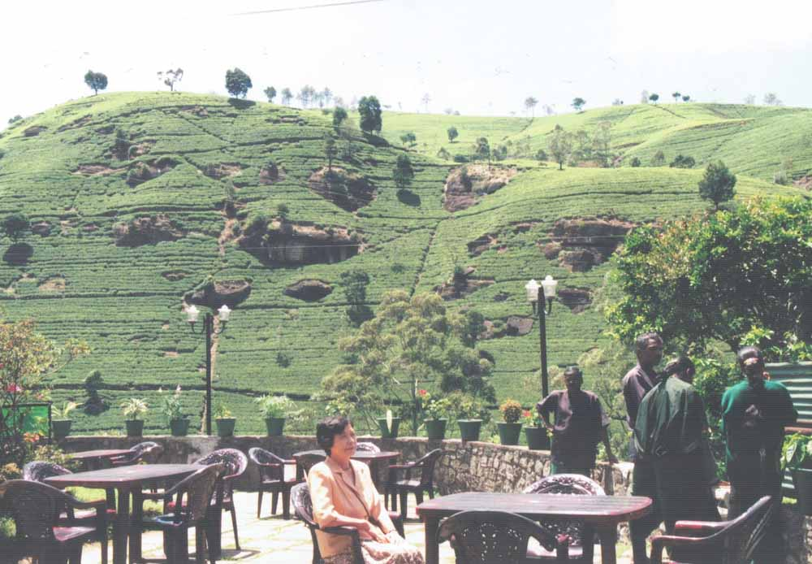

### ㉚霧がかかる高原の避暑地：ヌワラエリヤ（Nuwara Eliya）{#subsect30}

13時に出発。茶畑が続く山道を登り、2,000メートル以上の峠を越えて茶畑を見ながら南に下ると、高原の街ヌワラエリヤに着きました（13時15分）。標高約1,900メートルの街の真ん中あたりで車を降りて、眺めますと、西から北、東の山々は霧がかかって、霞んでいます。ここは小奇麗な小さな街です。

この辺りの丘陵地帯はセイロン紅茶の本場なので、一面に緑の畑ですが、またゴルフ場も見えます。南東の山の方には植物園もあるそうです。イギリス植民地時代には避暑地としても栄えたそうで、イギリス風の建物やホテルが多く、また教会や修道院もあります。

見るべき所も休む当てもないので、すぐ出かけるのですが、給油所でガソリンを補給してから、13時35分に出発します。小雨の中を西南に向かってどんどん下って行きます。私たちは、持ってきたおやつを食べて空腹をしのぎます。14時16分ケッパーティポラ（Keppetipola）から東に向かい、15時20分ハリ・エラ（Hali Ela）を左折して北に向かうと、10分ほどでバドゥッラ（Badulla）の街に入りました。手前を流れるバドゥッラ川は北に向かって流れ、マハーヴェリ河に合流してポロンナルワの北で海に注ぐのです。

### ㉛バドゥッラ（Badulla）：壁画があるシヴァ神殿{#subsect31}

14日、15時半に、たどり着いた街バドゥッラは、標高約680メートル、植民地時代に、このあたりの紅茶の集積地として、発展したところだそうです。

街の南部に大寺院ムティヤンガナ・ヴィハーラ（Mutiyangana Vihāra）があり、白い仏塔が建ち巨大な菩提樹が茂っています。本堂には金色の仏坐像が安置されていました。カタラガマ神殿（Kataragama Devalaya）を探したところ、そこの北西500メートルほどにありました。ここの奥の院には壁画があるのです。漆喰を塗った横に長い外壁に、彩色がやや薄れてはいますが、繊細な描線で輪郭が描かれています。沢山の男女が並んで、お祭りをしているような絵で、数頭の大きい象の姿も見えます（写真）。

16時15分に同じ道を戻って、15分後にハリ・エラで左折して南に向かうと登り道となり、青い田んぼが続きます。16時42分にダモダラ（Damodara）を通り、1,200メートル位の峠を越え、16時50分にクンバルワダ（Kumbalwada）で左折して、橋を渡ると登りとなって峠の上に出て（16時55分）、やがて下りとなると、すぐにエッラの村です。この村は標高はおよそ900メートル前後で、東西に伸びています。車は三叉路を過ぎたところの右側にある宿エッラ・ギャップ・ツーリスト・ホテル（Ella-Gap Tourist Hotel）の前に止まりました。時計を見ると17時を過ぎています。雨が降り始めました。

### ㉜雨のエッラ：見上げる岩山エッラ・ロックとエッラ滝 {#subsect32}

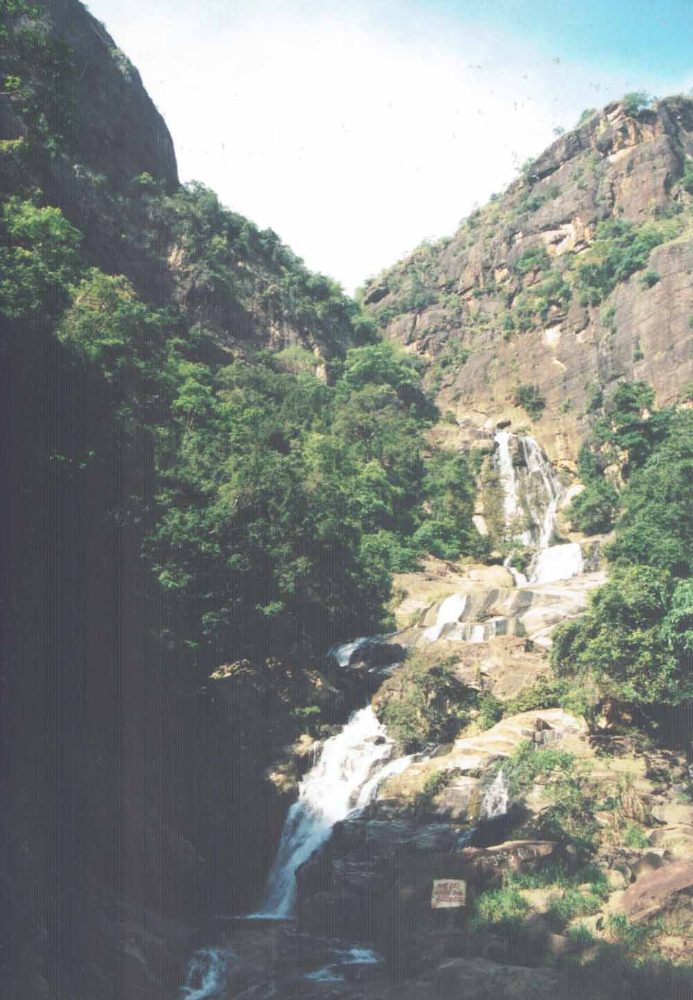{height=289}

私らは宿の1階奥の2号室に入りました。18時過ぎに夕食です。大雨の音を聞きながら、ビールで乾杯し、ご飯に魚のフライ、ゆで玉子、即席の味噌汁、生野菜などを、ゆっくり頂きます。21時前にベッドに入りました。

10月15日（水曜日）朝、6時過ぎに起きて、外出して見ました。右（東）の方の坂道を登り、右の丘に上って行きます。道端は緑豊かで黄色い花が咲いています。ユウカリの大木もあり、道端の草原には{蕨|わらび}が生えています。丘の上からは深い谷間を隔てて巨大な岩山エッラ・ロック（Ella Rock）が見えて、雄大な眺めが眼下に広がっています。

7時半に帰ってきて、お湯をもらい朝食を頂きます。8時45分に出発。すぐ近くの食堂グランド・エッラ・モーテル（Grand Ella Motel）の庭に寄って岩山を眺めてから、どんどん南に下って行ってエッラ滝（Ella Falls）が流れ落ちる谷川の手前で停車しました。降りて写真を撮り、滝の水に手をかざしますと、なんと期待に反して水は生ぬるくて気持ちが悪い。滝は谷の100メートルほど上から数段に折れて落下しています。

9時25分に出発。その内に山間部から出て平坦地を南に向かって走っています。9時58分に進む道が東西の道と交差する村に入って左折しました。ここがウェッラワーヤ（Wellawaya）で、これから行くブドゥルワーガラの{磨|ま}{崖|がい}{仏|ぶつ}への基点です。10時に村の中央の辻を右折して南に進むと、5分後に右に標識があった小道に入ります。荒地の中の舗装がない道を10分ほど西に走ると、低い建物が見え人影もあります。ここが遺跡の受付でした。道端で入場券100ルピーを2枚買い、300メートルほど北に行くと、木蔭に管理人がいました。人もいない広場の前方西正面に大摩崖仏を仰ぎます。ここの主尊は高さが16メートル（51フィート）とスリランカでは最も背が高い立像の仏様なのだそうです。

### ㉝ブドゥルワーガラ（Buduruvagala）：荒地に立つ大摩崖仏{#subsect33}

10月15日（水曜日）、10時15分。木々が雑然と茂る丘を背にした東面する巨岩の中央には、大きく厳かな仏様が開いた右手を挙げて（{施無畏|せむい}{印| いん}をもって）私らを招いているように立っています。その左右にはそれぞれ三尊形式の諸菩薩像が立って招いている様子です。向かって左の白い中尊は冠に坐像の{化|け}{仏|ぶつ}を頂く観音様、右方の中尊は{彌|み}{勒|ろく}{菩|ぼ}{薩|さつ}、その右端は{金|こん}{剛|ごう}{杵|しょ}を右肩にかざす{執|しゅう}{金|こん}{剛|ごう}{神|じん}だそうです（Mahinda Deegale, Buddha’s Rock―Mahāyāna Legacy at Buduruvagala―、『パーリ学仏教文化学』12号、1998年、pp.103-115）。スリランカの仏像はお釈迦様と弟子の{比丘|びく}達の姿だったのに、ここは大乗の菩薩様です。これまでに見てきた遺跡には大乗仏教を示すものが見られませんでしたが、スリランカでも、大乗仏教が行われていたのです。7世紀に玄奘もこの国において無畏山寺では大乗と小乗とを学ぶと伝えています。{金|こん}{剛|ごう}{智|ち}や{不|ふ}{空|くう}は、この獅子国の密教を伝えたのです。しかし12世紀に大乗は抑圧されて滅んだのでしょう。般若経などの大乗の経文を彫った黄金板や銅板の発掘報告もあります。人里離れたジャングルの岩肌に彫られた大乗の仏・菩薩達もあったのです。管理人は地名を解説し（Buduは仏、ruvaは形、galaは岩）、ずっと雨が降らないで困っていると。なるほど草は殆ど生彩がないのです。昨夜大雨だったエッラから20キロメートルほどなのに、ここは乾燥圏なのです。彼に20ルピーをあげると、8頁の小冊子を渡されました。それはこの仏像達と瞑想道場（Meditation center）を紹介する和文の冊子でした。

### ㉞仏都ティッサマハーラーマ、聖地カタラガマ（Kataragama）{#subsect34}

11時10分にここを出発。11時56分に散村を通過してから東南に向かい、12時26分に左折して東に向かうと、人家も木々も多くなり、左方に白い仏塔マニック・ダーガバ（Menik Dagaba）が見え、次に寂れた大きな仏塔ヤータラ・ダーバガ（Yatala Dagaba, Tooth Relic Shrine）が見えます。紀元前に遡る由緒のあるお寺の由ですが、お参りの人は見えません。やがて左に大きな湖を見ながら行くと、右にティッサマハーラーマ（Tissamahārāma）の白く巨大な大塔が見えます。その前で下車します（12時45分）。大塔の左側に大菩提樹が茂り、その四辺に坐仏が安置されています。その右にはヴィシュヌ神殿があります。仏塔には参拝者も多く、処々に僧衣の姿も見えます。青年僧が学ぶ僧院があります。大塔の右脇に小菩提樹があり、その奥には中菩提樹が枝を拡げています。参道の右側の煉瓦が崩れかけたお堂には、優しいお姿の石の仏様が立っていました。ここは紀元前3世紀に遡る歴史のある町です。

13時20分にここを出て10分で今日の宿レイクサイド・ツーリスト・イン（Lake Side Tourist Inn）に着きました。平屋の9号室に落ちつき、海老フライ、ご飯、お湯を取り寄せて味噌汁を作って昼食を頂きます。16時過ぎにちょっと出掛けて湖畔の広場でバナナ50ルピーを買って帰ります。

17時に車で出発し山を越えて25分でカタラガマの門前市場に着きました。川を渡ると聖地で、その中央のカタラガマ神殿には参拝者が多く並んでいます。この神はシヴァ神の息子とされ、美しい二妃を伴い孔雀に乗る綺麗な青年です。仏教も共存し仏像が諸所に祀られています。背後の参道の奥には巨大な仏塔が聳え、香花を供える人の流れが絶えません。橋のたもとにはイスラームのモスクもあります。18時50分に帰路につき1時間で宿に着いて、ご馳走を取り寄せビールで乾杯して夕食。22時に蚊もいないのに蚊帳を吊って休みました。

### ㉟ハンバントタから、宝石の町ラトゥナプラ（Ratnapura）へ{#subsect35}

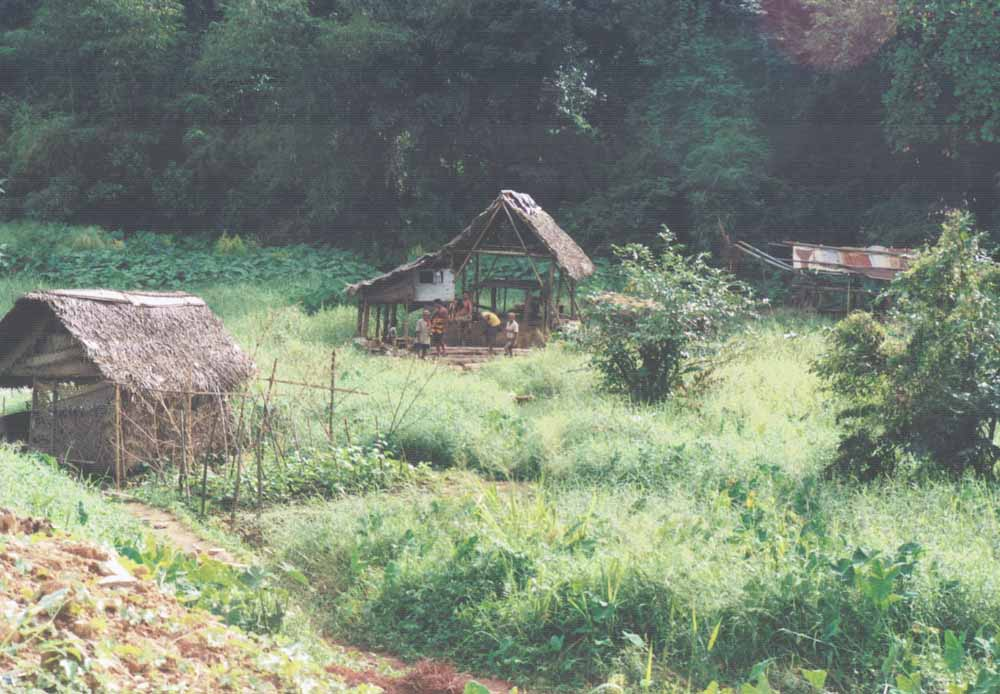

10月16日（木曜日）7時前に起きて朝食。勘定は2,539ルピーです。8時55分に出発して南西に向かいます。9時40分に塩田や風車（風力発電用）が見え、やがてハンバントタ（Hambantota）の市場の裏に海が見えてきました。ここはインド洋に面した港で塩の産地です。ここから海岸線を西に走り、入り江では鶴を眺め、アンバラントタを通り、ノーナガマで右折して、川沿いに西北に遡ります。左手の貯水池チャンドリカ湖（Chandrika）の岸で休憩し（10時55分）、エンビリピティヤ（Embilipitiya）、シンボルケティヤ（Timbolketiya）など幾つかの町を通って、右の山腹にお寺サンカパーラ寺（Sankhapāla vihāra）が見えたので、下りて巨石に建つ小仏塔や仏堂を廻り、金色の大きい仏や色鮮やかな仏達を拝みました。すぐ出掛けると（12時26分）、葬送の黒い車の長い列に出会います。カハワッタ（Kahawatta）町に入り橋を渡ると（13時33分）、少し山道で茶畑も見えます。ペルマドゥッラ（Pelmadulla）から平坦な舗装道になり、右側に立つ大仏（Ganegama寺）を拝み、レッロピティヤを通り（14時8分）、ラトゥナプラ市内に入ります（14時15分）。丘の中腹に探し当てた宿ラトゥナプラ・レストハウス（Ratnapura Rest House）に入り（14時30分）、食事を注文して頂きます。

15時50分に国立博物館に行きますと閉館でした。宝石採掘現場へ向かいます。街の空き地の{草叢|くさむら}に井戸があって、傍の小屋に寝起きしながら宝石を捜すのだそうです。井戸は2メートル四方、深さは25メートルもあるそうで、ロープを引き上げると灰色の泥土がざるに盛られて揚がってきます。それを洗って宝の原石を探すのです。屑の水晶を100ルピーで2個買いました。クル川（Kulu Ganga）に行きますと、子供達が砂を掘って宝石を捜しています。道端の店でバナナとオクラ、椰子の実12ルピーを買って帰ります。17時頃に宿の宝石商に声を掛けられて、原石と首飾りを3,000ルピーで買うはめになりました。2階の部屋に入って、ご飯、魚と海老のフライ、ビールを取り寄せて夕食です。椰子の実の液を啜りましたが、あまりさっぱりしません。21時過ぎに星を見に外に出ます。蛍は見えましたが南十字星は分かりません。22時に休みます。

### ㊱大都市コロンボ：郊外ケラニヤ河畔：壁画のある大寺院{#subsect36}

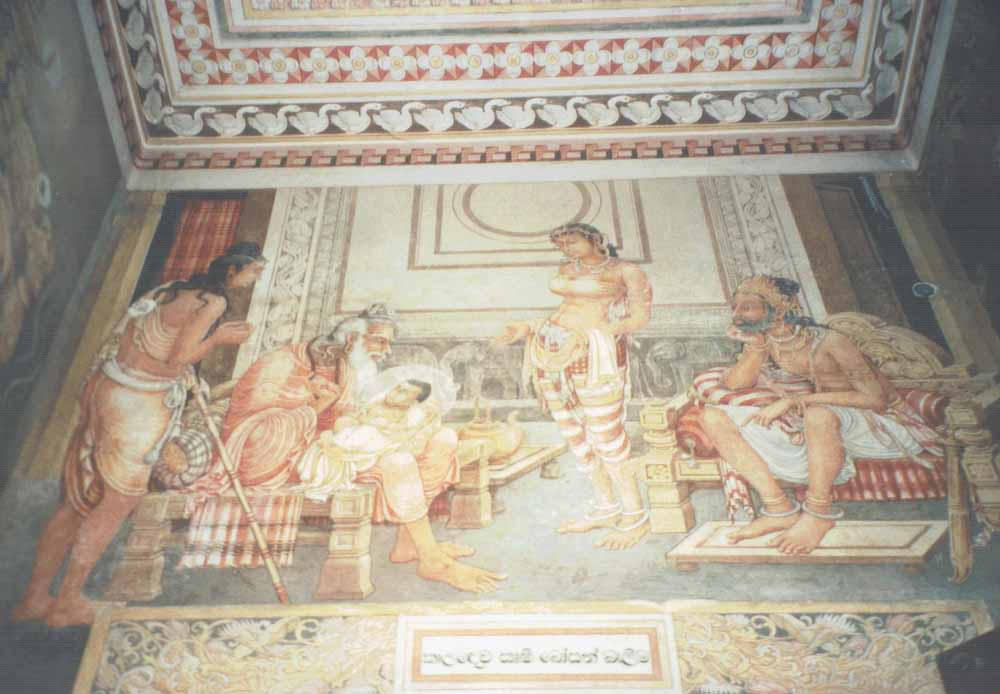

10月17日（金曜日）、朝4時半、イスラームのお祈りの声で目を覚ましました。7時過ぎに朝食、8時に出発、北西に進んでクルヴィータ（Kuruwita）、エヘリヤゴダ（Eheliyagoda）など幾つかの町を過ぎ、アヴィッサウェッラ（Avissawella）から西へ向かい、ハンウェッラ（Hanwella）を過ぎ、10時にカドゥウェラ（Kaduwela）で川を渡ってからは車の調子が悪くなりました。修理工を探して応急処置をさせて徐行しますが、やがてもう動かなくなりました（11時30分）。皆三輪車（リキシャ）に乗り換え、荷物も積み込んで、コロンボ西へ向かいます。渋滞しながら宿ザ・セントラル・YMCAに着きました（12時）。運転手のガムヌさんは帰って車の手配を考えるそうです。630ルピーを前払いして3階のA16号室に入ります。ご飯と玉子を取り寄せ味噌汁を作って食べ、14時過ぎに出掛けて銀行で両替すると30,000円が25,065ルピーとなりました。14時40分に三輪車でバスターミナルに行き、バスで30分走るとケラニヤ（KeLaniya）に着きました。

バス駐車場に近い大寺院ラージャ・マハー・ヴィハーラ（Rāja mahā vihāra）が、濁った聖なるケラニヤ河の西北畔にあります。満月の日（Poya day）は、信者達が多数集まってくる休日とか。平日でも参拝者は多く線香や花を売る人達も見えます。本堂に詣でて金色の仏坐像を拝します。この本堂は前世紀初頭の建立の由ですが、基礎は13世紀に遡るとか。スリランカではお釈迦様が3度訪れたと信ぜられ、壁画に仏伝物語や寺の歴史などが見事に描かれています。紀元前3世紀に原型が造られたとかいう白い大仏塔や大菩提樹を巡って見てから、門前の段の下で線香を350ルピーで買います。バスに乗って市場の前で下車し、お土産に財布5つ1,400ルピーを買って宿に帰りますと（18時45分）、食堂も閉まっています。また出掛けて近くの中国料理店オーキッド（Orchid）で夕食を摂り、440ルピーを払ってご飯も包んで貰って帰りました。部屋には蚊帳もないので蚊取り線香を焚いて休みます（22時）。

### ㊲コロンボ海岸：大統領邸、高層建築：市内の公園、博物館{#subsect37}

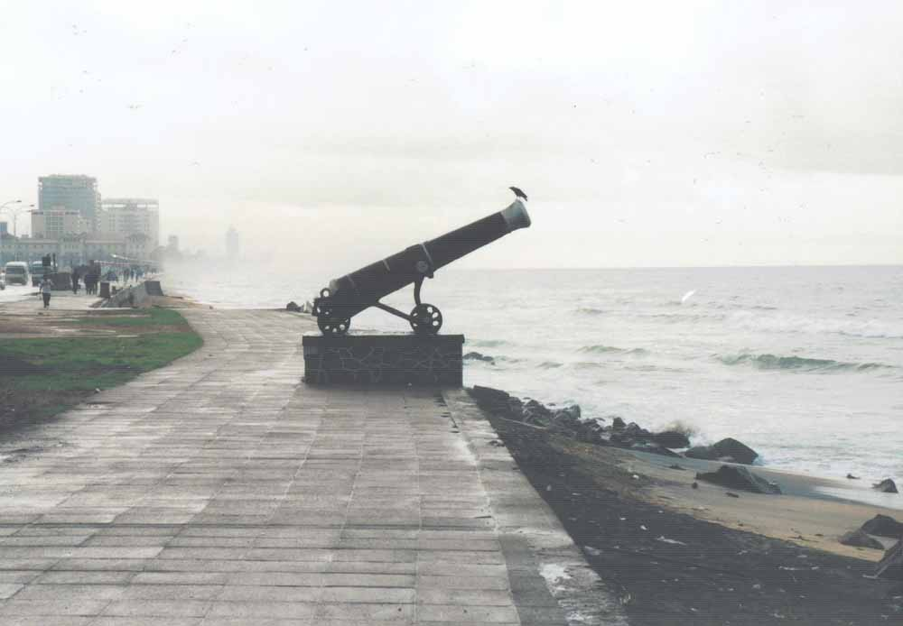

10月18日（土曜日）、朝6時に起きて散歩に出ます。西に400メートルほどの時計台のところまで行くと雨が降ってきたので、官庁の門衛の詰め所の屋根の下で雨宿りしますが、小降りになったところで、海岸の方へ出ました。荒海に向かって古い大砲が据えられています。海沿いの広い敷地に大統領邸があり、写真を撮っていると呼び止められたようでしたが、知らんふりして通り過ぎます。その後、世界貿易センター、銀行など高層ビルの間を一巡して宿に帰りました。宿の食堂で朝食を調達して部屋に運んで食べて、9時にやっと階下に下りると、旅行業者のサンタさんと運転手のガムヌさんが別の車で待っていました。その車に乗って赤白の縞模様のモスク、ベイラ湖、湖上の仏堂などを廻って、9時42分にコロンボ国立博物館（Colombo National Museum）に入ります。ここは1877年にイギリスのセイロン総督によって造られたという白い2階建ての洋館です。発掘されたアヌラーダプラ期の石仏や、ポロンナルワ期のブロンズ製の仏像、ヴィシュヌ神、12世紀の踊るナタラージャ、壁画も沢山あります。11時半にここを出て、すぐ北側のヴィハーラ・マハー・デーヴィ公園（Vihāra Mahā devi）に行きます。白いホールと仏像もある美しい公園です。12時頃に出発します。サンタさんは途中で、バナナ、マンゴー、パパイヤなどを買ってくれます。ネゴンボの宿に着いたのは14時頃でした。彼に16,000ルピーを払いました。食堂で昼食を摂ってから、荷物を整理し、18時過ぎに外の海岸に出て、夕日が沈むのを見てから部屋に戻ります。19時過ぎに、ソーマランシ師に電話を繋いでもらって、明日のお昼前に行く約束をしました。20時近くに食堂で、ビールを飲み、ご馳走を沢山（1,580ルピー）頂いて、部屋に帰って22時45分に休みます。

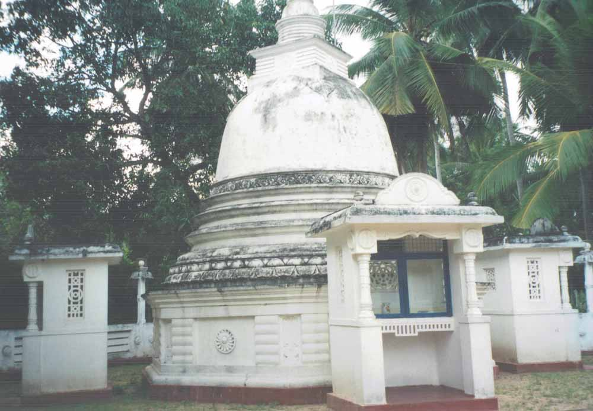

### ㊳ソーマランシ師の木蔭が多いお寺と建築中の仏教大学{#subsect38}

10月19日（日曜日）、7時半に朝食。荷物を作り、受付に預けて置きます。9時サンタ氏が来てすぐ出発。彼の家に立ち寄りますが、さすが社長の家は普通の民家とは違い立派です。また北に進み、マーケットで新聞を買ってくれたり、彼は気がききます。9時53分にマハ・オヤ河（Maha Oya）の鉄橋を渡ります。ここダンコトゥワ（Dankotuwa）はタイルで有名な村で、せともの工場や店が多いのです。バティクで有名なマカンデュラ村（Makanduwa）を通過し（10時8分）パイナップルの名産地パンナラ（Pannala）を通り、仏教寺院や日曜学校の前を過ぎてから（10時25分）、サンタ氏の知人の農家に立寄りました。もぎたてのパイナップルを頂き、バナナを貰います。

ギリウラ（Giriulla）の三叉路を過ぎ（10時47分）、ダンバデニヤ（Dambadeniya）に入り（10時50分）、ソーマランシ師のお寺ワルダナーラーマ（Wardhanarama）に着きました（11時7分）。仏塔、菩提樹や本堂の本尊、仏像、壁画、傍らの神祠を廻り、大学の建設現場に案内されます。紅茶を頂いてから、出掛けて隣町の料理店レストラン・クラウン・フィールド（Restaurant Crown Field）でお昼のご馳走を頂いてからお寺に戻りました。師は大学運営の抱負を語り、当地のお寺の在り方や神仏の関係を説明します。帰り際に寄付（5,000ルピー、30ドル）をして師に別れを告げました（14時13分）。

師は日本の大学にも留学され、仏教の研究・教育機関を造るのに国内外で奔走されていたのに、2004年3月、半年後の落成式を目前にして倒れて帰らぬ人となったのです。無念至極です。同じ道を通って15時20分に宿に着きました。サンタ氏に車代2,500ルピーを支払います。

### ㊴ネゴンボの休日：運河沿いの道、大仏、ヒンドゥー神殿、教会、モスク{#subsect39}

{height=289}

夕方18時過ぎに宿の食堂で軽食を摂り、宿に1,100ルピーを支払います。タクシーは19時20分発車して19時50分に空港に到着しました。入り口の所で急ぐように言われて、荷物と身体検査を受けてから、急いで行って空港税を納めるところまで進むと、「もう乗れない」と言われました。すぐ前の人は入れたのに、どうしてなのか。何と実は離陸時間が20時45分に変更されたので間に合わないのだというのです。驚いて困惑していると、そばに日本語の少しできる青年僧インダラタナ（Indaratana）君がいて、話しかけてきました。彼は日本の知人を見送ったところだといい、スリランカ航空の窓口で次の便の確定を頼んでくれましたが、明日電話するようにと言われたのです。結局、彼の手配した車で帰ることにしました。21時15分にネゴンボの同じ宿に戻り、104号室に落ち着きます。なおインダラタナ君とは帰国してからも、しばらく手紙やメールの交換をしていました。

10月20日（月曜日）、朝7時過ぎ、宿の受付で空港への連絡を尋ねると、空港の事務は8時半に開くとのこと。海辺を散歩してから、朝食。9時10分に三輪車で空港に急ぐと9時40分に着きました。切符売り場の窓口で尋ねると、3日後の切符で日本に帰る他はないと言われます。昨夜、出発時間の変更を確かめなかったばかりに大変なミスをしたのです。でも嘆いてもいられません。飛行機の追加料金も要らないし滞在費も大したこともないので、ゆっくり過ごそうときまりました。

9時52分に空港を後にして、運転手のアジタ君に、仏教寺院に案内してもらいます。10時20分にボーディラタラマヤ（Bodhirataramaya）寺院に到着。道路からも見える赤い衣の大仏坐像が鎮座しておられます。拝観料（本堂50ルピー、舎利塔2ルピー）を2人分払って本堂に入りました。涅槃仏、周りに弟子たちの像や壁画、彌勒菩薩の立像もあります。右の方に舎利仏塔、左に菩提樹があります。ネゴンボの近くにこんなに大きい仏教寺院があるとは驚きでした。さらに北の方にヒンドゥー神殿シッダ・スーニャン・デーヴァラヤ（Siddha Sooniyan Devalaya）があります。インドの塔門のように大きくはないが華麗です。ほかにキリスト教会、イスラームのモスクや学校も見えました。アジタ君には明日も乗せてもらうことになりました。

10時45分に帰ることにしました。途中で両替すると、10,000円が8,540ルピーになりました。宿に着いたのは11時15分。アジタ君に1,000ルピーを払います。食後は昼寝をしたりして一休み。私は日本の我が家の隣人や子供、親戚の数人に、電話で帰国日が遅れて23日になったことを伝えます。15時頃にまた三輪車で外出し、町を見物しながら、バティク2,500ルピーなどを買いました。18時に宿に帰り、また海辺の砂浜を歩いて、料理店マーシャル・シーフード・レストラン（Marshal Sea Food Restaurant）に入ってご馳走をたべると605ルピーでした。19時半に宿に帰りました。21時に休みます。

{height=289}

### ㊵郊外のアルタパーラ寺：白い仏塔、なだらかな岩山、岩窟内の涅槃仏{#subsect40}

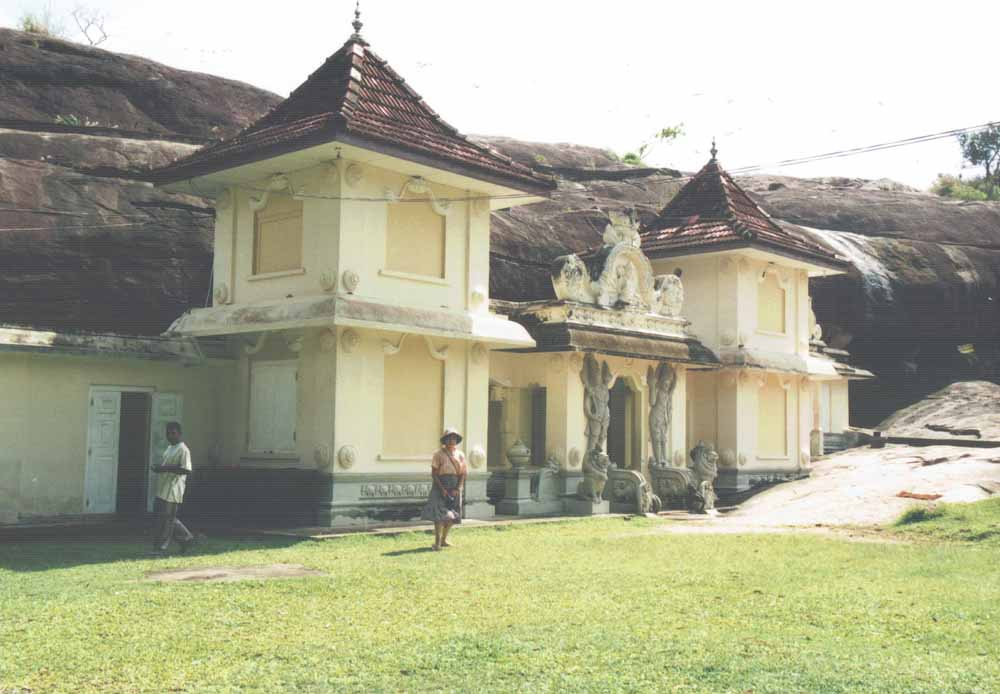{height=289}

10月21日（火曜日）、朝7時過ぎに、散歩をしてから帰って、8時に食堂で朝食。9時にはアジタ君が来ています。今日も彼に案内を頼みます。彼は木、鳥、蛇、田、稲などを見せていろいろ説明して郊外に向かいます。アルタパーラ寺（Alutapala）に着きました（10時20分）。ここは人影が少ないが、巨大な岩山の下にある窟堂を中心とする大寺院で、門構えや白い仏塔や大会堂などは、新しいようです。窟内には大きい涅槃仏や仏坐像が安置されています。上方が平らな巨岩に登ると、高い石積みがあり、下の堂塔の向こうまでよく見えます。

11時7分にここを出て、パパイヤを売る農家などで休憩しながら、1時間ほどで宿に着きました。アジタ君には900ルピーを払います。部屋に荷物を置いて、奥庭の椰子の下で、ゆっくり休みます。すると婦人や子供が柵に寄って来て、売り物の織物などを広げるのです。とうとう私はテーブル掛け1枚1,000ルピーを買いました。これは今も炬燵掛けにして重宝にしているのです。それから自室に帰って昼食を摂ってから昼寝をしました。

16時半に出掛けて、砂浜を北へ歩いてから、東南へ向かって街を一廻りして、19時頃に疲れたところで中華飯店サナズ・ビーチ・ホテル・レストラン（Sana’s Beach Hotel Restaurant）に入って夕食を食べました。沢山食べたのにお代は966ルピーでした。車で移動して気が付かなかったのですが、安くて美味しい店もあちこちにあるのです。

20時40分に宿に戻って入浴してから、屋外に出て、海辺の砂浜で満天の星をみます。南十字星は見えませんが、白い波頭を見ながら、砂浜を歩きました。一昨夜、飛行機に乗り遅れて、この宿に戻ったときには、意気消沈だったのに、このときほど自由な安らぎを感じたことは、これまでになかったのではないでしょうか。予定表もないし、束縛もない。気ままに歩いていると、思わぬ発見もある。何よりあの大海原や星空を眺めて憩い、大自然を満喫できたのです。

10月22日（水曜日）、朝6時半に起きて、荷物を作り、8時に食堂でパン、ゆで玉子、ポテト、煮魚、果物などをゆっくり頂きます。9時50分に外出。1時間で戻って、11時55分に部屋を出て受付で勘定を払います。3泊分が10,410ルピーでした。ロビー上階の通路の涼しい所で休んでいると、アジタ君が来たので、彼の三輪車で近くの古い洋式の砦や牢獄を見、深く入り組んだ内海ニゴンボ・ラグーン（Nigombo lagoon）を巡ります。

14時50分に宿に帰り、15時20分にまた彼の運転で、空港へと出発しました。途中、仏教寺院に寄ったりしたので、着いたのは16時10分、彼には1,000ルピーを払います。20時45分発の成田行きに乗らねばならないので、早めに出たのです。

空港はネゴンボに近いカトゥナヤカ国際空港です。なお1985年から首都はコロンボ東方11キロメートルのスリー・ジャヤワルダナプラ（Sri Jayawardenepura）、別名コッテ（Kotte）に定められ、そこに国会議事堂が新築されたそうです。ですが人口68万人のコロンボは事実上は行政上の首都で、大統領府なども元のままです。

空港では17時頃にチェック・イン。出国手続きをするとき、空港税と荷物の運賃で3,000ルピーが入用となり、また両替をして払います。19時30分まで待つように云われて、私は空港内の店を見物したり、土産を少し買います。

20時20分に搭乗。成田行きのUL460便は21時に離陸しました。22時7分にモルディヴのマレに着陸。大半の客は降りていきます。やがて乗客がどんどん入ってきてほぼ満席になり23時25分に離陸。南インドを横断しインド東海岸沿いに北上して、カルカッタ（コルカタ）南方で右へ旋回すると星が見えてきます。

23日（木曜日）、スリランカ時間の5時（日本時間8時半）、朝日はもう昇っています。中国上空を通過し、日本時間9時過ぎには九州を目指しています。10時過ぎに四国北岸の上空を飛び、11時5分に成田空港に着きました。成田エクスプレスで東京着（13時15分）。新幹線で 仙台に15時半頃に到着。朝市で食料を買ってタクシーで帰宅したのは16時半過ぎでした。

もう紅葉の季節になっていました。

## おわりに {.chap-afterword data-sect-title="おわりに"}

昨年は、各地で「トリノ・エジプト展」が催され、2,000年前の美女クレオパトラ女王が話題となりました。アレキサンドリア周辺の海底遺跡の探査でも彼女の像はコインの彫像の他に見つからないそうですが、その妹の遺骨がトルコのエフェスで確認されたというのです。その骨格の分析で、姉妹はアフリカ人とヨーロッパ人の混血で、古来描かれてきた体型と美貌とはいささか違うとか、復元の美女像がNHKで紹介されていました。

さて2,400余年前のお釈迦様はどのようなお方であったのか。仏が入滅した後、遺骨（仏舎利）は弟子達によって護られ、崇拝されました。百数十年後にアショーカ王が舎利を再配分して諸仏塔に納め、インド内外に石に刻ませた詔勅は、今も残って読まれています。仏のお姿は、現在各地にある仏像や仏画でも想像できません。なにしろ仏像は最初期は造られず漸く紀元1世紀になって造り始められたというのです。しかし仏が遺した言葉と教えは暗誦によって弟子から弟子へと伝えられ、やがてお経となりました。膨大な経典は時代や地域によって様々に解釈されて来たのです。仏のことばとして伝えられた中で、最も古いと言われるパーリ聖典とその註釈書を及川先生と夫が研究し、パーリの用語の原意を辿り仏の教えとその思考法をずっと発掘してきました。

伝承によるとスリランカに仏教を伝えたのが、アショーカ王の王子マヒンダです。また仏のことば（パーリ語）がスリランカ中央のアルヴィハーラで紀元前1世紀に初めて文字で記録されました。そして国王の保護の下に、伝統的な仏教国となり、そこから東南アジア各地に広まったのです。これが南方仏教で、上座部仏教と呼ばれます。一方、仏教は西方から北方へ伝わり、西域諸国を経て、後漢の終わり近くには、中国に入り、そこから朝鮮、日本へと伝わったのです。またヒマラヤを越えてチベットに広まった仏教は西域、モンゴルから中国に伝わりました。これらが北方仏教です。北方仏教の主流はわが国のように大乗仏教です。利他を始めとし、{懺|さん}{悔|げ}して仏となる心を発して修行することを教えるのです。修行はほぼ念仏と坐禅とが主ですが、南方仏教にはない理念の追究があります。南方上座部仏教は大乗仏教を排除しました。大乗仏教では、上座部のような部派の仏教を小乗仏教と呼びますが、部派の戒律は護っていたのです。例えば、台湾の仏教がそうです。しかしわが国では部派の戒律は行われません。日本の仏教史は堕落の歴史だとも評されたのです。でも聖職者アベラール（11世紀〜12世紀）の{権謀術数|けんぼうじゅっすう}や情事の弁明を語る『アベラールとエロイーズ』（岩波文庫）を読んだ感想では、ほぼ同時代に生きた法然上人や親鸞聖人の方が、遥かに志が高く、自己の向上と他者の善導の心に曇りがないように思います。わが国の伝統は私たちの財産なのです。

<b>【神と仏を考える】</b>スリランカの対岸のインドで隆盛しているヒンドゥー教がこの島にも伝わります。イスラーム教も入ります。近代にはポルトガル、オランダ、イギリスの植民地となって、キリスト教も入ってきました。スリランカは大海の孤島とはいえ、内憂と外患が絶えなかったようです。インドに本拠を持つタミル人勢力との抗争は、紀元前1世紀から、何遍も何遍も今日まで繰り返されて来たのです。13世紀にはマレー半島の王チャンダバーヌ（Candabhānu）が侵入してきたと史書が伝えています。15世紀初（1410年）には明の海軍を率いた鄭和がコッテ王と争いになり、王を捕虜にして帰国したといいます。その次の世紀から、西洋の諸勢力と争って終に敗れるのです。しかしシンハラ人達は全て負け続けたわけでもありません。

19世紀後半にはスリランカの仏教僧グナーナンダ（Migettuwatte Guṇānanda，1823年〜1890年）がキリスト教の不合理性を批判して宣教師を論破したといいます（最後が1873年、 Pandura Debate）。この反響は世界に広まり、欧米に仏教を探求する人士（Henry Steel Olcott, Helena Petrovna Bllavatsky）の運動が興り、その余波はインドにおける仏教復興運動となり、また廃仏毀釈から立ち上がる日本の仏教界にも刺激になったといわれます（{釈|しゃく}{悟|ご}{震|しん}「スリランカにおける仏教とキリスト教の歴史的対論」『宗教研究』357号, 2008年, pp.301-324）。

インドとスリランカの西のインド洋に南北に連なる諸島のことは、日本にはこれまで殆ど知られなかったようですが、モルディブだけはここ数十年来、観光地として人気があるようです。モルディブは古くからスリランカと関係が深く、スリランカの仏教徒が移住してきたようです。今にも仏教の遺跡が残っているそうです。しかし12世紀にはイスラーム教が伝えられ、以来イスラーム圏になっています。中国の元代には北溜国、明代（15世紀初）には溜山国として知られ、相互の交流があったと伝えられます。16世紀にはポルトガル、17世紀にはオランダに支配され、1887年にはイギリスの保護領となり、1965年に独立し、その3年後から共和制になったといいます。諸島の真ん中にある首都マレはコロンボの西南西800キロメートル弱に位置する環礁にあります。モルディブの南1,600キロメートルには英領のチャゴス諸島（Chagos）がありますが、1971年以来全島民が追い出され、その最大のディエゴガルシア島（Diego Garcia）が米海軍・空軍に貸与されて中東の軍事戦略の要衝となっています。基地問題で苦しむのは沖縄の人達だけではないのです。基地問題はどこであれ、民意に反する限りは、いずれは解消されるのが道理でしょう。ここにも平和を願う世界中の人々の目が注がれているのです。

スリランカは日本と同様に、ほぼ仏教国でありますが、実は多宗教の国であり多神教の世界です。そして多神教の世界の方が、我々旅行者にとっては面白く親しみやすく、しかも安全である、というように思われます。スリランカでは仏様に供養して得た功徳を神様に回向して、神様のご利益を願うのだそうです。

<b>【天災と人災】</b>この旅の翌2004年12月26日に、スマトラ沖大地震が発生して大津波が起こり、インド洋沿いの島々や諸地域が大変な被害を受けたと報じられました。死者が20万人を超え、スリランカで3万人余、インドで1万人余、モルディブでも100人近い死者が出て、旅行中に津波に倒れた日本人も50人もあったとか。あのポンディシェリやハンバントタの海岸で見た情景、人々や港、船、建物などはどうなったのか。今は復興できたのでしょうか。天災も人災もこの地上では、止むことなく続くのでしょうか。スリランカでは、今も民族間の血腥い内紛が続いていると耳にします。災難に遭わなかった私どもは幸運であったのです。

最近はインターネットで、インドやスリランカの地理や、名所の写真も簡単に見ることができるようになり、しばしば、それで記憶を確認します。Google Earth、Kanchipuram photo Gallery, Meenakshi temple in Madurai-photo gallery、Sri Lanka、Photo Gallery等で検索したのです。インドは電脳大国といわれるだけあって、航空写真地図でも名所等の写真画像でもよく検索できますが、スリランカの地図の情報は少ないし、むらがあったり、分からないところが多いのです。また私らの旅行した時と今とでは、交通路でも風景でも決して同じはずはありません。当時の旅の経路を確かめ、手持ちの資料とメモ（野帳）と写真と2人の記憶とを照合し確認して表現したいのですが、記録も記憶も不確かで再現も追体験もできないところが多いのです。この作業は、つらくもあり、また楽しいのです。

<b>【地図に因んで】</b>地図を見ると、スリランカはいかにもインド大陸から落ちた一滴の雫のように小さい島です。でもこの国には2,000年以上の歴史があり、記録が残されているのです。その王統史は4世紀頃に書き始められたそうですが、『南伝大蔵経』第60巻・第61巻（昭和14年〜15年発行）を見ますと、仏の入滅の年に来島した初代の王から始まって、イギリス人勢力によって王朝が滅びる1815年まで186代の王の名と業蹟、王位の継承、争奪、内紛、戦争など詳細に書き継がれています。

日本では、お寺も機能し、住職も家族をもって後継者を育成しているのですが、スリランカでは、タイやミャンマーと同じように、出家して、僧団で修行する伝統を護持しています。日本ではもうその真似は出来ません。大抵のお寺は後継者難を抱えています。仏教の研究は大学と研究所の役割となり、お寺は葬式と観光に関わるのです。でも心をこめて死者を浄土に送り、遺族の心を癒しながら善に導く人材が葬式仏教においても求められているのです。ですが、いまはもう葬式も葬儀社の仕事だとか。とはいえ、仏教の知識は益々広まり、仏教を求め学ぶ人は全世界において増えています。

仏教徒が多いスリランカでも、タイでも、ミャンマーでも、国内の紛争を収めるのに、なかなか成功していません。インドはヒンドゥー教の国で、仏教徒は極めて少なく、イスラーム教とキリスト教の勢力も小さくはなく、内紛の種はなくなりません。でもまた、選挙に基づく政治は定着し、最近は、経済的に興隆し始めているといいます。その傾向は7年前にも感じられました。この多民族・多宗教・多言語の国家の安定と存在は、人類の将来を占う材料になるかのようです。

時代や地域によって文化の受容と変遷がありますが、何とか現代の各国の内戦や国際間の紛糾が収拾されるようにと切に願うのです。願うだけでよいのか。いやそう願わない人々が世界に充満していて、他を責めて許さない風潮に対しては、願うことは意味を失わないでしょう。

<b>【旅費など】</b>旅行前に仙台の旅行社JTBに支払った料金は2人で285,040円でした。これには成田からコロンボ経由でチェンナイに飛んだ航空機代の往復分と、スリランカに着いたときと、帰るときのホテル代2泊分をふくみます。スリランカとインドで6回両替した額は約120,000円、ドルを330ドル（約40,000円）ほど使っていますが、それには宿代、車代のほか、食費、寄進料、買い物代などが入ります。仙台―成田間の往復とホテル代を含めると2人で500,000円ほどかかったようです。物価が安いので車を多く使ってもこれくらいで済みました。

7年前の南インドとスリランカの旅の記録がようやく纏まりました。その前年のタイ、ミャンマー、インドへの旅は、翌年に仕上げたのに、こちらは何かと長びいてしまいました。その間、モスクワ、北欧、中国、トルコ等へ行き、紀行文も作ったのですが、旅の度に中断して、仕上げるのが遅くなりました。

平成22（2010）年5月30日

